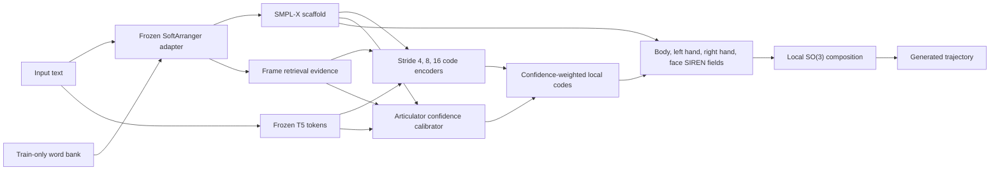

# Retrieval-Confidence Adaptive Neural Sign Field

## Status

This document describes the implemented paper-oriented successor to the fixed stride-8 local amortized field. The implementation is additive: the previous local implicit and residual-flow paths remain unchanged.

This model is retained as the completed fixed multi-scale baseline. Its implemented
successor is documented in
[`retrieval_uncertainty_adaptive_knot_field.md`](retrieval_uncertainty_adaptive_knot_field.md).

The new path is named `retrieval_confidence_adaptive_field`.

## Goal

The frozen text-conditioned SoftArranger adapter supplies a useful lexical motion scaffold, but scaffold quality is not uniform. Retrieved lexical cores may be reliable, while out-of-vocabulary words, transitions, and articulator-specific details may be weak. The new field learns where to preserve the scaffold and where to correct it.

At inference, the model uses only text, a text-predicted duration, and the adapter-predicted scaffold. Ground-truth motion is used only to construct training losses and confidence targets.

## Data Split Contract

Two different PHOENIX manifests have different roles:

| Role | Data | Manifest |
| --- | --- | --- |
| Sentence trajectory training | PHOENIX sentence SMPL-X | `/media/cvpr/haomian/data/SOKE_FLOW/phoenix_upper_smplx/meta/manifest_train.jsonl` |
| Lexical retrieval bank | PHOENIX word SMPL-X | `/media/cvpr/haomian/data/SOKE_FLOW/phoenix_upper_smplx_word_ctc/meta/manifest_train.balanced.jsonl` |

The config sets `adapter.word_split: train.balanced`, which resolves to the second path. A runtime guard rejects another retrieval manifest while `retrieval.require_train_only_bank` is enabled. Validation and test sentences therefore retrieve only training-word motions.

The supplied adapter checkpoint was originally trained with `all.balanced`; this experiment freezes its learned weights but rebuilds its runtime candidate bank from `train.balanced` to prevent direct evaluation-motion retrieval. For the final paper protocol, the adapter itself should also be retrained with `train.balanced`, because changing only the runtime bank cannot remove information already learned by its weights.

## Pipeline



### Retrieval evidence

SoftArranger attention is compressed into seven inference-available signals at latent resolution and linearly resampled to output frames:

1. retrieval confidence from attention concentration and lexical mass
2. maximum lexical attention
3. total lexical attention mass
4. null-token attention mass
5. adjacent-frame attention change
6. sentence lexical coverage by the candidate bank
7. mean candidate gate probability

The same features are stored with cached scaffolds, so training does not need to run the frozen adapter on every epoch.

### Articulator confidence

Confidence is predicted separately for body, left hand, right hand, and face. During training, scaffold error for articulator $a$ is measured in rotation geodesic space, with an additional expression term for the face:

$$
E_a(t) = \frac{1}{J_a}\sum_{j \in a}
d_{\mathrm{SO}(3)}\!\left(R^s_j(t), R^{\mathrm{gt}}_j(t)\right).
$$

The confidence target is

$$
q_a^*(t) = \exp\!\left(-\frac{E_a(t)}{\tau_a}\right).
$$

The calibrator predicts $q_a(t)$ from text, retrieval evidence, scaffold velocity/acceleration, and normalized time. It never receives ground-truth error during inference.

### Confidence-adaptive temporal scale

Separate context encoders produce articulator codes at strides 4, 8, and 16. Their frame-interpolated codes are mixed as

$$
z_a(t) = \sum_s w_{a,s}(t) z_{a,s}(t),
$$

with

$$
w_{a,s}(t) = \operatorname{softmax}_s\!\left(
\ell_{a,s}(t) + \beta(2q_a(t)-1)r_s
\right).
$$

Here $r_s$ increases from the fine stride to the coarse stride. High confidence favors a coarse code that preserves a stable lexical core; low confidence favors a fine code that can repair local transitions and details.

### SO(3) residual field

Each articulator has a separate SIREN decoder. It predicts local tangent rotations rather than adding unconstrained rot6D coordinates. The effective correction gate is

$$
\tilde{g}_a(t) = \sigma(g_a(t))
\left[f + (1-f)(1-q_a(t))\right],
$$

where $f$ is a small correction floor. Rotations are composed as

$$
\hat{R}_{a,j}(t) = R^s_{a,j}(t)
\operatorname{Exp}\!\left(\alpha_a\tilde{g}_a(t)\Delta\omega_{a,j}(t)\right).
$$

This keeps every generated joint on $\mathrm{SO}(3)$. Expression coefficients use an additive gated residual.

## Objective

The total objective combines:

- endpoint rot6D, geodesic, expression, FK-joint, hand, and path losses
- scaffold-to-target local tangent correction loss
- residual velocity and acceleration matching
- confidence calibration loss against $q_a^*(t)$
- confidence-conditioned scale-prior loss
- high-confidence correction-gate penalty
- multi-scale local-code smoothness
- text-only duration prediction loss
- FK-space velocity, acceleration, and jerk **matching** to ground truth

The default config sets absolute FK velocity/acceleration/jerk regularizers to zero. This is intentional: the model matches physical dynamics instead of minimizing motion derivatives toward zero, which previously encouraged over-smoothed trajectories.

## Files

| Component | Path |
| --- | --- |
| Retrieval evidence extraction | `flow/adapter_prior.py` |
| Online/cache scaffold metadata | `NIAF/continuous_sign_field/scaffold_provider.py` |
| Package | `NIAF/retrieval_confidence_field/` |
| Multi-scale SO(3) field | `NIAF/retrieval_confidence_field/models/retrieval_adaptive.py` |
| Trainer | `NIAF/retrieval_confidence_field/scripts/train_retrieval_adaptive_field.py` |
| Exporter | `NIAF/retrieval_confidence_field/scripts/export_retrieval_adaptive_samples.py` |
| Full config | `NIAF/retrieval_confidence_field/configs/phoenix_retrieval_confidence_adaptive_trainbalanced.yaml` |
| Cache launcher | `scripts/NIAF/cache_retrieval_confidence_scaffolds_sbatch.sh` |
| Training launcher | `scripts/NIAF/train_retrieval_confidence_field_sbatch.sh` |

## Running

Generate the new scaffold cache first. The old scaffold cache does not contain retrieval evidence and was built with a different word bank.

```bash
sbatch scripts/NIAF/cache_retrieval_confidence_scaffolds_sbatch.sh
```

Then launch training with online W&B logging:

```bash
sbatch scripts/NIAF/train_retrieval_confidence_field_sbatch.sh
```

Export generation samples using predicted lengths:

```bash
/media/cvpr/haomian/python_envs/SOKE/bin/python \
  -m NIAF.retrieval_confidence_field.scripts.export_retrieval_adaptive_samples \
  --config NIAF/retrieval_confidence_field/configs/phoenix_retrieval_confidence_adaptive_trainbalanced.yaml \
  --checkpoint experiments/NIAF/retrieval_confidence_field/phoenix_retrieval_confidence_adaptive_trainbalanced/checkpoints/best.pt \
  --split test \
  --num_samples 100 \
  --length_mode predicted \
  --out_dir experiments/NIAF/retrieval_confidence_field/phoenix_retrieval_confidence_adaptive_trainbalanced/export_test100
```

Each exported sample contains the generated and scaffold motions plus retrieval features, articulator confidence, correction gates, scale weights, scale strides, and the exact retrieval manifest path.

## Evaluation and Ablations

Primary comparisons should use predicted sequence length and the same frozen adapter checkpoint:

1. adapter scaffold only
2. previous fixed stride-8 local implicit field
3. new field with one fixed scale
4. multi-scale field without confidence gating
5. full confidence-adaptive multi-scale SO(3) field

Report DTW-MPJPE for whole body and hands, PA-MPJPE, hand-path ratio, velocity/acceleration/jerk matching, duration error, and confidence calibration. Confidence should also be analyzed by lexical coverage, transition versus lexical-core frames, and articulator.

## Implementation Validation

The implementation has passed:

- eight focused unit tests covering retrieval evidence, shape/masking, valid rotations, confidence gating, scale selection, tangent targets, gradients, split enforcement, and legacy import compatibility
- a real PHOENIX online-adapter smoke test using the requested retrieval manifest
- one real PHOENIX optimizer step with endpoint and FK velocity/acceleration/jerk losses

The real-data smoke test loaded 29,323 training word motions across 1,085 lexical keys. Full cache generation and full training are separate Slurm jobs and have not been launched by this implementation pass.
