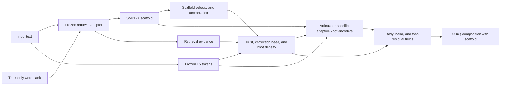

# Retrieval-Uncertainty Adaptive Knot Field

## Status

This document describes the implemented successor to the retrieval-confidence
adaptive field. The original model remains available as the fixed multi-scale
baseline and its completed checkpoints are unchanged.

The new model type is:

```text
retrieval_uncertainty_adaptive_knot_field
```

## Motivation

The first retrieval-confidence experiment improved whole-body DTW by about 1.1%,
but worsened PA hand DTW. Its trained effective correction gates averaged only
0.011 for the left hand and 0.016 for the right hand, while both hands favored the
coarse stride-16 code. A single confidence value was simultaneously selecting scale
and suppressing residual amplitude.

The new field separates these decisions and places local codes non-uniformly in
time. It is designed to preserve reliable lexical cores while retaining enough
capacity to repair transitions and hand articulation.

## Inference Contract

Inference uses only:

- raw sentence text;
- a text-predicted duration;
- the frozen SoftArranger adapter scaffold; and
- retrieval evidence produced by the train-only runtime word bank.

Ground-truth pose, gloss, and duration are not model inputs at inference.

## Pipeline



## Retrieval Uncertainty

The current train-only scaffold cache contains seven frame-level retrieval features.
To remain compatible with all 7,611 completed train/validation cache entries, the
new field derives a candidate-attention uncertainty proxy from:

- inverse retrieval confidence;
- lexical attention dispersion, `lexical_mass - lexical_max`;
- null-attention mass;
- temporal attention change; and
- inverse lexical coverage.

This summarizes candidate ambiguity without regenerating the adapter cache. Direct
candidate-motion variance is a separate future ablation.

## Decoupled Adaptation

For articulator (a) and frame (t), the calibrator predicts three independent
quantities:

- scaffold trust (q_a(t));
- correction need (n_a(t)); and
- adaptive knot density \(\rho_a(t)\).

Trust and correction need use separate heads and separate temperatures. During
training, their targets are derived from the scaffold-to-GT articulator error
(e_a(t)):

$$
q_a^*(t) = \exp\left(-\frac{e_a(t)}{\tau_a^{trust}}\right),
$$

$$
n_a^*(t) = 1 - \exp\left(-\frac{e_a(t)}{\tau_a^{need}}\right).
$$

They are not coupled inside the model. Trust controls the preference for stable
coarse codes. Correction need controls residual amplitude. The effective gate is

$$
g_a(t) = g_a^{learned}(t)
\left[g_{floor} + (1-g_{floor})n_a(t)\right].
$$

Unlike the previous field, high trust does not directly close the correction gate.

## Adaptive Knot Placement

Each articulator receives a fixed knot budget at each scale, but knot positions are
warped toward frames with high predicted density. Define the cumulative coordinate

$$
u_a(t) =
\frac{\sum_{j < t}\rho_a(j)}
{\sum_{j < T-1}\rho_a(j) + \epsilon}.
$$

Uniform knot positions in (u_a) correspond to non-uniform positions in the
original frame coordinate. More knots therefore fall in uncertain or rapidly
changing intervals without changing batch tensor shapes.

The configured knot budgets are:

| Articulator | Fine | Medium | Coarse |
|---|---:|---:|---:|
| Body | stride 4 | stride 8 | stride 16 |
| Left hand | stride 2 | stride 4 | stride 8 |
| Right hand | stride 2 | stride 4 | stride 8 |
| Face | stride 4 | stride 8 | stride 16 |

The density target combines correction need with temporal change in the oracle
scaffold-to-GT tangent correction. This assigns additional knot density to detailed
transitions rather than only to frames with a large static error.

## Pose Composition

The articulator decoders output local axis-angle tangent corrections. Rotations are
composed on SO(3):

$$
\hat{R}_a(t) = R_a^{scaffold}(t)
\exp\left(g_a(t)\,\Delta\omega_a(t)\right).
$$

This preserves valid rotation matrices and avoids adding rot6D vectors directly.

## Training Objectives

The new configuration includes:

- rot6D, geodesic, FK joint, and global hand reconstruction;
- wrist-relative hand reconstruction;
- tangent-space correction supervision;
- residual velocity, acceleration, and jerk matching;
- FK velocity, acceleration, and jerk matching;
- hand path-length matching;
- trust, correction-need, and knot-density calibration;
- confidence-conditioned scale supervision;
- correction-need gate supervision; and
- a small reliable-region preservation penalty.

Absolute velocity, acceleration, and jerk regularizers remain zero. The objective
matches GT dynamics instead of minimizing motion derivatives toward zero.

Checkpoint selection is a configurable composite of endpoint, wrist-relative hand,
FK velocity, FK acceleration, and FK jerk losses. It no longer selects a model using
endpoint loss alone.

## Distributed Training

The trainer now supports the repository's DDP interface. The provided launcher uses
four nodes, one GPU process per node, a per-rank batch size of 2, and an effective
global batch size of 8:

```bash
sbatch scripts/NIAF/train_retrieval_uncertainty_adaptive_knots_sbatch.sh
```

Only rank 0 writes checkpoints, metrics, and the online W&B run. Training and
validation metrics are reduced across all ranks.

## Implementation Map

| Component | Path |
|---|---|
| Model | `NIAF/retrieval_confidence_field/models/uncertainty_adaptive.py` |
| Shared trainer | `NIAF/retrieval_confidence_field/scripts/train_retrieval_adaptive_field.py` |
| Exporter | `NIAF/retrieval_confidence_field/scripts/export_retrieval_adaptive_samples.py` |
| Full config | `NIAF/retrieval_confidence_field/configs/phoenix_retrieval_uncertainty_adaptive_knots_trainbalanced.yaml` |
| Four-node launcher | `scripts/NIAF/train_retrieval_uncertainty_adaptive_knots_sbatch.sh` |
| Tests | `tests/test_niaf_uncertainty_adaptive.py` |

## Exported Diagnostics

In addition to generated and scaffold poses, exported NPZ files contain:

- articulator trust;
- articulator correction need;
- effective correction gates;
- adaptive knot density and cumulative coordinates;
- knot counts and articulator-specific strides;
- retrieval uncertainty;
- temporal scale weights; and
- the exact retrieval manifest and model type.

## Validation Completed Before Full Training

- Python compilation for model, trainer, exporter, and shared losses;
- eight focused uncertainty/adaptive-knot assertions;
- eight original retrieval-confidence compatibility assertions;
- one real PHOENIX CUDA optimizer step with cached retrieval evidence and all FK
  dynamics losses; and
- Slurm shell validation plus a four-node command dry run.

The real-data step used the 29,323-entry train-only retrieval bank. It produced
finite losses, nonzero residuals, hand gates near 0.255 at initialization, and 32
fine hand knots for a 64-frame sequence.

## Remaining Paper Protocol Caveat

The runtime candidate bank is strictly training-only, but the frozen adapter
checkpoint was originally trained using `all.balanced`. A final publication run
should retrain the adapter weights themselves with `train.balanced`, then repeat the
scaffold, fixed-stride, multi-scale, and adaptive-knot ablations under one protocol.
