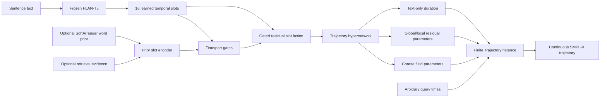

# SignTrajField-v2 Dual-Mode Pipeline

Date: 2026-08-06

Status: implementation and one-batch real-data smoke complete; PHOENIX
experiment training has not been launched

## 1. Purpose

SignTrajField-v2 makes the word prior optional without removing it. One fresh
model supports two inference modes:

- **text-only**: sentence text is sufficient to create and query a trajectory;
- **word-prior**: the same text path receives a gated residual update from the
  frozen SoftArranger scaffold and its retrieval evidence.

The v1 pipeline is unchanged. V2 uses a separate model identity and checkpoint
contract and must be trained from scratch.

## 2. Structure



The text planner uses 16 ordered slots and two eight-head cross-attention
decoder layers. Duration is predicted only from text. The optional prior is
encoded onto the same slot grid and fused as a residual with sigmoid gates for
body, left hand, right hand, and face. Multiplying by the per-sample availability
mask guarantees that a dropped or absent prior contributes exactly zero.

The motion decoder remains the existing SignTrajField hierarchy:

- a learned coarse rot6D field;
- an SO(3) tangent-space global residual;
- uniformly allocated local fields;
- part-specific body/left-hand/right-hand/face local experts; and
- continuous-time querying from one serializable `TrajectoryInstance`.

## 3. Contracts

| Item | V1 | V2 |
|---|---|---|
| `model_type` | `continuous_trajectory_field` | `dual_mode_continuous_trajectory_field` |
| `trajectory_contract_version` | 1 | 2 |
| Text-only inference | No | Yes |
| Word prior | Required | Optional gated residual |
| Coarse auxiliary target | Adapter scaffold | Ground truth |
| Local allocation | Retrieval-guided/configurable | Uniform |
| Warm start from v1 | Supported for v1 Stage 2 | Forbidden |

Strict resume is supported only between checkpoints and configs with the same
model type and contract version. The trainer and inference tools reject a v1/v2
mismatch before loading weights.

## 4. Training behavior

V2 jointly trains the text planner, optional prior encoder, hypernetwork, coarse
field, global residual, local experts, part gates, and duration head from random
initialization. Each training sample independently drops the entire prior with
probability `0.5`:

```yaml
conditioning:
  word_prior_dropout_probability: 0.5
```

This is whole-prior dropout, not frame dropout. When any sample in a mixed batch
uses the prior, the cached scaffold batch is loaded once; dropped samples are
masked to exact zero at fusion. A completely text-only inference/evaluation
batch does not construct `ScaffoldProvider` at all.

The v2 auxiliary losses are:

```text
loss_coarse   = weighted L1(coarse trajectory, ground truth)
loss_residual = tangent L1(predicted correction,
                           GT correction relative to detached coarse)
```

All existing endpoint, FK temporal, analytic dynamics, duration, and local-field
regularizers remain active. V1 continues to use `loss_prior` against the adapter
scaffold.

Mixed training statistics are separated in W&B:

```text
train/text_only/batch/*
train/text_only/epoch/*
train/word_prior/batch/*
train/word_prior/epoch/*
train/word_prior/gates/*
validation/text_only/*
validation/word_prior/*
```

## 5. Checkpoint selection

Every v2 validation runs twice:

1. `text_only`: the provider is omitted and all availability bits are false;
2. `word_prior`: the prior is present and all availability bits are true.

The text-only composite score controls checkpoint ranking. A checkpoint is
feasible only if the word-prior composite is no more than 2% worse than the
text-only composite:

```yaml
selection:
  word_prior_max_relative_degradation: 0.02
```

The selected scores, relative degradation, allowed score, and rejection reason
are stored in `metrics.jsonl`, checkpoints, W&B, and standalone evaluation JSON.

## 6. PHOENIX configurations

| Phase | Config | Optimizer batch per GPU |
|---|---|---:|
| Five-sequence gate | `phoenix_signtrajfield_v2_overfit5.yaml` | 5 |
| Pilot-500 | `phoenix_signtrajfield_v2_pilot500.yaml` | `32 × 2 = 64` |
| Full split | `phoenix_signtrajfield_v2_full.yaml` | `32 × 2 = 64` |

Pilot/full configs intentionally use `train.num_workers: 0`. The real-data
smoke reproduced a late-fork wait when workers were first started after CUDA,
T5, and the scaffold provider had initialized. Keep loading synchronous unless
a spawn-safe loader is implemented and tested.

All paths are under:

```text
NIAF/continuous_trajectory_field/configs/
```

Run the five-sequence phase first. Do not launch pilot-500 or full training until
the preceding gate has been inspected.

## 7. Launch training

From the repository root:

```bash
export CFG=NIAF/continuous_trajectory_field/configs/phoenix_signtrajfield_v2_overfit5.yaml
export RUN_TAG=phoenix_signtrajfield_v2_overfit5
export OUT_DIR=experiments/NIAF/continuous_trajectory_field/$RUN_TAG
export DISTRIBUTED=none
export WANDB=1
unset WARM_START
unset RESUME

bash scripts/NIAF/train_continuous_trajectory_field_sbatch.sh
```

For Slurm, submit the same launcher after exporting the variables. To preview
the exact command without training:

```bash
DRY_RUN=1 bash scripts/NIAF/train_continuous_trajectory_field_sbatch.sh
```

To resume an interrupted v2 run, use its own `last.pt`:

```bash
export RESUME="$OUT_DIR/checkpoints/last.pt"
unset WARM_START
bash scripts/NIAF/train_continuous_trajectory_field_sbatch.sh
```

Never set `WARM_START` for a v2 config.

## 8. Evaluate both modes

Aligned validation/test diagnostics can evaluate both modes in one command:

```bash
export CFG=NIAF/continuous_trajectory_field/configs/phoenix_signtrajfield_v2_overfit5.yaml
export CHECKPOINT=experiments/NIAF/continuous_trajectory_field/phoenix_signtrajfield_v2_overfit5/checkpoints/best.pt
export SPLIT=val
export WORD_PRIOR=both
export SCAFFOLD_MODE=config
export OUT_JSON=experiments/NIAF/continuous_trajectory_field/phoenix_signtrajfield_v2_overfit5/evaluation/val_both.json

bash scripts/NIAF/evaluate_continuous_trajectory_field_sbatch.sh
```

Use `WORD_PRIOR=off` for a text-only report or `WORD_PRIOR=on` for a
prior-enabled report. In a `both` report, metrics are stored below
`text_only/` and `word_prior/`.

## 9. Export predicted trajectories and run DTW

Text-only v2 export:

```bash
export WORD_PRIOR=off
export PRIOR_KEY=continuous_coarse_smplx
export OUT_DIR=/path/to/new/text_only_export
bash scripts/NIAF/export_and_evaluate_continuous_trajectory_predicted_sbatch.sh
```

Prior-enabled v2 export:

```bash
export WORD_PRIOR=on
export PRIOR_KEY=adapter_context_smplx
export OUT_DIR=/path/to/new/word_prior_export
bash scripts/NIAF/export_and_evaluate_continuous_trajectory_predicted_sbatch.sh
```

Text-only NPZ files contain `continuous_coarse_*` and trajectory tensors but no
`adapter_context_*` or `retrieval_features`. Prior-enabled files contain both.

## 10. Implementation checklist

- [x] Preserve v1 model, training, evaluation, and checkpoint contract.
- [x] Add a separate v2 model type and contract version.
- [x] Add 16 temporal text slots with two eight-head cross-attention layers.
- [x] Make duration prediction text-only.
- [x] Add optional word-prior slot encoding and time/part gated residual fusion.
- [x] Guarantee exact zero prior contribution for unavailable samples.
- [x] Add 50% per-sample whole-prior dropout during joint training.
- [x] Replace v2 scaffold imitation with coarse-to-ground-truth supervision.
- [x] Evaluate and log text-only and prior-enabled validation separately.
- [x] Select checkpoints by text-only score with a 2% word-prior regression gate.
- [x] Prevent v1/v2 warm-start or resume mismatches.
- [x] Add explicit off/on evaluator, exporter, and resolution-test controls.
- [x] Add PHOENIX overfit-5, pilot-500, and full configs.
- [x] Add focused v2 tests and rerun the v1 suite.
- [x] Run a one-batch real-data GPU smoke test.
- [x] Evaluate a real validation sample in both inference modes.
- [x] Train and evaluate the five-sequence gate.
- [ ] Continue to pilot-500 only if the five-sequence gate passes. Blocked by
  scaffold-relative PA-hand, hand-path, and jerk regressions.
- [ ] Continue to the full split only if the pilot gate passes.

The 2026-08-06 smoke used five real PHOENIX samples on one GPU. It completed one
mixed optimizer step in 10.15 seconds with two text-only and three prior-enabled
samples, wrote a contract-v2 `last.pt`, and exited successfully. Its disposable
artifacts are under:

```text
/tmp/signtrajfield_v2_smoke_20260806_complete2/
```

The same checkpoint also completed a one-sample validation smoke in both modes.
The output contained separately namespaced text-only and word-prior metrics, and
the checkpoint-selection calculation used the text-only composite while applying
the 2% prior-regression gate.

## 11. Five-sequence gate result (2026-08-06)

The epoch-200 checkpoint was exported at its predicted duration and evaluated
at 20 FPS on the exact five PHOENIX training sequences. Values below are mean
length-normalized DTW; raw DTW sums are in parentheses.

| Metric | Part | Text-only | Word-prior | Paired scaffold |
|---|---|---:|---:|---:|
| Default | Body | 0.02540 (2.4582) | 0.02539 (2.4568) | 0.02957 (2.9312) |
| Default | Left hand | 0.02354 (2.4670) | 0.02358 (2.4668) | 0.03933 (4.1871) |
| Default | Right hand | 0.03020 (3.1101) | 0.03022 (3.1120) | 0.04213 (4.2611) |
| Default | Whole body | 0.03052 (3.0424) | 0.03048 (3.0363) | 0.07533 (7.2897) |
| PA | Body | 0.02377 (2.2958) | 0.02374 (2.2923) | 0.02582 (2.5755) |
| PA | Left hand | 0.00721 (0.7347) | 0.00720 (0.7343) | 0.00650 (0.6506) |
| PA | Right hand | 0.00874 (0.8732) | 0.00873 (0.8722) | 0.00771 (0.7665) |
| PA | Whole body | 0.02369 (2.3324) | 0.02367 (2.3304) | 0.04662 (4.5671) |

Default nDTW improves over the scaffold for every part, including 59.53% for
whole body. PA body and whole-body nDTW also improve, but PA left/right hands
are 10.83% and 13.26% worse. Aligned hand-path loss is 0.60006 versus the
scaffold's 0.30831, and analytic FK jerk ratio is 1.106. Predicted-duration MAE
on the overfit set is 0.00011 seconds.

Decision: the experiment is completed, but the conservative continuation gate
does not pass. Do not launch pilot-500 until PA hand articulation and path/jerk
preservation are addressed. The literal five-example validation-split probe is
retained separately under `evaluation/predicted_val5_*_epoch0200` and is not
used for this overfit-gate decision.
