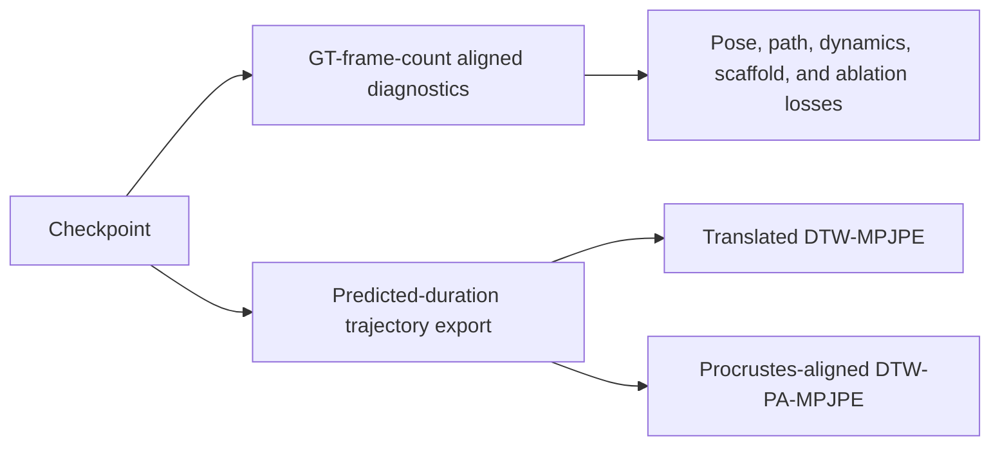

# SignTrajField Evaluation Guide

Date: 2026-07-21

Status: current PHOENIX evaluation protocol for the continuous trajectory field

## 1. Pipeline name and scope

The recommended name for the current pipeline is **SignTrajField**:

> **SignTrajField: a retrieval-guided neural implicit sign trajectory field**

The name emphasizes the main model contract: sentence text and a frozen
SoftArranger scaffold are encoded once into a finite trajectory instance, and
that same instance can then be queried at arbitrary continuous times. It also
distinguishes the method from the older latent flow-matching pipeline.

This guide evaluates the PHOENIX SignTrajField implementation under:

```text
NIAF/continuous_trajectory_field/
```

The current Stage-2 configuration is:

```text
NIAF/continuous_trajectory_field/configs/
  phoenix_continuous_trajectory_stage2_part_experts_full.yaml
```

Its conditioning field is sentence `text`, not gloss. The frozen adapter uses
the PHOENIX training-only balanced word bank.

## 2. Evaluation protocols

SignTrajField has two model-evaluation paths followed by two DTW alignment
variants. They answer different questions and should be reported separately.



| Protocol | Output length | Purpose | Main output |
|---|---|---|---|
| Aligned diagnostics | Ground-truth frame count | Isolate pose and trajectory quality from duration error | One JSON metrics report |
| Predicted export | Text-predicted duration and length | Exercise the deployable, non-oracle generation path | Paired GT/sample NPZ files and duration summary |
| Default DTW | Predicted-length export | Measure temporally warped motion error after translation alignment | JSON and per-sequence CSV |
| PA-DTW | Predicted-length export | Measure temporally warped articulation after per-frame similarity alignment | JSON and per-sequence CSV |

The aligned path uses ground-truth frame counts only to define the diagnostic
query grid. It is not the deployable duration protocol. Conversely, the
predicted export uses text-predicted context length and duration to construct and
sample the trajectory. Ground truth is loaded only for saving and scoring.

## 3. Environment and inputs

Run commands from the repository root:

```bash
export PROJECT_ROOT=/media/cvpr/haomian/NeuralImplicitSignMotionTrajectory
export PYTHON_ENV=/media/cvpr/haomian/python_envs/SOKE
export SOKE_PY="$PYTHON_ENV/bin/python"
export PYTHONNOUSERSITE=1
export PYTHONPATH="$PROJECT_ROOT:${PYTHONPATH:-}"
cd "$PROJECT_ROOT"
```

Set an exact configuration, checkpoint, and output tag. Pass a checkpoint file,
not merely a checkpoint directory, when exact reproducibility matters:

```bash
export CFG=NIAF/continuous_trajectory_field/configs/phoenix_continuous_trajectory_stage2_part_experts_full.yaml
export RUN_ROOT=experiments/NIAF/continuous_trajectory_field/phoenix_continuous_trajectory_stage2_part_experts_full
export CHECKPOINT="$RUN_ROOT/checkpoints/last.pt"
export EVAL_TAG=epoch0004
export EVAL_ROOT="$RUN_ROOT/evaluation"
```

Inspect the checkpoint before launching an evaluation:

```bash
"$SOKE_PY" - <<'PY'
import os
import torch

checkpoint = torch.load(os.environ["CHECKPOINT"], map_location="cpu")
print("epoch:", checkpoint.get("epoch"))
print("global_step:", checkpoint.get("global_step"))
print("model_type:", checkpoint.get("model_type"))
print("validation_pending:", checkpoint.get("metrics", {}).get("validation_pending"))
PY
```

The required external inputs are:

- PHOENIX compact SMPL-X data and FK caches under
  `/media/cvpr/haomian/data/SOKE_FLOW`;
- local FLAN-T5 weights under `deps/flan-t5-base`;
- SMPL-X models under `deps/smpl_models`;
- the frozen SoftArranger adapter checkpoint recorded by the configuration; and
- the frozen temporal VAE checkpoint used by that adapter.

## 4. Recommended smoke test

Before a full test run, evaluate one validation example. Validation scaffolds are
cached, so strict configuration behavior is appropriate:

```bash
export SPLIT=val
export BATCH_SIZE=1
export LIMIT=1
export MAX_BATCHES=1
export SCAFFOLD_MODE=config
export OUT_JSON="$EVAL_ROOT/${EVAL_TAG}_val_smoke1.json"

SMOKE_JOB_ID=$(sbatch --parsable --nodes=1 \
  --job-name=signtraj_val_smoke \
  scripts/NIAF/evaluate_continuous_trajectory_field_sbatch.sh)
echo "$SMOKE_JOB_ID"
```

The smoke run should:

- load the expected checkpoint epoch and global step;
- report one dataset example;
- complete one logical and one memory microbatch;
- write valid metrics and selection diagnostics; and
- exit with scheduler code `0:0`.

## 5. Full ground-truth-aligned diagnostics

The PHOENIX test split does not currently have a scaffold cache. Use
`SCAFFOLD_MODE=fallback`, which prefers a compatible cache but constructs the
frozen adapter scaffold online when an entry is unavailable. With the current
cache layout, all test scaffolds are built online.

Use one sample per logical evaluation batch. Dense analytic dynamics contain
nested derivatives through SMPL-X and are substantially more memory-intensive
than ordinary inference:

```bash
export SPLIT=test
export BATCH_SIZE=1
export LIMIT=0
export MAX_BATCHES=0
export SCAFFOLD_MODE=fallback
export OUT_JSON="$EVAL_ROOT/${EVAL_TAG}_test_aligned.json"

ALIGNED_JOB_ID=$(sbatch --parsable --nodes=1 \
  --job-name=signtraj_test_aligned \
  scripts/NIAF/evaluate_continuous_trajectory_field_sbatch.sh)
echo "$ALIGNED_JOB_ID"
```

`LIMIT=0` and `MAX_BATCHES=0` mean the complete split. The current full test
split contains 642 examples.

The resolved configuration also enforces:

```yaml
eval:
  num_workers: 0
  max_samples_per_memory_batch: 1
  max_frames_per_memory_batch: 512
  empty_cache_between_batches: true
```

Do not increase `eval.num_workers` for online-scaffold evaluation without first
switching to a spawn-safe worker design. Forking DataLoader workers after CUDA
and transformer initialization can deadlock before the first batch.

### 5.1 Aligned JSON fields

The result JSON records checkpoint identity, dataset size, scaffold
configuration, retrieval-bank provenance, selection diagnostics, and metrics.
Important metric families are:

| Prefix | Meaning |
|---|---|
| `pred_*` | Complete SignTrajField prediction |
| `scaffold_*` | Frozen adapter scaffold at the dataset frame grid |
| `prior_*` | Continuous prior branch queried from the trajectory instance |
| `global_only_*` | Current checkpoint with the local residual branch disabled |
| `local_only_*` | Current checkpoint with the global residual branch disabled |

Useful aligned metrics include:

- `pred_loss_endpoint`: configured composite endpoint objective;
- `pred_loss_joint`, `pred_loss_rot6d`, and `pred_loss_geo`: joint and rotation
  fidelity;
- `pred_loss_hand_relative`: wrist-relative hand-joint fidelity;
- `pred_loss_path`: relative cumulative hand-joint travel-length error;
- `pred_dense_analytic_fk_jerk_ratio`: analytic FK jerk relative to the target;
- `pred_loss_duration`: duration-head diagnostic loss; and
- local-field counts, gates, coverage, overlap, and residual RMS values.

`pred_loss_path` is **not DTW**. For each hand and example it is:

$$
\left|
\frac{\sum_{t,j}\lVert \hat{x}_{t+1,j}-\hat{x}_{t,j}\rVert}
     {\sum_{t,j}\lVert x_{t+1,j}-x_{t,j}\rVert}
-1
\right|,
$$

averaged over left/right hands and examples. It is normalized by target hand
travel, not by sequence frame count, and does not perform temporal warping.

## 6. Predicted-duration export and DTW evaluation

Use a new, checkpoint-specific output directory. Reusing a directory can leave
stale `sample_*.npz` files from a previous interrupted export.

The combined launcher exports all predicted-length trajectories and then runs
both default DTW and PA-DTW:

```bash
export SPLIT=test
export NUM_SAMPLES=0
export BATCH_SIZE=1
export CONTEXT_FPS=20
export SAMPLE_FPS=20
export DEVICE=cuda
export TEXT_DEVICE=cpu
export OUT_DIR="$EVAL_ROOT/${EVAL_TAG}_test_predicted"

PREDICTED_JOB_ID=$(sbatch --parsable \
  --job-name=signtraj_test_predicted \
  scripts/NIAF/export_and_evaluate_continuous_trajectory_predicted_sbatch.sh)
echo "$PREDICTED_JOB_ID"
```

`NUM_SAMPLES=0` selects all examples. The combined launcher deliberately uses
the online frozen adapter rather than test-target information or a test cache.
At 20 FPS it creates:

```text
<OUT_DIR>/
  gt_0000.npz ... gt_0641.npz
  sample_0000.npz ... sample_0641.npz
  manifest_test_first642.jsonl
  sample_manifest_summary.json
  export_summary.json
  dtw_mpjpe_t2m_default_h2s_betas.json
  dtw_mpjpe_t2m_default_h2s_betas.csv
  dtw_mpjpe_t2m_pa_h2s_betas.json
  dtw_mpjpe_t2m_pa_h2s_betas.csv
```

Each sample NPZ contains the generated SMPL-X motion, continuous prior,
online-adapter context, retrieval evidence, predicted duration, trajectory
parameters, and optional global/local branch ablations.

### 6.1 Arbitrary-FPS export

For a resolution-consistency study, call the exporter directly with multiple
sampling rates. The same stored trajectory instance is queried at every rate:

```bash
"$SOKE_PY" \
  -m NIAF.continuous_trajectory_field.scripts.export_continuous_trajectory \
  --config "$CFG" \
  --checkpoint "$CHECKPOINT" \
  --split test \
  --num_samples 5 \
  --selection_mode first \
  --out_dir "$EVAL_ROOT/${EVAL_TAG}_test_multifps5" \
  --batch_size 1 \
  --device cuda \
  --text_device cpu \
  --length_mode predicted \
  --context_fps 20 \
  --sample_fps 20 40 80
```

Multi-FPS output is an invariance diagnostic. The headline PHOENIX test scores
should continue to use the agreed 20 FPS protocol.

## 7. DTW definitions and reporting

Both DTW variants use SMPL-X FK keypoints and dynamic programming over every
predicted/ground-truth frame pair. Lower is better.

### 7.1 Default translated DTW-MPJPE

Default mode follows the repository's mGPT/T2M-compatible alignment:

- body is pelvis-translation aligned before selecting upper-body joints;
- each hand is wrist-translation aligned; and
- whole body is translation aligned by the first concatenated joint (neck).

It retains relative orientation and scale.

### 7.2 PA-DTW-MPJPE

PA mode performs a per-frame similarity Procrustes alignment before computing
MPJPE. The transform for every part is fitted on the same keypoints that are
scored: 12 upper-body keypoints for body, 21 keypoints for each hand, and the
54 concatenated body-and-hand keypoints for whole body. It removes translation,
global rotation, and scale. For hands, it is therefore a stronger diagnostic of
internal articulation shape than default translated DTW.

### 7.3 Raw and normalized scores

Each report contains separate summaries for `body`, `lhand`, `rhand`, and
`wholebody`, for both `flow` and `adapter_prior`.

| JSON field | Definition |
|---|---|
| `dtw_mean` | Mean raw accumulated DTW cost; depends on sequence length |
| `ndtw_mean` | Mean DTW cost divided by the optimal warping-path length |
| `ndtw_ref_mean` | Mean DTW cost divided by the predicted reference length |
| `ndtw_median` | Median path-normalized DTW across examples |

For a single headline number, report `summary["flow/wholebody"]["dtw_mean"]`
as raw whole-body DTW and the corresponding value from the PA report as raw
whole-body PA-DTW. Also report the path-normalized scores and hand/body parts so
that sequence length and articulation behavior remain visible.

Example extraction:

```bash
"$SOKE_PY" - <<'PY'
import json
import os
from pathlib import Path

root = Path(os.environ["OUT_DIR"])
for mode in ("default", "pa"):
    path = root / f"dtw_mpjpe_t2m_{mode}_h2s_betas.json"
    result = json.loads(path.read_text(encoding="utf-8"))
    print(f"\n{mode}: pairs={result['num_pairs']} skipped_prior={result['skipped_prior']}")
    for part in ("body", "lhand", "rhand", "wholebody"):
        row = result["summary"][f"flow/{part}"]
        print(
            f"{part:10s} raw={row['dtw_mean']:.6f} "
            f"normalized={row['ndtw_mean']:.6f}"
        )
PY
```

## 8. Monitoring and completion checks

Monitor jobs with:

```bash
squeue -j "$ALIGNED_JOB_ID" -o '%.18i %.12T %.12M %.30R'
squeue -j "$PREDICTED_JOB_ID" -o '%.18i %.12T %.12M %.30R'
```

Aligned evaluation writes a `val:` progress bar to its Slurm stderr log. The DTW
evaluator currently writes its JSON and CSV only after processing the complete
set, so a long interval without a partial result file is expected. It repeatedly
loads SMPL-X layers and may be CPU/filesystem bound even when GPU utilization is
low.

Before accepting a result, verify:

1. the Slurm job completed with `ExitCode=0:0`;
2. checkpoint epoch and global step match the intended snapshot;
3. `dataset_examples`, `num_exported`, and both `num_pairs` values are 642 for
   the full PHOENIX test protocol;
4. `skipped_prior` is zero in both DTW reports;
5. `length_mode` is `predicted` in `export_summary.json`;
6. `sample_fps` contains the agreed 20 FPS evaluation rate;
7. conditioning and adapter metadata show sentence text and the train-only word
   bank; and
8. aligned, default-DTW, and PA-DTW output paths are unique to the checkpoint.

## 9. Current checkpoint reference result

The dated multi-dataset results for the last-checkpoint snapshots evaluated on
2026-07-24 are recorded in
[`test_results_2026-07-24.md`](test_results_2026-07-24.md).

The following values are a reproducibility snapshot, not permanent project
baselines:

```text
checkpoint: phoenix_continuous_trajectory_stage2_part_experts_full/checkpoints/last.pt
checkpoint epoch: 4
global step: 444
split: PHOENIX test
examples: 642
context/sample FPS: 20/20
```

| Metric | Current value |
|---|---:|
| Duration MAE | 0.608131 seconds |
| Raw whole-body DTW | 10.595126 |
| Path-normalized whole-body DTW | 0.121321 |
| Raw whole-body PA-DTW | 6.899705 |
| Path-normalized whole-body PA-DTW | 0.077656 |
| Aligned prediction path loss | 0.401358 |
| Aligned scaffold path loss | 0.361444 |
| Analytic FK jerk ratio | 0.663040 |

The full result files are expected at:

```text
<EVAL_ROOT>/epoch0004_test_aligned.json
<EVAL_ROOT>/epoch0004_test_predicted/dtw_mpjpe_t2m_default_h2s_betas.json
<EVAL_ROOT>/epoch0004_test_predicted/dtw_mpjpe_t2m_pa_h2s_betas.json
```

## 10. Minimal reporting template

Every experiment report should state:

- pipeline name and configuration;
- exact checkpoint path, epoch, and global step;
- split, sample count, FPS, and predicted/ground-truth length mode;
- text condition and retrieval-bank provenance;
- online, cached, or fallback scaffold mode;
- duration MAE;
- aligned prediction versus scaffold endpoint, joint, hand-relative, path, and
  jerk metrics;
- raw and normalized default DTW for body, both hands, and whole body;
- raw and normalized PA-DTW for the same parts;
- global-only and local-only ablations when local experts are enabled; and
- selection feasibility, score, constraint violation, and rejection reasons.

Do not compare `loss_path`, raw DTW, and normalized DTW as though they were the
same metric. They measure relative hand travel, accumulated warped pose error,
and average warped pose error, respectively.
