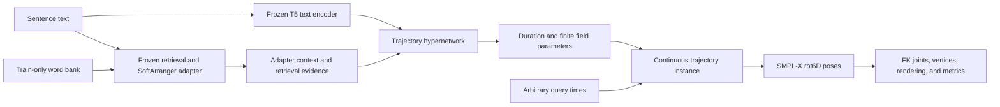

# Continuous Trajectory Field Implementation Plan

Date: 2026-07-19

Status: implemented; full PHOENIX training snapshots and epoch-72 test
evaluations are available

Recommended next steps are documented in
[`improvement_roadmap.md`](improvement_roadmap.md).

## 1. Goal

Build a new text-to-sign pipeline whose output is a **continuous SMPL-X motion
trajectory**, rather than a pose tensor tied to a fixed number of frames. The model
first creates a finite trajectory instance from text and retrieval-adapter context:

$$
\Theta_i = H_\psi(y_i, e_i),
$$

then evaluates the same implicit function at arbitrary normalized times:

$$
\hat{x}_i(\tau) = \Phi(\tau; \Theta_i),
\qquad \tau \in [-1, 1].
$$

Sampling the function at any requested timestamps produces an ordinary pose
sequence for rendering, FK, or evaluation. Changing the sampling rate must not
regenerate or change \(\Theta_i\).

This design is inspired by *Neural Implicit Action Fields: From Discrete
Waypoints to Continuous Functions for Vision-Language-Action Models*, but adapts
the idea to long, articulated SMPL-X sign-language motion.

## 2. Non-Negotiable Contracts

1. **The trajectory is the model output.** A sampled `[T, 256]` tensor is only one
   evaluation of that output.
2. **One trajectory instance supports arbitrary queries.** The same \(\Theta_i\)
   can be queried at 20, 40, or 80 FPS, at irregular timestamps, or for a motion
   derivative.
3. **The final field has no frame-indexed input.** Discrete adapter features may be
   consumed while constructing \(\Theta_i\), but querying the completed trajectory
   depends only on continuous time and the stored trajectory parameters.
4. **Inference is non-oracle.** It may use sentence text, train-bank retrieval,
   frozen adapter outputs, and predicted duration. It must not use GT pose, GT
   gloss, or GT duration.
5. **The existing pipeline remains intact.** The current
   `NIAF/retrieval_confidence_field` implementation and checkpoints stay as the
   principal discrete baseline.
6. **Rotations remain valid.** Residual rotations are composed on \(SO(3)\), not
   added directly in rot6D space.

## 3. New Pipeline Boundary

The implementation will be added beside the current pipeline:

```text
NIAF/continuous_trajectory_field/
  __init__.py
  models/
    modulated_siren.py
    trajectory_hypernetwork.py
    hierarchical_field.py
    trajectory_instance.py
  scripts/
    train_continuous_trajectory_field.py
    export_continuous_trajectory.py
    evaluate_resolution_consistency.py
  configs/
    phoenix_continuous_trajectory_overfit5.yaml
    phoenix_continuous_trajectory_pilot500.yaml
    phoenix_continuous_trajectory_full.yaml
  losses.py
  derivatives.py
```

Associated artifacts will live under:

```text
experiments/NIAF/continuous_trajectory_field/
scripts/NIAF/train_continuous_trajectory_field_sbatch.sh
docs/NIAF/continuous_trajectory_field/
tests/test_niaf_continuous_trajectory_field.py
```

Shared PHOENIX loading, text encoding, frozen adapter execution, SMPL-X
conversion, FK, DDP, W&B, and DTW evaluation utilities should be reused or moved
to neutral shared modules only when necessary. The behavior of the existing
retrieval-confidence models must not change.

## 4. End-to-End Pipeline



The frozen adapter is a motion prior and conditioning source. Its decoded
framewise pose scaffold is not passed into the final decoder at every query time.
The current completed cache does not contain the adapter's pre-decoder latent
plan, so the first implementation encodes the cached decoded plan and retrieval
statistics once with the trajectory hypernetwork. A future latent cache can
replace this encoder input without changing the trajectory or query contracts.

## 5. Trajectory Representation

### 5.1 Predicted duration

The text/context encoder predicts physical duration \(T_i > 0\). A physical query
time \(t \in [0,T_i]\) is mapped to:

$$
\tau = 2\frac{t}{T_i} - 1.
$$

At training time, GT duration supervises the duration head and defines observed
pose timestamps. At inference and test time, only predicted duration is used.

### 5.2 Modulated SIREN

Each implicit field uses shared SIREN weights and trajectory-specific grouped
modulations produced by the hypernetwork. For layer \(l\):

$$
\tilde{W}_{i,l} = W_l \odot (1 + \gamma_{i,l}),
\qquad
\tilde{b}_{i,l} = b_l + \beta_{i,l},
$$

$$
h_{i,l+1}(\tau) =
\sin\!\left(\omega_l
(\tilde{W}_{i,l}h_{i,l}(\tau)+\tilde{b}_{i,l})\right).
$$

The modulation is grouped by output channel or channel block so that the
hypernetwork predicts a compact parameter vector instead of a complete dense
network. The shared base weights are learned across the dataset.

### 5.3 Continuous prior and residual

The adapter-conditioned prior field produces a continuous base trajectory:

$$
S_i(\tau) = \Phi_{\mathrm{prior}}(\tau; \Theta_i^s).
$$

A separate field predicts continuous tangent-space refinements:

$$
\Delta_i(\tau) = \Phi_{\mathrm{res}}(\tau; \Theta_i^r).
$$

For each modeled SMPL-X joint \(j\), the final rotation is:

$$
\hat{R}_{i,j}(\tau) =
R^s_{i,j}(\tau)
\exp\!\left([\Delta\omega_{i,j}(\tau)]_\times\right).
$$

Expression coefficients use additive residuals. The query API returns the
repository's compact 256-dimensional representation:

| Component | Dimensions |
|---|---:|
| Upper body rot6D | 60 |
| Left hand rot6D | 90 |
| Right hand rot6D | 90 |
| Jaw rot6D | 6 |
| Expression | 10 |
| **Total** | **256** |

### 5.4 Hierarchical field for long sequences

PHOENIX sequences can be much longer than the short action chunks used by the
reference paper. A single global field may average away fingers and lexical
transitions. The full model therefore combines a global field with overlapping
local fields:

$$
\Phi(\tau) = \Phi_g(\tau;\Theta_g)
+ \sum_{m=1}^{M} \bar{w}_m(\tau)
  \Phi_m\!\left(\frac{\tau-\mu_m}{\sigma_m};\Theta_m\right),
$$

with smooth Gaussian windows:

$$
w_m(\tau) =
\exp\!\left(-\frac{(\tau-\mu_m)^2}{2\sigma_m^2}\right),
\qquad
\bar{w}_m(\tau) =
\frac{w_m(\tau)}{\epsilon + \sum_n w_n(\tau)}.
$$

The windows and SIRENs are smooth, so the composed trajectory has analytic
derivatives. Local centers are monotonic, widths are positive and bounded, and a
mask supports a variable number of active fields inside a fixed batched maximum.

Retrieval uncertainty controls where capacity is allocated:

- reliable lexical spans use wider, lower-capacity local fields;
- uncertain transitions and fast hand motion receive denser or narrower fields;
- the allocation is predicted once and becomes part of \(\Theta_i\); and
- it never depends on the later query grid.

This replaces interpolated frame-stride trajectory codes. No Catmull-Rom or linear
interpolation is used to define the final motion function.

## 6. Model API

The public interface should make the representation boundary explicit:

```python
trajectory = model.encode_trajectory(
    text_tokens=text_tokens,
    adapter_context=adapter_context,
    retrieval_evidence=retrieval_evidence,
)

poses = model.query_trajectory(
    trajectory=trajectory,
    query_times=query_times,
    time_domain="seconds",
)
```

`encode_trajectory` returns a serializable `TrajectoryInstance` containing:

- predicted duration;
- prior-field global modulations;
- residual-field global modulations;
- local-field modulations;
- local centers, widths, and active masks;
- optional articulator gates; and
- metadata needed to reproduce the coordinate mapping.

`query_trajectory` must accept `[B, K]` query times with arbitrary \(K\), including
irregular and unordered queries. It must not rerun text, retrieval, adapter, or
hypernetwork components.

## 7. Training Data and Conditioning

Initial experiments use PHOENIX with the existing balanced training manifest:

```text
/media/cvpr/haomian/data/SOKE_FLOW/phoenix_upper_smplx_word_ctc/meta/
  manifest_train.balanced.jsonl
```

Frozen adapter checkpoint:

```text
experiments/flow/adapter/
  phoenix_soft_arranger_adapter_ctc_all_text_noneg_k64_b128x4_v2_online/
  checkpoints/epoch_0400.pt
```

Frozen VAE checkpoint:

```text
experiments/flow/VAE/phoenix_rot6d_vae_jerk_b16x4_online_retry1/
  checkpoints/best.pt
```

The first implementation reuses current train-only retrieval-bank and scaffold
cache infrastructure. Cached adapter evidence is an input optimization, not the
trajectory representation. The field and dataset path support long inputs, but
the active frozen PHOENIX VAE/adapter checkpoint has `max_frames: 400`; therefore
the supplied experiment configs cap context at 400 frames. Reaching 1000 frames
requires a compatible VAE/adapter checkpoint or a latent-context path that avoids
that decoder limit.

## 8. Query Sampling During Training

For each sequence and optimizer step:

1. Run the text/context encoders and hypernetwork once to create \(\Theta_i\).
2. Query all or a random subset of observed GT timestamps for reconstruction.
3. Query additional random continuous times between observed frames.
4. Evaluate analytic FK-space derivatives at selected continuous times.
5. Update the hypernetwork, shared field weights, and duration head jointly.

Random query density must vary across batches. This prevents the implementation
from accidentally learning an API tied to the native frame count.

## 9. Physical Derivatives

Derivatives are computed from the continuous field with automatic
differentiation. Since \(\tau = 2t/T - 1\):

$$
\frac{d\hat{J}}{dt}
= \frac{2}{T}\frac{d\hat{J}}{d\tau},
$$

$$
\frac{d^2\hat{J}}{dt^2}
= \left(\frac{2}{T}\right)^2
  \frac{d^2\hat{J}}{d\tau^2},
$$

$$
\frac{d^3\hat{J}}{dt^3}
= \left(\frac{2}{T}\right)^3
  \frac{d^3\hat{J}}{d\tau^3}.
$$

The implementation should use repeated JVPs rather than materializing full
Jacobians. Dynamics are measured after SMPL-X FK so they describe physical joint
motion rather than raw representation differences.

GT derivative targets are estimated from temporally denoised FK trajectories at
physical timestamps. Raw third differences are retained only as a diagnostic,
because they amplify pose-estimation noise.

## 10. Objectives

The initial total objective is:

$$
\mathcal{L} =
\lambda_{rot}\mathcal{L}_{rot}
+ \lambda_{geo}\mathcal{L}_{geo}
+ \lambda_{fk}\mathcal{L}_{fk}
+ \lambda_{hand}\mathcal{L}_{hand}
+ \lambda_{expr}\mathcal{L}_{expr}
+ \lambda_{prior}\mathcal{L}_{prior}
+ \lambda_{res}\mathcal{L}_{res}
+ \lambda_v\mathcal{L}_v
+ \lambda_a\mathcal{L}_a
+ \lambda_j\mathcal{L}_j
+ \lambda_{reg}\mathcal{R}_{jerk}
+ \lambda_{path}\mathcal{L}_{path}
+ \lambda_T\mathcal{L}_{duration}.
$$

The terms are:

- rot6D reconstruction and rotation geodesic loss;
- global and wrist-relative SMPL-X FK joint reconstruction;
- hand-weighted reconstruction and expression loss;
- supervision of the continuous adapter prior and tangent residual;
- FK velocity and acceleration matching;
- robust jerk matching against denoised GT dynamics;
- direct physical jerk regularization;
- hand path-length preservation; and
- text-only duration regression.

The jerk objective must not simply reproduce noisy GT jerk. A target-band
regularizer will encourage predicted jerk energy below a configurable fraction
\(\rho < 1\) of denoised GT while path and velocity losses prevent static or
over-smoothed motion:

$$
\mathcal{R}_{jerk} =
\max\!\left(
E_j(\hat{x}) - \rho E_j(x_{GT}), 0
\right).
$$

Weights are introduced with a curriculum: first learn pose and path, then enable
derivative matching, and finally increase jerk regularization. This avoids an
early collapse to a nearly static smooth solution.

## 11. Implementation Stages

### Stage 0: Infrastructure

- Add `TrajectoryInstance`, query-time normalization, and serialization.
- Implement grouped modulated SIREN layers.
- Implement rot6D prior output and tangent-space residual composition.
- Add analytic FK derivative helpers.
- Add arbitrary-time NPZ export and resolution-consistency tests.

### Stage A: Five-sequence overfit

Use one global prior field and one global residual field. Do not add local fields
until this smallest model can memorize five training sequences.

Success conditions:

- near-zero training reconstruction relative to the chosen model capacity;
- non-trivial residual motion, especially in the hands;
- valid rotations and finite first through third FK derivatives;
- identical values at shared timestamps regardless of query-grid size; and
- visually recognizable motion at native, half, and double sampling rates.

### Stage B: Resolution consistency

Query each learned trajectory at 20, 40, and 80 FPS. Compare direct values at
shared physical timestamps and render all three versions. The trajectory
parameters must be byte-identical across the three exports.

### Stage C: Long-sequence local fields

Add overlapping Gaussian-window local fields and uncertainty-adaptive allocation.
Compare:

- global field only;
- uniform local fields;
- retrieval-uncertainty-adaptive local fields; and
- a discrete Catmull-Rom local-code baseline.

### Stage D: 500-sequence amortized pilot

Train the trajectory hypernetwork on a fixed 500-sequence subset. Validate that
unseen sequences can be represented without per-sequence optimization. Tune field
capacity, local count, derivative weights, and memory use here.

### Stage E: Full PHOENIX training

Launch a four-node DDP run with online W&B. Use the largest per-GPU batch that fits
after derivative-loss memory profiling; gradient accumulation should preserve the
chosen global batch if third-order derivatives reduce physical batch size.

## 12. Evaluation Protocol

Use the existing fixed seed-123, 100-sentence PHOENIX test manifest with predicted
duration and no GT inference inputs. Report:

- translated DTW-MPJPE for body, left hand, right hand, and whole pose;
- PA-DTW-MPJPE for the same regions;
- duration MAE, median error, and bias;
- physical FK velocity, acceleration, and jerk errors;
- predicted-to-GT jerk-energy ratio;
- left- and right-hand path-length ratios;
- per-sample win rates and paired significance;
- trajectory parameter count and generation latency; and
- 20/40/80 FPS resolution consistency.

Primary comparisons:

1. frozen adapter scaffold;
2. current retrieval-uncertainty segmental field;
3. global continuous field;
4. hierarchical continuous field; and
5. hierarchical field without analytic dynamics losses.

The main success criterion is improved hand and whole-pose DTW over the frozen
scaffold while producing lower, physically scaled jerk without collapsing hand
path length. PA hand metrics must not regress materially.

## 13. Export and Visualization

Each sample export should include:

- serialized `TrajectoryInstance` parameters;
- predicted duration;
- query timestamps in seconds and normalized time;
- sampled compact rot6D poses;
- expanded SMPL-X poses;
- FK joints and optional vertices;
- continuous prior samples;
- continuous residual samples;
- local field centers, widths, masks, and uncertainty allocation; and
- source checkpoint, manifest entry, and adapter metadata.

The initial comparison video uses four synchronized panels:

```text
Ground truth | Adapter scaffold | Continuous prior | Continuous final
```

Additional renders show the same final trajectory sampled at 20, 40, and 80 FPS.

## 14. Tests

Focused tests must cover:

- arbitrary `[B, K]` query shapes and variable `K`;
- query-order permutation invariance;
- shared-time equality across different query grids;
- trajectory serialization and deterministic reload;
- grouped modulation shape and finite gradients;
- valid `SO(3)` composition and compact `[B, K, 256]` output;
- monotonic local centers, positive widths, and masked local fields;
- smooth local-window blending at centers and overlap regions;
- analytic velocity, acceleration, and jerk versus finite-difference checks;
- correct physical-duration derivative scaling;
- one CPU and one CUDA optimizer step;
- DDP checkpoint compatibility; and
- an inference audit proving that GT pose, gloss, and duration are absent.

## 15. Risks and Guardrails

| Risk | Guardrail |
|---|---|
| Global SIREN loses long-sequence detail | Introduce local fields only after the global overfit test passes |
| Hypernetwork output becomes too large | Use grouped modulation and shared field weights |
| Local hierarchy secretly becomes discrete interpolation | Store field parameters, centers, and widths; query only continuous time |
| Third-order derivatives exhaust memory | Use timestamp subsampling, repeated JVPs, AMP-safe derivative blocks, and gradient accumulation |
| Jerk regularization freezes motion | Preserve velocity and hand path, then schedule jerk weight gradually |
| Predicted duration changes motion speed incorrectly | Train and report derivatives in physical seconds using explicit duration scaling |
| Rotation coordinates introduce discontinuities | Compose tangent residuals on `SO(3)` and measure dynamics after FK |
| Retrieval leakage compromises evaluation | Use a train-only word bank and audit every inference input |

## 16. Planned Novel Contribution

The intended research contribution is not merely replacing a frame decoder with a
SIREN. It is the combination of:

1. an amortized text-conditioned finite representation of an entire SMPL-X sign
   trajectory;
2. a hierarchical continuous field that scales to long sign-language sequences;
3. retrieval-confidence-adaptive allocation of local continuous capacity;
4. valid continuous rotational residual composition; and
5. physically scaled analytic FK dynamics supervision with explicit smoothness
   control.

This claim should be retained only if ablations show that the continuous
representation, adaptive local allocation, and analytic dynamics each contribute
measurably beyond the current discrete segmental baseline.

## 17. Immediate Implementation Order

When implementation begins, use this order:

1. `TrajectoryInstance` and arbitrary-time query contract.
2. Grouped modulated SIREN and rotation composition.
3. Five-sequence global-field overfit with sampled exports.
4. Analytic FK derivatives and physical-time losses.
5. Resolution-consistency evaluation.
6. Hierarchical local fields and retrieval-adaptive allocation.
7. 500-sequence pilot.
8. Full four-node PHOENIX run and paper ablations.

Do not start the full PHOENIX experiment before the five-sequence model passes the
query-consistency and overfit checks.

## 18. Implemented Components and Validation

The implementation now lives at:

```text
NIAF/continuous_trajectory_field/
```

Implemented entry points:

```bash
# Five-sequence overfit
python -m NIAF.continuous_trajectory_field.scripts.train_continuous_trajectory_field \
  --config NIAF/continuous_trajectory_field/configs/phoenix_continuous_trajectory_overfit5.yaml

# Non-oracle arbitrary-FPS export
python -m NIAF.continuous_trajectory_field.scripts.export_continuous_trajectory \
  --config <config> \
  --checkpoint <checkpoint> \
  --split test \
  --num_samples 5 \
  --out_dir <output> \
  --sample_fps 20 40 80

# Query-resolution contract check
python -m NIAF.continuous_trajectory_field.scripts.evaluate_resolution_consistency \
  --config <config> \
  --checkpoint <checkpoint> \
  --out <summary.json>

# Four-panel rendering
python -m NIAF.continuous_trajectory_field.visualization.visualize_continuous_trajectory_compare \
  --gt <gt.npz> \
  --sample <sample.npz> \
  --out_dir <render_dir>
```

Four-node full training launcher:

```bash
sbatch scripts/NIAF/train_continuous_trajectory_field_sbatch.sh
```

Validation completed during implementation:

- all nine focused continuous-field tests passed in the SOKE environment;
- one cached PHOENIX CUDA optimizer step completed with finite losses;
- analytic FK velocity, acceleration, and jerk were finite on CUDA;
- a combined third-order FK objective backpropagated through SMPL-X and the field;
- non-oracle online-adapter export produced one stored trajectory sampled at 20
  and 40 FPS;
- the resolution evaluator measured a maximum shared-time difference of
  `1.31e-8`, zero query-order error, and byte-identical trajectory parameters; and
- the four-panel renderer produced a valid smoke-test MP4.

The CUDA SMPL-X path is not stable under `torch.func.jvp` on the current software
stack. The implemented derivative helper therefore uses nested
`torch.autograd.functional.jvp(..., create_graph=True)`, which passed third-order
CUDA forward and backward checks.
