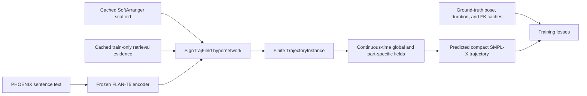

# SignTrajField Training Guide

Date: 2026-07-21

Status: standalone operator guide for the current full-PHOENIX Stage-2 pipeline

## 1. Purpose

This document is sufficient for an agent with no previous project context to:

1. verify the training environment and all required artifacts;
2. run a small end-to-end training and validation smoke test;
3. start a new full SignTrajField experiment;
4. resume the existing full experiment without resetting its optimizer; and
5. monitor, stop, diagnose, and hand off the job safely.

The current model is **SignTrajField**, a retrieval-guided neural implicit sign
trajectory field. The current training target is the Stage-2 architecture with
retrieval-guided, part-specific local experts:

```text
NIAF/continuous_trajectory_field/configs/
  phoenix_continuous_trajectory_stage2_part_experts_full.yaml
```

Always pass this top-level configuration. Its `_base_` chain is resolved
automatically by `NIAF.continuous_sign_field.config.load_config`; do not launch
one of its base configurations by mistake.

Choose the operation from this table before setting launch variables:

| Intent | Initialization | Output directory | Section |
|---|---|---|---|
| Verify that the stack works | Warm start, five tiny epochs | New disposable directory | 6 |
| Reproduce Stage 2 from its canonical initialization | Warm start from the global epoch-30 checkpoint | New unique directory | 7 |
| Continue the current Stage-2 run | Strict resume from that run's `last.pt` | The same existing directory | 8 |

Do not guess between warm start and resume: they have different optimizer and
epoch semantics.

## 2. What training does



The trainable system predicts duration, trajectory modulations, the global
implicit residual, and body/left-hand/right-hand/face local residuals. The
following dependencies remain frozen:

- the local FLAN-T5 text encoder;
- the SoftArranger adapter and its temporal VAE;
- the cached SoftArranger scaffold and retrieval features; and
- the SMPL-X forward-kinematics model.

Training conditions on sentence `text`, not gloss. The retrieval bank is the
PHOENIX `train.balanced` word bank. Ground truth supervises training losses but
does not become an inference-time scaffold.

## 3. Canonical files and current settings

| Role | Path or value |
|---|---|
| Training launcher | `scripts/NIAF/train_continuous_trajectory_field_sbatch.sh` |
| Python entry point | `NIAF.continuous_trajectory_field.scripts.train_continuous_trajectory_field` |
| Current config | `NIAF/continuous_trajectory_field/configs/phoenix_continuous_trajectory_stage2_part_experts_full.yaml` |
| Fresh-run initialization | Global-field epoch-30 `best.pt`, listed below |
| Train/validation examples | 7,092 / 519 |
| Condition | Sentence text |
| Epoch target | 50 |
| Validation interval | Every 5 epochs |
| Checkpoint interval | Every epoch |
| Per-GPU logical batch | 32 examples |
| Gradient accumulation | 2 logical batches |
| Effective optimizer batch | 64 examples per GPU |
| Training loader workers | 4 per rank |
| Validation loader workers | 0 per rank |

The fresh-run initialization checkpoint is:

```text
experiments/NIAF/continuous_trajectory_field/
  phoenix_continuous_trajectory_full_smooth_q32_jreg1e2_w10_b32x8/
  checkpoints/best.pt
```

It is the selected epoch-30 global-field checkpoint. A new Stage-2 run loads its
compatible shared weights, reinitializes the local branch, resets the optimizer,
and starts at epoch 1. This is a **warm start**, not a resume.

### 3.1 Batch-size semantics

For a world size of $W$, the nominal batch represented by one optimizer update
is:

$$
32\ \text{examples/rank}
\times 2\ \text{accumulation steps}
\times W
=64W.
$$

The current one-GPU run therefore uses 64 examples per optimizer update. A
four-GPU DDP run uses a global optimizer batch of 256.

The loader's logical batch may be split into smaller GPU memory microbatches.
The current limits are 32 samples and 4,096 padded frames per memory microbatch.
This splitting does not change the gradient represented by the logical batch.

Do **not** set `BATCH_SIZE=64` to request an optimizer batch of 64. The launcher
overrides only `train.batch_size`; accumulation remains 2, producing 128
examples per GPU per optimizer update and increasing memory pressure. The
current safe setting is deliberately `32 × 2 = 64` per GPU.

### 3.2 Learning schedule

- Epochs 1-3 are local-branch warmup: global LR is `0`, local LR is `2e-4`.
- Epochs 4-50 jointly fine-tune: global LR is `2e-5`, local LR is `1e-4`.
- Analytic dynamics begin at epoch 1.
- Analytic jerk begins at epoch 2 and ramps over three epochs.
- Validation runs after epochs 5, 10, ..., 50.
- Dense validation uses nested time derivatives through SMPL-X. A logical
  validation batch of eight is streamed to the GPU one sample at a time.

The full run is exploratory. `selection.require_feasible` is false, so an
experiment can finish even if no validation checkpoint satisfies every current
path/articulation/jerk constraint.

## 4. Environment setup

Run all commands from the repository root:

```bash
export PROJECT_DIR=/media/cvpr/haomian/NeuralImplicitSignMotionTrajectory
export PYTHON_ENV=/media/cvpr/haomian/python_envs/SOKE
export PYTHON_BIN="$PYTHON_ENV/bin/python"
export PYTHONNOUSERSITE=1
export PYTHONPATH="$PROJECT_DIR:${PYTHONPATH:-}"
export CFG=NIAF/continuous_trajectory_field/configs/phoenix_continuous_trajectory_stage2_part_experts_full.yaml
cd "$PROJECT_DIR"
```

Confirm that the Python environment and Slurm client exist:

```bash
test -x "$PYTHON_BIN"
command -v sbatch
command -v squeue
"$PYTHON_BIN" --version
```

The provided launcher targets the `spark` Slurm partition. Its defaults request
four nodes, one GPU and one task per node, 16 CPUs per task, 100 GB RAM per node,
and 72 hours. The commands below explicitly override the node count when a
one-GPU job is intended.

## 5. Required data and dependency preflight

The configuration expects the following local resources:

| Resource | Expected location |
|---|---|
| PHOENIX compact SMPL-X | `/media/cvpr/haomian/data/SOKE_FLOW/phoenix_upper_smplx` |
| Train/validation FK cache | `.../phoenix_upper_smplx/meta/niaf_fk_rot6d_h2s_fixed` |
| Cached scaffold/retrieval evidence | `.../phoenix_upper_smplx/meta/niaf_adapter_scaffold_confidence_trainbalanced_epoch0400` |
| Balanced word data | `/media/cvpr/haomian/data/SOKE_FLOW/phoenix_upper_smplx_word_ctc` |
| FLAN-T5 | `deps/flan-t5-base` |
| SMPL-X models | `deps/smpl_models` |
| Frozen SoftArranger | `experiments/flow/adapter/phoenix_soft_arranger_adapter_ctc_all_text_noneg_k64_b128x4_v2_online/checkpoints/epoch_0400.pt` |
| Frozen temporal VAE | `experiments/flow/VAE/phoenix_rot6d_vae_jerk_b16x4_online_retry1/checkpoints/best.pt` |

Set `INITIAL_CHECKPOINT` to the checkpoint appropriate to the operation:

```bash
# For a new Stage-2 run:
export INITIAL_CHECKPOINT=experiments/NIAF/continuous_trajectory_field/phoenix_continuous_trajectory_full_smooth_q32_jreg1e2_w10_b32x8/checkpoints/best.pt

# For a resume, set it to that run's checkpoints/last.pt instead.
```

Run this complete preflight. Do not submit training unless it prints
`PRE-FLIGHT PASSED`:

```bash
"$PYTHON_BIN" -u - <<'PY'
import json
import os
from pathlib import Path

import numpy as np

from NIAF.continuous_sign_field.config import load_config

project = Path(os.environ["PROJECT_DIR"]).resolve()
cfg = load_config(project / os.environ["CFG"])

def resolve(value):
    path = Path(value)
    return path if path.is_absolute() else project / path

def required(label, value):
    path = resolve(value)
    assert path.is_file(), f"{label} missing: {path}"
    print(f"OK {label}: {path}")
    return path

required("initial checkpoint", os.environ["INITIAL_CHECKPOINT"])
required("FLAN-T5 config", Path(cfg["text"]["model_path"]) / "config.json")
text_root = resolve(cfg["text"]["model_path"])
assert any(
    (text_root / name).is_file()
    for name in ("model.safetensors", "pytorch_model.bin")
), f"FLAN-T5 weights missing under {text_root}"
required(
    "SMPL-X model",
    Path(cfg["metrics"]["model_dir"]) / "smplx/SMPLX_NEUTRAL.npz",
)
required("adapter checkpoint", cfg["adapter"]["checkpoint"])
required("VAE checkpoint", cfg["adapter"]["vae_checkpoint"])

counts = {}
for split in (cfg["data"]["train_split"], cfg["data"]["val_split"]):
    manifest = required(
        f"{split} manifest",
        Path(cfg["data"]["data_dir"]) / "meta" / f"manifest_{split}.jsonl",
    )
    count = sum(1 for line in manifest.open(encoding="utf-8") if line.strip())
    counts[split] = count
    for label, root in (
        ("motion", resolve(cfg["data"]["data_dir"])),
        ("FK", resolve(cfg["cache"]["fk_cache_dir"])),
        ("scaffold", resolve(cfg["scaffold"]["cache_dir"])),
    ):
        actual = sum(1 for _ in (root / split).glob("*.npz"))
        assert actual == count, (split, label, actual, count)
    print(f"OK {split}: {count} motions, FK caches, and scaffolds")

word_manifest = required(
    "word bank",
    Path(cfg["adapter"]["word_data_dir"])
    / "meta"
    / f"manifest_{cfg['adapter']['word_split']}.jsonl",
)
assert sum(
    1 for line in word_manifest.open(encoding="utf-8") if line.strip()
) == 29323

summary_path = required(
    "scaffold summary",
    Path(cfg["scaffold"]["cache_dir"]) / "cache_summary.json",
)
summary = json.loads(summary_path.read_text(encoding="utf-8"))
assert summary["word_split"] == "train.balanced"
assert summary["require_retrieval_features"] is True
for split, count in counts.items():
    assert summary["splits"][split]["written"] == count

sample_path = next(
    (resolve(cfg["scaffold"]["cache_dir"]) / "train").glob("*.npz")
)
with np.load(sample_path) as sample:
    assert {
        "scaffold",
        "retrieval_features",
        "retrieval_feature_names",
    } <= set(sample.files)

assert cfg["text"]["condition_field"] == "text"
assert cfg["adapter"]["condition_field"] == "text"
assert cfg["scaffold"]["cache_only"] is True
print("PRE-FLIGHT PASSED")
PY
```

The expected counts are 7,092 train examples, 519 validation examples, and
29,323 entries in the train-only balanced word bank.

## 6. End-to-end smoke test

Run this before a new full experiment or after modifying the environment,
configuration, launcher, model, losses, data loader, or validation code. It
executes five one-batch epochs so that epoch-5 validation and checkpoint
selection are exercised.

Use a unique output directory:

```bash
export RUN_TAG="signtrajfield_stage2_smoke_$(date +%Y%m%d_%H%M%S)"
export OUT_DIR="experiments/NIAF/continuous_trajectory_field/$RUN_TAG"
export WARM_START=experiments/NIAF/continuous_trajectory_field/phoenix_continuous_trajectory_full_smooth_q32_jreg1e2_w10_b32x8/checkpoints/best.pt
export RESET_LOCAL_BRANCH=1
unset RESUME

export EPOCHS=5
export LIMIT_TRAIN=64
export LIMIT_VAL=8
export MAX_TRAIN_BATCHES=1
export MAX_VAL_BATCHES=1
unset BATCH_SIZE

export DISTRIBUTED=none
export WANDB=0
test ! -e "$OUT_DIR" || { echo "Refusing to reuse $OUT_DIR"; exit 1; }
```

Preview the exact Python command without allocating a GPU:

```bash
DRY_RUN=1 bash scripts/NIAF/train_continuous_trajectory_field_sbatch.sh
unset DRY_RUN
```

Submit the smoke job on one GPU:

```bash
SMOKE_JOB_ID=$(sbatch --parsable \
  --export=ALL \
  --nodes=1 \
  --ntasks-per-node=1 \
  --time=04:00:00 \
  --job-name=stf_s2_smoke \
  scripts/NIAF/train_continuous_trajectory_field_sbatch.sh)
echo "$SMOKE_JOB_ID"
```

A successful smoke run should report:

```text
Loaded continuous trajectory datasets: train=64 val=8 world_size=1 ...
Retrieval bank: ... "entries": 29323 ...
Warm-started model weights ... checkpoint_epoch=30, reset_local_branch=True ...
```

It should then complete an epoch-5 `val:` progress bar, exit with Slurm code
`0:0`, and create:

```text
<OUT_DIR>/
  config.resolved.json
  metrics.jsonl
  selection_summary.json
  checkpoints/
    last.pt
    epoch0005.pt
    best.pt or best_infeasible.pt
```

The smoke test establishes launch correctness only; its metrics are not a model
quality result.

Open a fresh shell before the full run, or explicitly unset the smoke-only
overrides. Leaving `LIMIT_*` or `MAX_*_BATCHES` exported would silently turn the
full job into a small-data run.

## 7. Start a new full run

This is the recommended reproducible recipe for a new Stage-2 experiment. It
uses the validated one-GPU optimizer semantics and starts from the selected
global-field checkpoint.

```bash
export PROJECT_DIR=/media/cvpr/haomian/NeuralImplicitSignMotionTrajectory
export PYTHON_ENV=/media/cvpr/haomian/python_envs/SOKE
export PYTHON_BIN="$PYTHON_ENV/bin/python"
export PYTHONNOUSERSITE=1
export PYTHONPATH="$PROJECT_DIR:${PYTHONPATH:-}"
export CFG=NIAF/continuous_trajectory_field/configs/phoenix_continuous_trajectory_stage2_part_experts_full.yaml
cd "$PROJECT_DIR"

export RUN_TAG="signtrajfield_stage2_full_$(date +%Y%m%d_%H%M%S)"
export OUT_DIR="experiments/NIAF/continuous_trajectory_field/$RUN_TAG"
export WARM_START=experiments/NIAF/continuous_trajectory_field/phoenix_continuous_trajectory_full_smooth_q32_jreg1e2_w10_b32x8/checkpoints/best.pt
export RESET_LOCAL_BRANCH=1
unset RESUME

unset EPOCHS BATCH_SIZE LIMIT_TRAIN LIMIT_VAL
unset MAX_TRAIN_BATCHES MAX_VAL_BATCHES DRY_RUN
export DISTRIBUTED=none
export TEXT_DEVICE=cpu
export WANDB=1
export WANDB_MODE=online
export WANDB_PROJECT=soke-niaf-continuous-trajectory
export WANDB_RUN_NAME=signtrajfield-stage2-full-resume-epoch4
export WANDB_ID=stfs2e4r20260721
export WANDB_RESUME=allow
export WANDB_API_KEY_FILE="$PROJECT_DIR/scripts/key"

test ! -e "$OUT_DIR" || { echo "Refusing to reuse $OUT_DIR"; exit 1; }

FULL_JOB_ID=$(sbatch --parsable \
  --export=ALL \
  --nodes=1 \
  --ntasks-per-node=1 \
  --job-name=stf_s2_full \
  scripts/NIAF/train_continuous_trajectory_field_sbatch.sh)
echo "$FULL_JOB_ID"
```

Do not omit `OUT_DIR`. The top-level YAML's default output path contains the
existing full-run checkpoint, so launching a new experiment there would
overwrite `last.pt` and append unrelated rows to `metrics.jsonl`.

The Slurm time limit is 72 hours. If all 50 epochs do not fit in one allocation,
resume from the last completed epoch as described below.

## 8. Resume an existing run

Use a resume to continue the same architecture and experiment. Resume restores
model weights, optimizer state, completed epoch, and global step. It starts at
`checkpoint_epoch + 1` and continues until the configured or overridden total
epoch count.

The existing full run is stored at:

```text
experiments/NIAF/continuous_trajectory_field/
  phoenix_continuous_trajectory_stage2_part_experts_full/
```

Inspect its checkpoint rather than assuming its current epoch:

```bash
export OUT_DIR=experiments/NIAF/continuous_trajectory_field/phoenix_continuous_trajectory_stage2_part_experts_full
export RESUME="$OUT_DIR/checkpoints/last.pt"

"$PYTHON_BIN" - <<'PY'
import os
import torch

checkpoint = torch.load(os.environ["RESUME"], map_location="cpu")
print("epoch:", checkpoint.get("epoch"))
print("global_step:", checkpoint.get("global_step"))
print("model_type:", checkpoint.get("model_type"))
print(
    "validation_pending:",
    checkpoint.get("metrics", {}).get("validation_pending"),
)
print(
    "batch/accumulation:",
    checkpoint.get("config", {}).get("train", {}).get("batch_size"),
    checkpoint.get("config", {}).get("train", {}).get("accumulation_steps"),
)
PY
```

At the time this guide was written, that checkpoint was epoch 4, global step
444, from the one-GPU `32 × 2` run. Always trust the inspection output, because
the checkpoint may have advanced since then.

Submit an exact one-GPU continuation:

```bash
export RUN_TAG=signtrajfield_stage2_full_resume
export CFG=NIAF/continuous_trajectory_field/configs/phoenix_continuous_trajectory_stage2_part_experts_full.yaml
export EPOCHS=50
unset WARM_START
export RESET_LOCAL_BRANCH=0

unset BATCH_SIZE LIMIT_TRAIN LIMIT_VAL
unset MAX_TRAIN_BATCHES MAX_VAL_BATCHES DRY_RUN
export DISTRIBUTED=none
export TEXT_DEVICE=cpu
export WANDB=0

RESUME_JOB_ID=$(sbatch --parsable \
  --export=ALL \
  --nodes=1 \
  --ntasks-per-node=1 \
  --job-name=stf_s2_resume \
  scripts/NIAF/train_continuous_trajectory_field_sbatch.sh)
echo "$RESUME_JOB_ID"
```

`WANDB_ID` is the stable machine identifier for the online run. Keep the same
ID and `WANDB_RESUME=allow` when another Slurm allocation continues this exact
training run; choose a new ID for a different model initialization or optimizer
history. The current run is available at:

```text
https://wandb.ai/hh3443-new-york-university/
  soke-niaf-continuous-trajectory/runs/stfs2e4r20260721
```

The launcher reads either a raw key or a shell-style
`WANDB_API_KEY="..."` assignment from `WANDB_API_KEY_FILE`. It never adds the
key to the printed Python command. Do not print, copy into a config, or commit
the credential.

W&B uses independent metric namespaces and custom horizontal axes:

| Namespace | Step axis | Meaning |
|---|---|---|
| `train/batch/...` | `train/optimizer_step` | Selected loss and residual statistics for each optimizer update |
| `train/epoch/...` | `train/epoch_step` | Complete training-set epoch averages, emitted before validation starts |
| `optimizer/...` | `train/epoch_step` | Global and local learning rates |
| `validation/...` | `validation/epoch_step` | Validation-only prediction, scaffold, prior, ablation, and selection metrics |

At the start of scheduled validation, `validation/pending` is logged as `1`.
Successful completion logs it as `0` together with the validation metrics. The
local `metrics.jsonl` and checkpoints retain their existing flat `train_*` and
`val_*` keys for backward compatibility.

For an exact continuation, keep the same config, output directory, per-rank
batch, accumulation, and world size. Changing one GPU to four GPUs changes the
global optimizer batch from 64 to 256 and should be recorded as a different
training experiment even though the checkpoint can technically be loaded.

Model and optimizer state resume exactly, but historical best-checkpoint
bookkeeping has a limitation: the trainer reconstructs its in-memory best score
only from the metrics embedded in the resume checkpoint. A non-validation
`last.pt` does not contain the earlier best score. Consequently, a later
validation can replace `best.pt` or `best_infeasible.pt` even when an earlier
validation was better. The configured `epochNNNN.pt` snapshots and
`metrics.jsonl` remain intact, so after a run spanning multiple Slurm
allocations, select across all retained validation epochs instead of trusting
the final `best*.pt` filename alone.

`RESUME` and `WARM_START` are mutually exclusive:

- `RESUME` restores the optimizer and advances the saved epoch;
- `WARM_START` loads compatible model weights only and starts a new epoch-1
  experiment; and
- training without either starts all SignTrajField weights randomly and is not
  the canonical current recipe.

### 8.1 Resuming around validation

Immediately before scheduled validation, the trainer saves a recovery
`last.pt` with `validation_pending: 1`. Successful validation overwrites it with
complete validation and selection metrics.

If a job is canceled during validation, the completed training epoch remains
recoverable. Resuming that checkpoint starts the next epoch; it does not rerun
the interrupted validation automatically. Preserve the checkpoint and run the
standalone aligned evaluation from
[`evaluation_guide.md`](evaluation_guide.md) if that epoch's validation evidence
is required before continuing.

## 9. Optional four-GPU DDP run

The launcher is configured for four nodes with one GPU process per node. Use
this only as a new, separately named experiment unless resuming a run that was
already trained with the same world size.

For a new DDP run, use the same fresh-run variables from Section 7, choose a
unique `OUT_DIR`, and change the launch to:

```bash
export DISTRIBUTED=ddp

DDP_JOB_ID=$(sbatch --parsable \
  --export=ALL \
  --nodes=4 \
  --ntasks-per-node=1 \
  --job-name=stf_s2_ddp4 \
  scripts/NIAF/train_continuous_trajectory_field_sbatch.sh)
echo "$DDP_JOB_ID"
```

With the current configuration this means:

- logical batch: 32 per GPU;
- optimizer batch: 64 per GPU; and
- global optimizer batch: 256 across four GPUs.

Never launch multiple tasks with `DISTRIBUTED=none`: each process would train an
independent model and write to the same output files. Multi-process training
must use `DISTRIBUTED=ddp`.

The launcher currently selects network interface `enP7s7` for NCCL and Gloo. On
a different cluster, set `NCCL_SOCKET_IFNAME` and `GLOO_SOCKET_IFNAME` to that
cluster's valid interface before submission.

## 10. Optional Weights & Biases logging

All canonical commands above use `WANDB=0` so missing credentials cannot block
training. To enable online logging, use a secret file outside the repository:

```bash
export WANDB=1
export WANDB_MODE=online
export WANDB_PROJECT=soke-niaf-continuous-trajectory
export WANDB_RUN_NAME="$RUN_TAG"
export WANDB_API_KEY_FILE=/secure/path/to/wandb_api_key
```

For a W&B resume, also restore the original run ID and request continuation:

```bash
export WANDB_ID=replace_with_original_run_id
export WANDB_RESUME=must
```

Do not put an API key in a configuration file, Git, this document, or a shared
Slurm log.

## 11. Monitoring

The launcher's log filenames use the Slurm job name and job ID. For a job named
`stf_s2_full`:

```bash
squeue -j "$FULL_JOB_ID" -o '%.18i %.12T %.12M %.30R'
sacct -j "$FULL_JOB_ID" --format=JobID,JobName%24,State,ExitCode,Elapsed
tail -F "logs/sbatch/stf_s2_full_${FULL_JOB_ID}.out"
tail -F "logs/sbatch/stf_s2_full_${FULL_JOB_ID}.err"
```

Use separate terminals for the two `tail -F` commands. Standard output contains
the resolved launch, dataset/retrieval provenance, warm-start message, and
logical-batch diagnostics. TQDM training and validation progress is normally in
standard error.

The beginning of a healthy one-GPU full run should contain:

```text
world_size=1
batch_per_rank=32
train=7092 val=519
entries=29323
checkpoint_epoch=30, reset_local_branch=True
epoch=1 logical_batch=...
```

The per-batch line reports both the logical batch and actual memory microbatch:

```text
logical_size=32 memory_microbatch=... max_frames=... loss=... residual_rms=...
```

A memory microbatch below 32 is expected for long sequences.

Inspect the latest completed epoch without reading the large checkpoint:

```bash
"$PYTHON_BIN" - <<'PY'
import json
import os
from pathlib import Path

path = Path(os.environ["OUT_DIR"]) / "metrics.jsonl"
rows = [json.loads(line) for line in path.read_text().splitlines() if line]
row = rows[-1]
for key in (
    "epoch",
    "global_step",
    "elapsed_sec",
    "lr_global",
    "lr_local",
    "train_loss_total",
    "train_loss_path",
    "train_active_local_fields",
    "validation_pending",
    "selection_score",
    "selection_feasible",
):
    print(f"{key}: {row.get(key)}")
PY
```

`metrics.jsonl` receives one row only after an epoch finishes. During an active
epoch, use the Slurm logs for batch-level progress.

## 12. Output and checkpoint meanings

| Artifact | Meaning |
|---|---|
| `config.resolved.json` | Fully inherited configuration plus CLI overrides used by the run |
| `metrics.jsonl` | One append-only row per completed epoch |
| `checkpoints/last.pt` | Latest completed training epoch; includes optimizer state |
| `checkpoints/epochNNNN.pt` | Retained scheduled-validation snapshot |
| `checkpoints/best.pt` | Lowest feasible score remembered by the current training allocation; see the resume caveat |
| `checkpoints/best_infeasible.pt` | Lowest infeasible score remembered by the current training allocation; see the resume caveat |
| `selection_summary.json` | Selector summary written when training exits normally; audit retained epochs after resumes |

The absence of `best.pt` does not by itself indicate a crashed run. It means no
evaluated checkpoint satisfied every selection constraint. Inspect
`best_infeasible.pt`, the per-validation metrics, and rejection reasons, then
use the evaluation protocol before choosing a checkpoint.

## 13. Stopping and recovering

Cancel only the intended job ID:

```bash
scancel "$FULL_JOB_ID"
```

If cancellation occurs:

- during an epoch, work since the previous completed epoch is lost;
- after an epoch checkpoint, `last.pt` can be resumed; and
- during scheduled validation, the pre-validation recovery checkpoint should
  contain the completed epoch with `validation_pending: 1`.

Inspect `sacct`, the end of both logs, and checkpoint metadata before submitting
a replacement job. Do not delete or overwrite the failed run while diagnosing
it.

## 14. Troubleshooting

### Missing scaffold, FK, or retrieval features

Training uses `scaffold.cache_only: true`. A single missing or incompatible
train/validation entry is fatal. Rerun the preflight and repair the cache; do not
silently switch to oracle or online target-derived scaffolds.

### CUDA out of memory during training

First confirm that the current config is loaded and that `BATCH_SIZE` is unset.
The logical batch is already memory-microbatched by sample and frame budgets. If
the longest bucket still fails, create a new derived config with lower
`train.max_samples_per_memory_batch` and/or
`train.max_frames_per_memory_batch`, while retaining logical batch 32 and
accumulation 2. Record that derived config in the experiment output.

### Validation appears much slower than training

This is expected: validation computes deterministic dense derivatives through
SMPL-X up to jerk. The current safe configuration requires:

```yaml
eval:
  num_workers: 0
  max_samples_per_memory_batch: 1
  max_frames_per_memory_batch: 512
  empty_cache_between_batches: true
```

Do not raise validation loader workers without redesigning initialization for
spawn-safe workers. Forking workers after CUDA/transformer initialization can
deadlock before the first validation batch.

### NCCL reports “connection closed by remote peer”

That message is usually secondary: another rank exited first because of an OOM,
Python exception, missing file, or network-interface problem. Find the earliest
error across the job logs:

```bash
export JOB_NAME=replace_with_job_name
export JOB_ID=replace_with_job_id
rg -n "Traceback|OutOfMemory|CUDA out of memory|ERROR:|NCCL WARN" \
  "logs/sbatch/${JOB_NAME}_${JOB_ID}.out" \
  "logs/sbatch/${JOB_NAME}_${JOB_ID}.err"
```

Debug on one GPU with `DISTRIBUTED=none` before retrying DDP.

### W&B login or network failure

Set `WANDB=0` and resubmit. W&B is optional and has no effect on checkpoint
contents or local metrics.

### Resume reports incompatible or missing keys

Use the exact Stage-2 configuration with a Stage-2 checkpoint for `RESUME`.
Use `WARM_START` only for the compatible global/Stage-1-to-Stage-2 transition.
Do not use `RESET_LOCAL_BRANCH=1` for a strict resume.

### Losses become non-finite

Stop the job, preserve its output, and record the first failing batch/epoch.
Check whether the run changed batch settings, world size, config, data, or
checkpoint initialization. Do not resume a non-finite optimizer state until the
cause is understood.

## 15. Completion and handoff checklist

A full training run is complete only when:

1. `sacct` reports `COMPLETED` with `ExitCode=0:0`;
2. the last `metrics.jsonl` row is epoch 50;
3. `checkpoints/last.pt` reports epoch 50 and no pending validation;
4. `selection_summary.json` exists;
5. the resolved configuration, Slurm job ID, world size, initialization
   checkpoint, W&B ID if any, and output directory are recorded;
6. feasible and infeasible status is audited across `metrics.jsonl` and all
   retained validation checkpoints, especially if the run was resumed; and
7. the chosen checkpoint is evaluated using
   [`evaluation_guide.md`](evaluation_guide.md), including predicted-duration
   default DTW and PA-DTW.

Do not choose a final checkpoint from training loss alone, and do not treat
`best_infeasible.pt` as satisfying the configured continuation gates.
