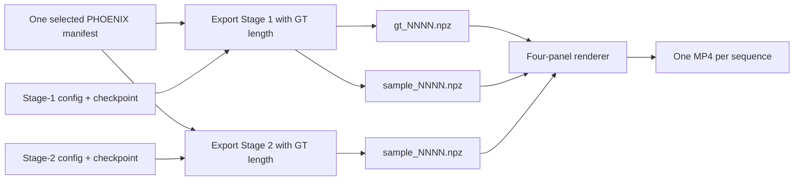

# SignTrajField Four-Panel Visualization Guide

Date: 2026-07-21

Status: standalone operator guide for ground-truth-aligned checkpoint comparisons

## 1. Purpose

This guide is sufficient for an agent with no previous project context to turn
two compatible SignTrajField checkpoints into comparable four-panel MP4 videos.
The panel order is:

```text
Ground-truth SMPL-X | Shared scaffold SMPL-X | Stage-1 prediction | Stage-2 prediction
```

The current known-good example compares:

| Role | Checkpoint | Epoch |
|---|---|---:|
| Stage 1 | `experiments/NIAF/continuous_trajectory_field/phoenix_continuous_trajectory_stage1_local16_overfit5_q64/checkpoints/best.pt` | 50 |
| Stage 2 | `experiments/NIAF/continuous_trajectory_field/phoenix_continuous_trajectory_stage2_part_experts_full/checkpoints/last.pt` | 4 |

It renders the first five PHOENIX training sequences. Their expected frame
counts are 64, 96, 128, 140, and 52 at 20 FPS.

This is a diagnostic visualization, not the deployable predicted-duration
protocol. Each continuous trajectory is queried on the ground-truth frame grid
so that panel frame `t` refers to the same normalized trajectory time in every
panel. No DTW or post-render temporal warping is used.

Choose the starting point from the available artifacts:

| Available artifacts | Procedure |
|---|---|
| Only configs and checkpoints | Follow Sections 3-8 |
| Compatible ground-truth-aligned NPZ exports | Set the variables in Section 4, then follow Sections 6-8 |
| Existing MP4 files | Run Section 8 to verify them; re-render only if the layout or labels must change |

## 2. Workflow and data contract



The relevant programs are:

| Task | Python module |
|---|---|
| Export a checkpoint on an explicit time grid | `NIAF.continuous_trajectory_field.scripts.export_continuous_trajectory` |
| Render the four-panel comparison | `NIAF.continuous_trajectory_field.visualization.visualize_stage_comparison` |

For every sample ID, the renderer reads:

| Panel | NPZ file and key |
|---|---|
| Ground truth | Stage-1 `gt_NNNN.npz`: `motion` or `smplx` |
| Scaffold | Stage-1 `sample_NNNN.npz`: `adapter_context_motion` or `adapter_context_smplx` |
| Stage 1 | Stage-1 `sample_NNNN.npz`: `motion` or `smplx` |
| Stage 2 | Stage-2 `sample_NNNN.npz`: `motion` or `smplx` |

The renderer also loads the Stage-2 scaffold and requires it to match the
Stage-1 scaffold. It refuses to render if sample names, sequence lengths,
`length_mode`, or scaffolds are incompatible. This guard prevents a visually
plausible but invalid comparison.

## 3. Environment setup

Run every command from the repository root:

```bash
export PROJECT_ROOT=/media/cvpr/haomian/NeuralImplicitSignMotionTrajectory
export PYTHON_ENV=/media/cvpr/haomian/python_envs/SOKE
export SOKE_PY="$PYTHON_ENV/bin/python"
export PYTHONNOUSERSITE=1
export PYTHONPATH="$PROJECT_ROOT:${PYTHONPATH:-}"
export TOKENIZERS_PARALLELISM=false
cd "$PROJECT_ROOT"
```

The workflow runs directly in the shell; it does not require a Slurm job. On a
shared cluster, obtain an interactive GPU allocation before using
`--device cuda`.

Required local resources are:

- the SOKE Python environment, including PyTorch, NumPy, ImageIO, SMPL-X, and
  the project dependencies;
- `ffmpeg` and `ffprobe`, with the `libx264` encoder;
- PHOENIX SMPL-X data under `/media/cvpr/haomian/data/SOKE_FLOW`;
- local FLAN-T5 weights under `deps/flan-t5-base`;
- the frozen adapter and VAE checkpoints referenced by the configurations;
- SMPL-X assets under `deps/smpl_models`; and
- the two exact model checkpoints being compared.

## 4. Define the comparison

The following variables reproduce the current epoch-50 versus epoch-4
comparison. Change all checkpoint-specific names together when comparing other
runs.

```bash
export STAGE1_CFG=NIAF/continuous_trajectory_field/configs/phoenix_continuous_trajectory_stage1_local16_overfit5.yaml
export STAGE1_RUN=experiments/NIAF/continuous_trajectory_field/phoenix_continuous_trajectory_stage1_local16_overfit5_q64
export STAGE1_CKPT="$STAGE1_RUN/checkpoints/best.pt"

export STAGE2_CFG=NIAF/continuous_trajectory_field/configs/phoenix_continuous_trajectory_stage2_part_experts_full.yaml
export STAGE2_RUN=experiments/NIAF/continuous_trajectory_field/phoenix_continuous_trajectory_stage2_part_experts_full
export STAGE2_CKPT="$STAGE2_RUN/checkpoints/last.pt"

export COMPARE_ID=stage1_epoch0050_stage2_full_epoch0004_gt_aligned
export EXPORT_ROOT=experiments/NIAF/continuous_trajectory_field/comparison_exports/$COMPARE_ID
export STAGE1_EXPORT="$EXPORT_ROOT/stage1"
export STAGE2_EXPORT="$EXPORT_ROOT/stage2"
export VIDEO_DIR=visualization/NIAF/continuous_trajectory_field/$COMPARE_ID

export DATA_SPLIT=train
export NUM_SAMPLES=5
export CONTEXT_FPS=20
export SAMPLE_FPS=20
export MODEL_DEVICE=cuda
export TEXT_DEVICE=cpu
```

Use a new `COMPARE_ID` for every checkpoint pair. The exporter creates its
directories but does not remove stale NPZ files from an earlier, interrupted
run.

### 4.1 Preflight

Check the executables, assets, module interfaces, and checkpoint identities:

```bash
test -x "$SOKE_PY"
command -v ffmpeg
command -v ffprobe
test -f deps/smpl_models/smplx/SMPLX_NEUTRAL.npz
test -f "$STAGE1_CFG"
test -f "$STAGE2_CFG"
test -f "$STAGE1_CKPT"
test -f "$STAGE2_CKPT"

"$SOKE_PY" -m NIAF.continuous_trajectory_field.scripts.export_continuous_trajectory --help >/dev/null
"$SOKE_PY" -m NIAF.continuous_trajectory_field.visualization.visualize_stage_comparison --help >/dev/null
ffmpeg -hide_banner -encoders 2>/dev/null | rg 'libx264'
```

Inspect the checkpoints rather than inferring their epochs from directory
names:

```bash
"$SOKE_PY" - <<'PY'
import os
import torch

for label, variable in (("Stage 1", "STAGE1_CKPT"), ("Stage 2", "STAGE2_CKPT")):
    path = os.environ[variable]
    checkpoint = torch.load(path, map_location="cpu")
    print(
        label,
        "path=", path,
        "epoch=", checkpoint.get("epoch"),
        "global_step=", checkpoint.get("global_step"),
        "model_type=", checkpoint.get("model_type"),
    )
PY
```

For the known-good pair, this must report Stage 1 epoch 50 and Stage 2 epoch 4.
If the epoch differs, update `COMPARE_ID`, panel labels, and output directory
before continuing.

If CUDA is requested, also run:

```bash
"$SOKE_PY" - <<'PY'
import torch

assert torch.cuda.is_available(), "CUDA was requested but is unavailable"
print(torch.cuda.get_device_name(0))
PY
```

Set `MODEL_DEVICE=cpu` if no GPU is available. CPU export and SMPL-X rendering
are valid but much slower.

## 5. Export the two checkpoints on one frame grid

### 5.1 Export Stage 1 and select the samples

This command selects the first five rows of the PHOENIX training manifest and
writes the selected rows into the Stage-1 export directory:

```bash
"$SOKE_PY" -u \
  -m NIAF.continuous_trajectory_field.scripts.export_continuous_trajectory \
  --config "$STAGE1_CFG" \
  --checkpoint "$STAGE1_CKPT" \
  --split "$DATA_SPLIT" \
  --num_samples "$NUM_SAMPLES" \
  --selection_mode first \
  --out_dir "$STAGE1_EXPORT" \
  --batch_size 1 \
  --device "$MODEL_DEVICE" \
  --text_device "$TEXT_DEVICE" \
  --length_mode ground_truth \
  --context_fps "$CONTEXT_FPS" \
  --sample_fps "$SAMPLE_FPS"
```

The important option is `--length_mode ground_truth`. It does both of the
following:

1. rebuilds the adapter scaffold at the ground-truth context length; and
2. queries the continuous trajectory at exactly the ground-truth number of
   frames.

Do not use `predicted` or `ground_truth_sampling` for this four-panel renderer.
The renderer deliberately accepts only exports whose stored `length_mode` is
`ground_truth`.

### 5.2 Export Stage 2 using the exact same manifest

Reuse the manifest created by Stage 1. This is safer than independently relying
on a random seed or manifest ordering:

```bash
export SHARED_MANIFEST="$STAGE1_EXPORT/manifest_${DATA_SPLIT}_first${NUM_SAMPLES}.jsonl"
test -f "$SHARED_MANIFEST"

"$SOKE_PY" -u \
  -m NIAF.continuous_trajectory_field.scripts.export_continuous_trajectory \
  --config "$STAGE2_CFG" \
  --checkpoint "$STAGE2_CKPT" \
  --split "$DATA_SPLIT" \
  --manifest "$SHARED_MANIFEST" \
  --num_samples "$NUM_SAMPLES" \
  --out_dir "$STAGE2_EXPORT" \
  --batch_size 1 \
  --device "$MODEL_DEVICE" \
  --text_device "$TEXT_DEVICE" \
  --length_mode ground_truth \
  --context_fps "$CONTEXT_FPS" \
  --sample_fps "$SAMPLE_FPS"
```

Both exports build the frozen adapter scaffold online. The configurations must
therefore use the same compatible adapter, temporal VAE, retrieval bank, text
conditioning, and scaffold settings. For the current pipeline the conditioning
input is sentence `text`, not gloss.

### 5.3 Expected export structure

Each export directory should contain:

```text
stage1/ or stage2/
  export_summary.json
  sample_manifest_summary.json
  manifest_train_first5.jsonl
  gt_0000.npz ... gt_0004.npz
  sample_0000.npz ... sample_0004.npz
```

Keep `export_summary.json` with the comparison. It records the exact config,
checkpoint, checkpoint epoch, split, length mode, FPS, manifest provenance, and
sequence metadata.

## 6. Validate the paired exports

Run this check before spending time on mesh rendering:

```bash
"$SOKE_PY" - <<'PY'
import os
from pathlib import Path

import numpy as np

stage1_dir = Path(os.environ["STAGE1_EXPORT"])
stage2_dir = Path(os.environ["STAGE2_EXPORT"])
expected = int(os.environ["NUM_SAMPLES"])
stage1_samples = sorted(stage1_dir.glob("sample_*.npz"))
assert len(stage1_samples) == expected, (len(stage1_samples), expected)

for stage1_path in stage1_samples:
    sample_id = stage1_path.stem.removeprefix("sample_")
    stage2_path = stage2_dir / f"sample_{sample_id}.npz"
    gt1_path = stage1_dir / f"gt_{sample_id}.npz"
    gt2_path = stage2_dir / f"gt_{sample_id}.npz"
    for path in (stage2_path, gt1_path, gt2_path):
        assert path.is_file(), f"missing {path}"

    with (
        np.load(stage1_path, allow_pickle=False) as stage1,
        np.load(stage2_path, allow_pickle=False) as stage2,
        np.load(gt1_path, allow_pickle=False) as gt1,
        np.load(gt2_path, allow_pickle=False) as gt2,
    ):
        name1 = str(stage1["name"].item())
        name2 = str(stage2["name"].item())
        assert name1 == name2
        assert str(stage1["length_mode"].item()) == "ground_truth"
        assert str(stage2["length_mode"].item()) == "ground_truth"

        lengths = {
            len(gt1["smplx"]),
            len(gt2["smplx"]),
            len(stage1["smplx"]),
            len(stage2["smplx"]),
            len(stage1["adapter_context_smplx"]),
            len(stage2["adapter_context_smplx"]),
        }
        assert len(lengths) == 1, (sample_id, lengths)
        gt_delta = float(np.max(np.abs(gt1["smplx"] - gt2["smplx"])))
        scaffold_delta = float(
            np.max(
                np.abs(
                    stage1["adapter_context_smplx"]
                    - stage2["adapter_context_smplx"]
                )
            )
        )
        assert gt_delta <= 1e-6, (sample_id, gt_delta)
        assert scaffold_delta <= 1e-5, (sample_id, scaffold_delta)
        frame_count = next(iter(lengths))
        print(
            sample_id,
            name1,
            f"frames={frame_count}",
            f"scaffold_max_abs_delta={scaffold_delta:.6g}",
        )

print("PAIRED EXPORT CHECK PASSED")
PY
```

For the current known-good comparison, the scaffold maximum absolute delta is
zero for all five samples.

## 7. Render the four-panel videos

The following loop discovers every Stage-1 `sample_NNNN.npz`, finds its paired
Stage-2 sample and ground truth, and renders one video:

```bash
mkdir -p "$VIDEO_DIR"

stage1_samples=("$STAGE1_EXPORT"/sample_*.npz)
test -e "${stage1_samples[0]}"

for stage1_sample in "${stage1_samples[@]}"; do
  sample_file=${stage1_sample##*/}
  sample_id=${sample_file#sample_}
  sample_id=${sample_id%.npz}

  "$SOKE_PY" -u \
    -m NIAF.continuous_trajectory_field.visualization.visualize_stage_comparison \
    --gt "$STAGE1_EXPORT/gt_${sample_id}.npz" \
    --stage1_sample "$stage1_sample" \
    --stage2_sample "$STAGE2_EXPORT/sample_${sample_id}.npz" \
    --out_dir "$VIDEO_DIR" \
    --model_dir deps/smpl_models \
    --device "$MODEL_DEVICE" \
    --fps "$SAMPLE_FPS" \
    --width 512 \
    --height 512 \
    --normalization_scope gt \
    --view_transform none \
    --upper_body_only \
    --stage1_label "Stage 1 (epoch 50)" \
    --stage2_label "Stage 2 full (epoch 4)"
done
```

`--normalization_scope gt` applies one camera normalization derived from the
ground truth to all four panels. This preserves spatial comparability. Avoid
`independent` normalization for model comparison because it can hide scale and
translation differences.

`--upper_body_only` keeps only the SMPL-X upper-body mesh faces, which makes the
hands and signing space easier to inspect. Omit it to render the full body.

With the current settings, the output names are:

```text
sample_0000_gt_scaffold_stage1_stage2.mp4
sample_0001_gt_scaffold_stage1_stage2.mp4
sample_0002_gt_scaffold_stage1_stage2.mp4
sample_0003_gt_scaffold_stage1_stage2.mp4
sample_0004_gt_scaffold_stage1_stage2.mp4
```

Each 512-pixel panel produces a 2048-pixel-wide video. The shared title and
frame-number band increases the current height from 512 to 568 pixels.

### 7.1 Fast smoke render

Before rendering long sequences, add these options to render only 10 frames at
lower mesh density:

```text
--max_frames 10 --software_face_stride 4
```

Use a separate smoke-test output directory so the truncated video cannot be
mistaken for a complete result.

## 8. Validate the MP4 files

List stream metadata and fully decode every output without displaying it:

```bash
videos=("$VIDEO_DIR"/*.mp4)
test "${#videos[@]}" -eq "$NUM_SAMPLES"

for video in "${videos[@]}"; do
  echo "$video"
  ffprobe -v error \
    -select_streams v:0 \
    -show_entries stream=codec_name,width,height,r_frame_rate,nb_frames:format=duration \
    -of default=noprint_wrappers=1 \
    "$video"
  ffmpeg -v error -i "$video" -f null -
done
```

For the known-good five-sample run, validation should report:

| Sample | Frames | Duration at 20 FPS |
|---|---:|---:|
| `0000` | 64 | 3.2 s |
| `0001` | 96 | 4.8 s |
| `0002` | 128 | 6.4 s |
| `0003` | 140 | 7.0 s |
| `0004` | 52 | 2.6 s |

All five current outputs use H.264, 2048x568 resolution, and 20 FPS.

Extracting one preview frame is a useful final visual check:

```bash
mkdir -p "$VIDEO_DIR/previews"
ffmpeg -v error \
  -ss 0.5 \
  -i "$VIDEO_DIR/sample_0000_gt_scaffold_stage1_stage2.mp4" \
  -frames:v 1 \
  "$VIDEO_DIR/previews/sample_0000.png"
```

Confirm that the visible order is ground truth, scaffold, Stage 1, then Stage 2,
and that the two checkpoint labels contain the epochs actually printed during
preflight.

## 9. Reuse existing exports

If compatible `gt_NNNN.npz` and `sample_NNNN.npz` files already exist, skip
Section 5 only after checking both `export_summary.json` files. At minimum they
must agree on:

- split and selected sample names/order;
- `length_mode: "ground_truth"`;
- context and sample FPS;
- adapter, VAE, retrieval-bank, and scaffold provenance; and
- the intended checkpoint epochs.

Then point `STAGE1_EXPORT` and `STAGE2_EXPORT` at those directories and continue
with Sections 6-8.

The current completed epoch-50 versus epoch-4 exports are:

```text
experiments/NIAF/continuous_trajectory_field/
  phoenix_continuous_trajectory_stage1_local16_overfit5_q64/
    evaluation/ground_truth_aligned_first5_epoch0050/

experiments/NIAF/continuous_trajectory_field/
  phoenix_continuous_trajectory_stage2_part_experts_full/
    evaluation/ground_truth_aligned_first5_epoch0004/
```

The current completed videos are under:

```text
visualization/NIAF/continuous_trajectory_field/
  stage1_epoch0050_stage2_full_epoch0004_gt_aligned/
```

The root `visualization/` directory is intentionally ignored by Git because MP4
files are generated artifacts. The renderer under
`NIAF/continuous_trajectory_field/visualization/` is source code and must remain
version-controlled.

## 10. Common failures

### `The four-panel renderer requires exact frame alignment`

One or both exports were produced with the wrong length mode or FPS. Re-export
both with `--length_mode ground_truth --context_fps 20 --sample_fps 20`. Do not
pad, truncate, or independently resample an NPZ to bypass this check.

### `Stage export names differ`

The exports do not use the same manifest or order. Export Stage 1 first and pass
its generated manifest to Stage 2 with `--manifest`.

### `Stage 1 and Stage 2 exports do not contain the same scaffold`

The configurations use incompatible scaffold construction, adapter/VAE
checkpoints, retrieval evidence, or text inputs. Compare both resolved configs
and `export_summary.json` files. Do not increase `--scaffold_tolerance` unless
the only difference is verified floating-point noise below an explicitly chosen
tolerance.

### Strict checkpoint loading fails

The checkpoint was paired with the wrong architecture config. Use the exact
config recorded by the run or export summary. A Stage-1 checkpoint cannot be
loaded with the Stage-2 part-expert config merely because both are trajectory
fields.

### `libx264` or an ImageIO writer is unavailable

Confirm that the SOKE environment is active through `SOKE_PY`, and check
`ffmpeg -encoders` for `libx264`. The renderer requests the `libx264` codec
explicitly.

### CUDA runs out of memory

Lower `--smplx_batch_size` from its default of 128, render on an idle GPU, or use
`--device cpu`. Reducing panel width does not reduce SMPL-X vertex-generation
memory as effectively as lowering the SMPL-X batch size.

### The video looks aligned but the comparison is misleading

Verify that `--normalization_scope gt` was used, that checkpoint labels match
their stored epochs, and that Section 6 passed. A video alone is not sufficient
provenance; retain both export summaries and the shared manifest.
