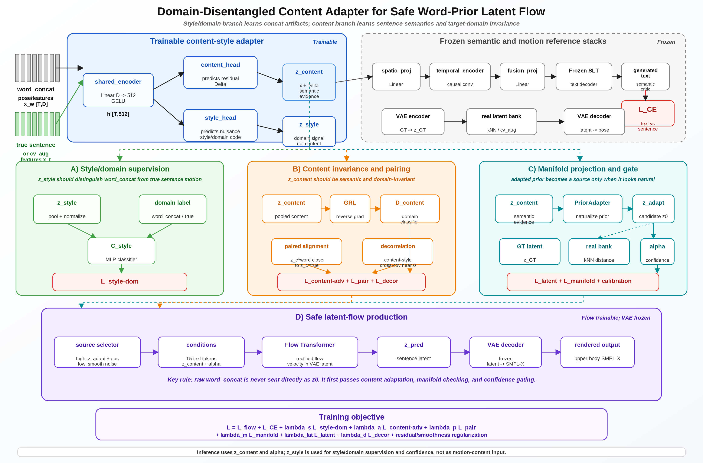

# Implementation Plan: Content-Style Adapter for Sign-Order Word-Pose Retrieval and Gated Latent Flow

**Target system:** SOKE upper-body SMPL-X sign-language production pipeline  
**Goal:** Given a sentence, retrieve word-pose dictionary clips in sign order, build a word-concat prior, extract content while isolating style/domain artifacts, project the prior toward the real sentence-motion manifold, and safely use it to condition or initialize latent flow generation.

> **Main design principle**  
> The word-pose dictionary should provide semantic evidence and sign-order candidates. It should **not** be forced into the flow model as the initial latent source unless it has been adapted, projected toward the natural sentence-motion manifold, and accepted by a confidence gate.

| Item | Plan |
|---|---|
| Primary output | A sign-ordered retrieval plan from the word-pose dictionary, plus a safe latent prior for the flow model. |
| Core modules | Sign-order retrieval, content-style adapter, style supervision, content invariance/pairing, manifold projection, confidence gate. |
| Safe default | Use adapted content as conditioning. Use the projected prior as \(z_0\) only when the gate is confident. |
| Training target | Make `word_concat` content close to true sentence content while keeping word-concat artifacts in the style/domain branch. |

---

## Table of contents

1. [Objective and expected behavior](#1-objective-and-expected-behavior)
2. [System context and motivation](#2-system-context-and-motivation)
3. [End-to-end improved pipeline](#3-end-to-end-improved-pipeline)
4. [Data objects and notation](#4-data-objects-and-notation)
5. [Sign-order word-pose retrieval module](#5-sign-order-word-pose-retrieval-module)
6. [Content-style adapter](#6-content-style-adapter)
7. [Style supervision module](#7-style-supervision-module)
8. [Content invariance and pairing module](#8-content-invariance-and-pairing-module)
9. [Manifold projection module](#9-manifold-projection-module)
10. [Gate module](#10-gate-module)
11. [Integration with latent flow matching](#11-integration-with-latent-flow-matching)
12. [Training schedule](#12-training-schedule)
13. [Losses and recommended weights](#13-losses-and-recommended-weights)
14. [Implementation file map](#14-implementation-file-map)
15. [Diagnostics, ablations, and acceptance criteria](#15-diagnostics-ablations-and-acceptance-criteria)
16. [Pseudocode and command skeletons](#16-pseudocode-and-command-skeletons)
17. [References and grounding notes](#17-references-and-grounding-notes)

---

## 1. Objective and expected behavior

**Goal.** Train a content-style adapter and safe retrieval prior so that a sentence-level input can retrieve an ordered sequence of word-pose dictionary clips in sign order, convert that sequence into a content-preserving prior, and use it safely in the SOKE latent flow model.

> **Two operating modes**  
> **Training / analysis mode:** given a ground-truth sentence pose, retrieve and align word-pose dictionary clips in sign order. This produces pseudo sign-order supervision and diagnostic retrieval plans.  
> **Generation mode:** given a text sentence, predict or infer sign order, retrieve word-pose clips, adapt them, and use the result as conditioning or a gated residual source for latent flow.

The final retrieval output should be a structured plan containing:

- word or gloss ID;
- selected dictionary clip ID;
- predicted sign-order position;
- start/end segment boundaries;
- per-item confidence;
- source diagnostics such as coverage, path score, and transition quality.

The final production output should be a natural sentence-level SMPL-X sequence decoded from latent flow, **not** a raw concatenation of dictionary clips.

The adapter should preserve translation-relevant content while isolating the following nuisance factors into a style/domain feature:

- word-concat artifacts;
- signer or dictionary-clip style;
- duration mismatch;
- hard word boundaries;
- missing coarticulation;
- phrase-level or sign-order mismatch;
- non-manual mismatch.

---

## 2. System context and motivation

### Current SOKE setup

The current SOKE flow pipeline supports two motion spaces:

```text
motion_space = smplx   -> compact 133D upper-body SMPL-X flow
motion_space = latent  -> frozen temporal VAE latent flow, then VAE decoding to compact SMPL-X
```

It also supports residual word-prior flow:

```text
sentence text
  -> word dictionary lookup
  -> concatenate word clips
  -> resample to target length
  -> use as residual source for flow
```

This is useful in principle, but the current word prior is simple lookup plus concatenation. It does not solve:

- sign order;
- timing;
- coarticulation;
- phrase-level retrieval;
- missing words;
- natural transitions;
- signer or clip-style mismatch.

### Observed problem

In the VAE latent space, the distance between the word-concat pose sequence and the true sentence pose is often larger than typical dataset pairwise distances. Therefore, raw `word_concat` is not a reliable prior. It is often an off-manifold and potentially misleading source.

> **Design response**  
> Use the dictionary sequence as lexical evidence, not as a guaranteed source state. First retrieve in sign order, then adapt content, remove style/domain artifacts, project toward the natural sentence-motion manifold, and finally gate whether the projected prior is safe enough for \(z_0\).

### Related modeling intuition

Recent structured sign-production work such as SignPR separates semantic-level structure from region/detail-level motion and also introduces temporal refinement. This supports the same high-level principle used here: semantic content, motion details, and temporal coherence should be modeled with separate mechanisms rather than a single flat concatenation.

---

## 3. End-to-end improved pipeline



**Figure 1.** Proposed content-style/domain-disentangled adapter with manifold projection, confidence gating, and safe latent-flow integration.

The key dataflow is:

```text
text or sentence pose
  -> sign-order retrieval from word-pose dictionary
  -> word_concat pose sequence
  -> frozen VAE encoder / visual feature extractor
  -> content-style adapter
  -> content tokens + style/domain diagnostics
  -> manifold projection
  -> confidence gate
  -> latent flow source selection
  -> frozen VAE decoder
  -> compact SMPL-X / render
```

The critical behavior is:

```text
Good projected prior:
  use z_proj + smooth noise as z0
  condition flow on text + content tokens + confidence

Bad projected prior:
  use smooth noise as z0
  still condition flow on text + content tokens + confidence
```

This avoids forcing the latent flow to start from a misleading word-concat source.

---

## 4. Data objects and notation

| Symbol | Meaning |
|---|---|
| `D_word` | Word-pose dictionary. Each entry stores word/gloss label, compact SMPL-X clip, VAE latent, content embedding, style/domain embedding, length, and signer/source metadata. |
| `x_sent` | Ground-truth sentence pose sequence in compact 133D SMPL-X, shape `[T, 133]`. |
| `z_sent` | Frozen VAE latent of `x_sent`, usually `[ceil(T/4), latent_dim]`. This approximates the natural sentence-motion manifold. |
| `x_word` | Word-concat pose sequence retrieved from `D_word` and resampled/aligned to the target length. |
| `z_word` | Frozen VAE latent of `x_word`. This is often off-manifold before adaptation. |
| `c` | Content representation. It should preserve sign meaning and be invariant to `word_concat` vs. true-sentence domain. |
| `s` | Style/domain representation. It should capture word-concat artifacts, dictionary source style, signer/style, duration mismatch, and coarticulation gaps. |
| `z_adapt` | Adapter output before manifold projection. Usually a residual correction of `z_word`. |
| `z_proj` | Projected prior latent after manifold projection. Candidate residual source for flow. |
| `alpha` | Gate confidence in `[0, 1]`. High `alpha` means the projected prior is safe enough to use as \(z_0\). |
| `retrieval_plan` | Ordered list of dictionary clips, segment boundaries, confidence, coverage, and transition scores. |

---

## 5. Sign-order word-pose retrieval module

**Purpose.** Replace naive sentence-word-order concatenation with a retrieval module that chooses dictionary clips in sign order and outputs a structured retrieval plan.

### 5.1 Dictionary preprocessing

1. Normalize every dictionary label: uppercase/lowercase consistently, punctuation removal, lemmatized variants, hyphenated gloss variants, plural/past/`-ing` variants.
2. Encode every dictionary pose clip with the frozen VAE to obtain `z_word_entry`.
3. Run the content-style adapter in dictionary mode to cache content embedding `c_entry` and style/domain embedding `s_entry`.
4. Store duration, frame count, signer/source ID, hand-validity statistics, and optional text embedding of the word/gloss label.
5. Build approximate-nearest-neighbor indices for content similarity, pose-latent similarity, and text/label similarity.

### 5.2 Pose-guided sign-order retrieval during training

This mode directly addresses your objective: **given a sentence pose, retrieve word-pose dictionary clips in sign order.** It should be used for pseudo-labeling, diagnostics, and training the text-to-sign-order planner. It should not be used to leak GT pose into a real text-only generation test.

```text
Input:
  x_sent: ground-truth sentence pose
  y: optional sentence text
  D_word: word-pose dictionary

Output:
  retrieval_plan = [
    (word_id, clip_id, start, end, confidence),
    ...
  ]
```

Procedure:

1. Encode `x_sent -> z_sent` and content tokens `c_sent`.
2. Propose temporal segments with a boundary detector or velocity/acceleration peaks.
3. For each segment, retrieve top-K dictionary clips by content similarity and duration compatibility.
4. Add text constraints when sentence text is available: candidate words should appear in the sentence or in an allowed synonym/gloss expansion set.
5. Use dynamic programming, CTC-style monotonic alignment, or DTW to select the ordered clip sequence.
6. Return the best path plus confidence and alternatives.

| Component | Recommended definition |
|---|---|
| Segment score | `cos(pool(c_segment), c_entry) - lambda_len * duration_penalty - lambda_style * style_artifact_penalty` |
| Text score | Lexical match, synonym/gloss expansion, or T5 similarity between sentence phrase and dictionary label. |
| Transition score | Smoothness between selected clip endpoints and adjacent segments; penalize hand/body discontinuities. |
| Path constraint | Monotonic temporal order; allow insertions, deletions, and repeated words if sign language requires it. |
| Output confidence | Softmax path margin, average segment similarity, coverage, and transition smoothness. |

### 5.3 Text-to-sign-order retrieval during generation

At inference for production, the system only has text, not GT pose. The text-to-sign-order planner should be trained using pseudo sign-order retrieval plans obtained in Section 5.2.

Recommended evolution:

- **v1 planner:** rule-based lexical order with longest-span matching and dictionary coverage score.
- **v2 planner:** Transformer sequence tagger that predicts ordered dictionary labels or pseudo-gloss IDs from text tokens.
- **v3 planner:** retrieval-augmented planner that retrieves similar training sentences, transfers their sign order, then fills missing words from the dictionary.

Always output top-K candidate plans, not just one plan, so the gate can reject low-confidence priors.

---

## 6. Content-style adapter

**Architecture.** Use a shared temporal encoder followed by two heads: a content head and a style/domain head. The content branch produces the adapted sequence used by SLT/flow conditioning. The style branch is explicitly trained to recognize `word_concat` vs. `true_sentence`/`cv_aug` domain and other nuisance factors.

```python
z_in = VAE.encode(x_word or x_sent)
h = shared_encoder(z_in, optional_text_tokens)

z_content = content_head(h)          # translation-relevant, domain-invariant
z_style   = style_head(h)            # domain/style/artifact-discriminative
z_adapt   = z_in + Delta_content     # residual; zero-init Delta head for stable start
```

Recommended details:

- Use residual output for `z_adapt` so the module starts near identity and learns corrections gradually.
- Use a bottleneck for `z_content` to prevent it from passing all style information through unchanged.
- Keep `z_style` out of the production forward path. Use it for supervision, diagnostics, and gate features.
- Use prior dropout so the flow model remains robust when the retrieved prior is poor.

Suggested v1 architecture:

| Component | Recommended v1 architecture | Notes |
|---|---|---|
| `shared_encoder` | Linear `Dz -> 512` + GELU + LayerNorm + 2 Transformer blocks | Can start with Linear+GELU if the dataset is small. |
| `content_head` | MLP or residual temporal block: `512 -> Dz` | Zero-init final layer so initial `z_adapt ≈ z_word`. |
| `style_head` | MLP: `512 -> Ds`, e.g. `Ds=128` or `256` | Do not zero-init if the style branch must learn immediately. |
| content bottleneck | Optional `Dc=256` or `512` before projecting to `Dz` | Prevents content from passing all nuisance information. |
| boundary features | Optional boundary mask added to encoder | Helps identify hard word-concat transitions. |

---

## 7. Style supervision module

**Main idea.** If the style feature is meaningful, it should distinguish `word_concat` sequences from true sentence / `cv_aug` pose sequences. This gives the style branch a positive task and prevents collapse.

| Item | Implementation |
|---|---|
| Domain label | `0 = word_concat / dictionary-composed sequence`; `1 = true sentence or cv_aug sentence feature`. |
| Classifier | MLP or small Transformer over pooled `z_style`. Output `p(real_sentence | z_style)`. |
| Loss | `L_style_domain = CE(C_style(pool(z_style)), domain_label)`. |
| Desired diagnostic | Style-domain accuracy should be high, e.g. `>85%`, while content-domain accuracy should be near chance after GRL. |
| Extra style labels | Signer ID, dictionary clip source ID, duration bucket, speed bucket, hand-dominance flag, augmentation type when available. |

> **Important constraint**  
> Style supervision alone is not enough. Without adversarial content-domain removal, the model may still leak word-concat artifacts through `z_content`. Therefore the style classifier must be paired with content-domain GRL and paired content alignment.

Optional style/nuisance labels can strengthen the branch:

```text
signer ID
source dictionary clip ID
source dataset
speed / duration bucket
left/right hand dominance
augmentation type
boundary density
```

---

## 8. Content invariance and pairing module

**Objective.** The content representation for a word-concat sequence and its corresponding true sentence pose should be close, even though their style/domain features are different.

> **Main rule**  
> For the same sentence, `word_concat` and true sentence pose should have different style/domain features but similar content features.

### 8.1 Content-domain adversarial loss

```python
domain_logits_content = D_content(GRL(pool(z_content)))
L_content_adv = CE(domain_logits_content, domain_label)

# D_content learns to classify domain.
# The content encoder receives reversed gradients.
# Desired: content-domain accuracy approaches 50%, meaning z_content is domain-invariant.
```

Expected diagnostic:

```text
style-domain accuracy: high
content-domain accuracy: near random, around 50% for two domains
```

### 8.2 Paired content alignment

For each paired sample \(i\):

```python
z_content_word_i = Adapter(word_concat_i).content
z_content_sent_i = Adapter(true_sentence_i).content

L_pair = || pool(z_content_word_i) - pool(z_content_sent_i) ||_1
```

Optional token-level pairing:

```text
align c_word_i and c_gt_i by time/DTW
then apply SmoothL1 per aligned step
```

### 8.3 Optional contrastive pairing

Use the same sentence as the positive pair and other sentences in the batch as negatives:

\[
L_{contrast} = -\log \frac{\exp(sim(c^{word}_i,c^{sent}_i)/\tau)}{\sum_j \exp(sim(c^{word}_i,c^{sent}_j)/\tau)}
\]

This prevents trivial collapse where all content embeddings become identical.

### 8.4 Semantic and latent regularization

Use frozen SLT/back-translation CE as a semantic regularizer if the adapted feature is passed through a frozen translation stack.

Use latent/pose loss when the adapted prior should become a valid motion prior, not only a translation-readable feature:

```text
L_latent = SmoothL1(z_adapt or z_proj, z_sent)
L_pose   = SmoothL1(VAE.decode(z_proj), x_sent)
L_vel    = SmoothL1(diff(VAE.decode(z_proj)), diff(x_sent))
L_accel  = SmoothL1(diff2(VAE.decode(z_proj)), diff2(x_sent))
```

---

## 9. Manifold projection module

**Purpose.** Move the adapted word-concat prior toward the latent distribution of real sentence-level sign motions learned by the frozen VAE. This directly fixes the observed off-manifold problem.

### 9.1 Real sentence latent bank

For every training sentence:

```text
x_sent -> frozen VAE encoder -> z_sent
store: pooled z_sent, full z_sent, text embedding, length, signer/source metadata

B_sent = {(z_sent_i, e_text_i, T_i, metadata_i)}
```

This bank approximates the natural sentence-motion manifold.

### 9.2 kNN projection v1

Start with kNN projection because it is simple and guarantees attraction toward real sentence latents.

```python
score_i = (
    lambda_text   * cos(e_text, e_i)
  - lambda_latent * dist(pool(z_adapt), pool(z_sent_i))
  - lambda_len    * abs(T - T_i)
)

TopK  = nearest real sentence latents by score
z_knn = weighted_average(resample(z_sent_i, T_latent) for i in TopK)
z_proj = (1 - rho) * z_adapt + rho * z_knn
```

Recommendations:

- Use text similarity to prevent projection from drifting toward a semantically unrelated sentence.
- Use length compatibility because aggressive resampling can damage the latent trajectory.
- Keep `rho` conservative at first, e.g. `0.3` to `0.7`.
- Save top-K neighbors and weights for debugging and paper figures.

### 9.3 Learned projection v2

After kNN projection proves useful, replace or augment it with a learned residual projection network.

```python
z_proj = z_adapt + ProjectionNet(
    z_adapt,
    text_tokens,
    retrieval_plan,
    confidence_features,
)
```

Recommended projection objective:

\[
L_{proj} = L_{latent}(z_{proj}, z_{sent})
+ \lambda_{pose} L_{pose}(VAE.decode(z_{proj}), x_{sent})
+ \lambda_{vel} L_{velocity}
+ \lambda_{accel} L_{acceleration}
+ \lambda_{NN} L_{nearest\_manifold}
+ \lambda_{delta} \|z_{proj} - z_{adapt}\|^2
\]

**Recommendation.** Implement kNN projection first, then train the learned projection network only after confirming that kNN projection reduces distance to GT and to the sentence-latent bank.

---

## 10. Gate module

**Purpose.** Decide whether the projected prior is safe enough to use as the flow source \(z_0\). Low-confidence priors should be used only as conditioning, while the flow source falls back to smooth latent noise.

| Gate feature | Meaning |
|---|---|
| `coverage` | Fraction of sentence words/sign candidates covered by dictionary retrieval. |
| `style_real_score` | Probability that adapted/projected feature looks like true sentence / `cv_aug` rather than `word_concat`. |
| `content_domain_score` | Content branch domain-invariance score; avoid high word-concat leakage. |
| `manifold_distance` | Distance from `z_proj` to nearest real sentence latents in `B_sent`. |
| `projection_norm` | `||z_proj - z_adapt||`. Very large correction indicates unreliable prior. |
| `SLT confidence` | Frozen SLT confidence or back-translation likelihood from adapted content. |
| `smoothness proxy` | Velocity/acceleration/jerk of `VAE.decode(z_proj)`. |
| `path_margin` | Difference between best and second-best retrieval plan scores. |

Gate prediction:

```python
alpha = GateMLP([
    coverage,
    style_real_score,
    content_domain_score,
    manifold_distance,
    projection_norm,
    slt_confidence,
    smoothness_proxy,
    path_margin,
])
```

Training oracle target:

```python
y_gate = 1 if (
    dist(z_proj, z_sent) < tau_GT
    and manifold_distance < tau_M
    and coverage > tau_cov
) else 0

L_gate = CE(alpha, y_gate)
```

> **Recommended gate behavior**  
> **Training:** use a stochastic hard gate, \(b \sim Bernoulli(\alpha)\), so the flow sees both prior and noise sources.  
> **Inference:** use a threshold hard gate. If \(\alpha \ge \tau\), use `z_proj + sigma * noise` as \(z_0\). Otherwise start from smooth latent noise.  
> Avoid simple linear interpolation between `z_proj` and noise at first, because it can create a strange source that is neither natural prior nor clean noise.

---

## 11. Integration with latent flow matching

**Safe latent source selection.** The flow model should always receive text tokens and adapted content tokens as conditioning. It should receive the projected prior as the source only when the gate accepts it.

```python
# Encode data
z_gt   = normalize_latent(VAE.encode(x_sent).mu)
z_word = normalize_latent(VAE.encode(x_word_concat).mu)

# Adapter and projection
z_content, z_style, z_adapt = Adapter(z_word, text_tokens)
z_proj = ManifoldProjector(z_adapt, text_tokens, retrieval_plan)
alpha = Gate(features(z_proj, z_adapt, z_style, retrieval_plan))

# Source selection
noise = smooth_latent_noise_like(z_gt)

if training:
    b = Bernoulli(alpha)
    z0 = b * (z_proj + sigma * noise) + (1 - b) * noise
else:
    z0 = z_proj + sigma * noise if alpha >= tau else noise

# Rectified flow objective
t = Uniform(0, 1)
zt = (1 - t) * z0 + t * z_gt
v_target = z_gt - z0
v_pred = Flow(
    zt,
    t,
    text_tokens=text_tokens,
    prior_tokens=z_content,
    prior_confidence=alpha,
)

L_flow = MSE(v_pred, v_target)
```

This preserves the residual-flow benefit when the prior is good, while safely reverting to noise when the prior is misleading.

---

## 12. Training schedule

| Phase | Name | Deliverable |
|---|---|---|
| Phase 0 | Diagnostics | Measure `d(z_word, z_GT)`, nearest-manifold distance, dictionary coverage, and raw word-concat rendering. |
| Phase 1 | Latent banks | Encode GT sentence poses and dictionary word poses with frozen VAE. Build ANN indices. |
| Phase 2 | Pose-guided retrieval | Retrieve sign-ordered dictionary clips from GT sentence poses. Save `retrieval_plan.jsonl` for each sample. |
| Phase 3 | Adapter | Train content-style adapter with style-domain supervision, content GRL, paired content loss, SLT/semantic loss, and optional latent/pose loss. |
| Phase 4 | Projection + gate | Train or calibrate manifold projection and gate. Start with kNN projection and rule gate, then train learned modules. |
| Phase 5 | Latent flow | Train latent flow with gated source selection and adapted content conditioning. Keep VAE frozen. |
| Phase 6 | Ablation and visual QA | Compare raw residual, noise-only, adapted conditioning, kNN-gated residual, and learned projection/gate. |

Recommended warm-up:

```text
Stage A: retrieval + latent-bank diagnostics only
Stage B: train adapter with L_pair + L_style_domain + weak L_content_adv
Stage C: add kNN projection + rule gate
Stage D: train flow with frozen adapter/projection/gate
Stage E: optionally joint fine-tune adapter/projection/flow with small LR
```

---

## 13. Losses and recommended weights

| Loss | Formula | Purpose | Start weight |
|---|---|---|---:|
| `L_style_domain` | `CE(C_style(z_style), domain)` | Train style to distinguish `word_concat` vs. true sentence / `cv_aug`. | `0.1` |
| `L_content_adv` | `CE(D_content(GRL(z_content)), domain)` | Remove domain/style information from content. | `0.05-0.1` |
| `L_pair` | `||pool(c_word) - pool(c_sent)||_1 + contrastive` | Align paired word-concat and true sentence content. | `1.0` |
| `L_CE / SLT` | `CE(frozen_SLT(z_adapt), text)` | Keep content translation-relevant. | `1.0` |
| `L_latent` | `SmoothL1(z_proj, z_sent)` | Make projected prior close to GT latent. | `1.0` |
| `L_pose/vel/accel` | decoded pose temporal losses | Ensure projected latent decodes into valid motion. | `0.5 / 0.5 / 0.25` |
| `L_NN` | nearest sentence-manifold loss | Keep `z_proj` close to real sentence latent bank. | `0.05` |
| `L_delta` | `||Delta_content||^2 + ||z_proj - z_adapt||^2` | Prevent overcorrection and shortcut solutions. | `0.001` |
| `L_decor` | `mean((c^T s)^2)` | Encourage content/style statistical separation. | `0.01` |
| `L_gate` | `CE(alpha, y_gate)` | Learn when prior is trustworthy. | `0.1` |
| `L_flow` | `MSE(v_pred, z_gt - z0)` | Train final latent flow velocity field. | `1.0` |

> **Warm-up strategy**  
> Do not turn on all adversarial losses at full weight from step 0. Start with paired content + semantic/latent losses, then ramp style-domain and content-GRL losses over the first 10-20% of training. Add CDAN only after the adapter preserves content reliably.

Recommended total objective:

```text
L_total =
  L_flow
+ lambda_proj      * L_latent
+ lambda_pose      * (L_pose + L_vel + L_accel)
+ lambda_style     * L_style_domain
+ lambda_adv       * L_content_adv
+ lambda_pair      * (L_pair + L_contrast)
+ lambda_gate      * L_gate
+ lambda_decor     * L_decor
+ lambda_delta     * ||z_proj - z_adapt||^2
+ lambda_smooth    * smoothness_loss(z_proj)
```

---

## 14. Implementation file map

| File | Responsibility |
|---|---|
| `flow/sign_order_retrieval.py` | Dictionary cache, pose-guided retrieval, dynamic programming path search, retrieval plan export. |
| `flow/content_style_adapter.py` | Shared encoder, content head, style head, GRL domain heads, pair/contrastive utilities. |
| `flow/manifold_projection.py` | Sentence latent bank, kNN projection, learned projection network. |
| `flow/gate.py` | GateMLP, oracle gate label construction, rule-based gate fallback. |
| `flow/prior_conditioning.py` | Packaging of text tokens, content tokens, confidence alpha, masks, and retrieval metadata for flow. |
| `flow/train_adapter.py` | Stage 3 adapter training loop. |
| `flow/train_projection_gate.py` | Stage 4 projection/gate training or calibration. |
| `flow/train_text_conditional.py` | Add `source_mode=gated_residual` and `prior_tokens` conditioning. |
| `flow/sample_text_conditional.py` | Load adapter/projector/gate; perform sign-order retrieval and gated source selection at inference. |
| `tools/prepare_sentence_latent_bank.py` | Offline VAE encoding of true sentence poses. |
| `tools/prepare_word_dictionary_bank.py` | Offline VAE encoding and feature caching of word dictionary clips. |
| `tools/evaluate_prior_quality.py` | Compute prior-to-GT distance, manifold distance, gate AUC, retrieval quality, and visual diagnostics. |

---

## 15. Diagnostics, ablations, and acceptance criteria

### 15.1 Required diagnostics

Prior quality:

```text
d(z_word, z_GT)
d(z_adapt, z_GT)
d(z_proj, z_GT)
nearest-manifold distance before/after projection
```

Style/content separation:

```text
style-domain classifier accuracy: high
content-domain classifier accuracy after GRL: near chance
```

Pairing:

```text
same-sentence content similarity > different-sentence content similarity
```

Retrieval:

```text
dictionary coverage
sign-order path confidence
segment-level Top-K retrieval accuracy
transition smoothness
```

Gate:

```text
gate AUC against oracle y_gate
prior usage rate
false accept rate
false reject rate
```

Flow:

```text
noise-only latent flow
raw residual latent flow
adapted-content conditioning flow
gated residual flow
projected/gated residual flow
```

### 15.2 Ablation table to report

| Variant | Setting | Question answered |
|---|---|---|
| A0 | Noise-only latent flow | Baseline generation without word prior. |
| A1 | Raw word-concat residual | Shows why naive prior can be misleading. |
| A2 | Content adapter only | Tests whether content conditioning helps without projection/gate. |
| A3 | + style supervision | Tests whether style branch becomes meaningful. |
| A4 | + content GRL + pairing | Tests domain-invariant semantic content. |
| A5 | + kNN projection | Tests manifold naturalization. |
| A6 | + learned projection + gate | Full system. |
| A7 | Gate disabled | Shows whether unsafe priors damage flow quality. |

### 15.3 Acceptance criteria

> **Definition of done**  
> Given a GT sentence pose, the system outputs a sign-ordered retrieval plan from `D_word` with segment boundaries and confidence.  
> The adapted/projected prior is closer to `z_GT` and to the sentence-latent bank than raw `word_concat`.  
> The gate rejects low-quality projected priors and prevents them from being used as \(z_0\).  
> When used in latent flow, gated residual generation is at least as stable as noise-only flow and improves semantic alignment when the gate confidence is high.

---

## 16. Pseudocode and command skeletons

### 16.1 Pose-guided retrieval pseudocode

```python
def retrieve_sign_order_from_pose(x_sent, text=None, D_word=None):
    z_sent = vae.encode(normalize_pose(x_sent)).mu
    c_sent = adapter.encode_content(z_sent, text_tokens=text)
    segments = propose_segments(x_sent, z_sent)

    candidates = []
    for seg in segments:
        c_seg = pool(c_sent[seg.start:seg.end])
        topk = D_word.search_by_content(c_seg, k=K)
        if text is not None:
            topk = apply_text_candidate_filter(topk, text)
        candidates.append(topk)

    path = dynamic_programming_path_search(
        candidates,
        segment_scores=True,
        transition_penalty=True,
        monotonic=True,
    )
    return path.to_retrieval_plan()
```

### 16.2 Training batch pseudocode

```python
batch = dataset.sample()
x_sent, text = batch.pose, batch.text

retrieval_plan = retrieve_sign_order_from_pose(x_sent, text, D_word)
x_word = compose_word_concat(
    retrieval_plan,
    target_length=len(x_sent),
)

z_sent = encode_latent(x_sent)
z_word = encode_latent(x_word)

z_content, z_style, z_adapt = adapter(z_word, text_tokens)
z_proj = projector(z_adapt, text_tokens, retrieval_plan)
alpha = gate(make_gate_features(z_proj, z_adapt, z_style, retrieval_plan))

loss_adapter = (
    L_style_domain
    + L_content_adv
    + L_pair
    + L_CE
    + L_decor
)

loss_proj_gate = (
    L_latent
    + L_pose_vel_accel
    + L_NN
    + L_gate
)

loss_flow = gated_latent_flow_loss(
    z_sent,
    z_proj,
    z_content,
    alpha,
    text_tokens,
)
```

### 16.3 Flow training step

```python
def flow_train_step(text, x_sent, x_word, retrieval_plan):
    text_tokens = t5(text)

    z_gt = latent_codec.encode_normalized(x_sent)
    z_word = latent_codec.encode_normalized(x_word)

    z_content, z_style, z_adapt = adapter(z_word, text_tokens)
    z_proj = projection(z_adapt, text_tokens, retrieval_plan)
    alpha = gate(make_gate_features(z_proj, z_adapt, z_content, z_style, retrieval_plan))

    noise = smooth_latent_noise_like(z_gt)
    use_prior = sample_or_threshold(alpha)
    z0 = torch.where(
        use_prior,
        z_proj + sigma * noise,
        noise,
    )

    t = torch.rand(z_gt.shape[0], device=z_gt.device)
    zt = (1 - t[:, None, None]) * z0 + t[:, None, None] * z_gt
    v_target = z_gt - z0

    v_pred = flow(
        zt,
        t,
        text_tokens=text_tokens,
        prior_tokens=z_content,
        alpha=alpha,
    )

    loss = mse(v_pred, v_target)
    loss = loss + aux_loss_weight * adapter_projection_gate_losses.total
    return loss
```

### 16.4 Example CLI skeletons

```bash
# 1. Build banks
python -m tools.prepare_sentence_latent_bank \
  --data_dir DATA \
  --vae_checkpoint VAE \
  --out banks/sentence_latents.pt

python -m tools.prepare_word_dictionary_bank \
  --word_data_dir WORDS \
  --vae_checkpoint VAE \
  --out banks/word_dictionary.pt

# 2. Generate pose-guided pseudo sign-order plans
python -m flow.sign_order_retrieval \
  --data_dir DATA \
  --word_bank banks/word_dictionary.pt \
  --out plans/train_retrieval_plans.jsonl

# 3. Train adapter
python -m flow.train_adapter \
  --data_dir DATA \
  --plans plans/train_retrieval_plans.jsonl \
  --sentence_bank banks/sentence_latents.pt \
  --word_bank banks/word_dictionary.pt \
  --out_dir experiments/adapter/content_style_v1

# 4. Train projection/gate
python -m flow.train_projection_gate \
  --adapter experiments/adapter/content_style_v1/best.pt \
  --sentence_bank banks/sentence_latents.pt \
  --out_dir experiments/adapter/proj_gate_v1

# 5. Train latent flow with gated residual source
python -m flow.train_text_conditional \
  --motion_space latent \
  --source_mode gated_residual \
  --adapter_checkpoint experiments/adapter/content_style_v1/best.pt \
  --projector_gate_checkpoint experiments/adapter/proj_gate_v1/best.pt \
  --text_conditioning token_prefix \
  --model_size base
```

---

## 17. References and grounding notes

1. **SOKE Upper-Body SMPL-X Flow-Matching Pipeline.** Internal implementation document describing compact 133D SMPL-X, frozen T5 conditioning, latent flow through a frozen VAE, and residual word-prior flow.
2. **Liu et al., SignPR: A Progressive Vector-Quantized Diffusion Framework for Sign Language Production.** The paper motivates structured semantic/detail modeling and temporal refinement for sign-language production.

---

## Summary recommendation

Use text/pose dictionary retrieval to construct `word_concat`, train the content-style adapter with domain-supervised style and domain-invariant paired content, apply kNN manifold projection, then use a hard gate. Feed content tokens to latent flow always, but use `z_proj` as \(z_0\) only when `alpha` is high.

This preserves the useful part of the word dictionary—lexical/sign evidence in order—while avoiding the failure mode where a geometrically bad word-concat sequence becomes a misleading residual source. It also creates clear diagnostics: if the adapted/projected prior does not become closer to the GT and the sentence-motion manifold, the gate should reject it and the flow should safely fall back to noise.
