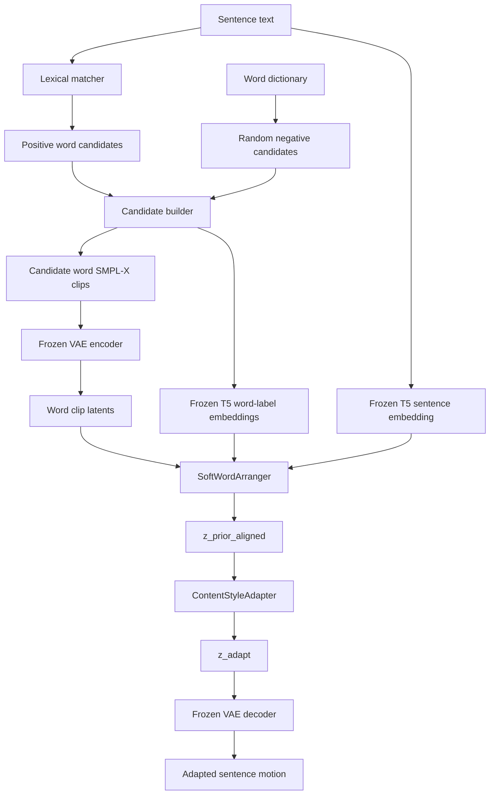

# SOKE Soft Word Arranger

This document explains the soft word arranger used by the content-style adapter pipeline. The short version is:

```text
unordered word-pose candidates + sentence text
  -> SoftWordArranger
  -> sentence-length latent prior
  -> ContentStyleAdapter
  -> adapted sentence latent
```

The goal is to stop depending on a fixed concatenation of word poses. A sentence may not sign words in English order, some words may be skipped, and a pure concatenation has no coarticulation. The soft arranger treats word clips as an unordered memory bank, learns which clips are useful, and learns where their latent motion tokens should contribute over the sentence timeline.

## Motivation

The original retrieval prior is:

```text
sentence text
  -> lexical word matching
  -> word clips in text order
  -> concatenate poses
  -> resample to sentence length
```

This is useful as a weak prior, but it bakes in a strong assumption:

```text
English word order == useful signing motion order
```

For sign language, that assumption is fragile. The same meaning can be expressed with different ordering, omissions, classifiers, facial expression, and coarticulation. The arranger is a first step toward making the word dictionary useful without forcing the dictionary clips into a hard sequence.

## Files

Main implementation:

```text
flow/temporal_word_attention.py
```

Training integration:

```text
flow/train_adapter.py
```

Evaluation integration:

```text
flow/evaluate_adapter.py
```

Slurm launcher:

```text
scripts/flow/train_adapter_sbatch.sh
```

Broader adapter overview:

```text
docs/flow/adapter/soke_content_style_adapter.md
```

## High-Level Pipeline



Trainable modules:

```text
SoftWordArranger
ContentStyleAdapter
```

Frozen modules:

```text
Temporal SMPL-X VAE
T5 text encoder
```

## Candidate Builder

The candidate builder is `WordCandidateBuilder` in:

```text
flow/temporal_word_attention.py
```

It reuses the lexical matching logic from:

```text
flow/residual_prior.py::WordMotionPrior
```

For a sentence:

```text
positive candidates = word clips matched by lexical lookup
negative candidates = random word clips from the dictionary
candidate order     = shuffled during training
```

Current defaults:

```text
num_word_candidates     = 32
num_negative_candidates = 16
candidate_selection     = flat
max_positive_variants_per_key = 0
shuffle_word_candidates = true
```

When a word dictionary contains many variants for the same lexicon key, the flat
selector can spend most positive slots on one repeated word before later matched
words are reached. Use round-robin selection with a per-key cap to spread the
positive budget across matched words:

```bash
--candidate-selection round_robin \
--max-positive-variants-per-key 2
```

With `num_word_candidates=32` and `num_negative_candidates=16`, this gives the
soft arranger up to 16 positive slots, filled as `word_a_1, word_b_1, ...,
word_a_2, word_b_2, ...` before random negatives are added.

The positive candidates are weak labels, not ground-truth sign-order labels. They mean:

```text
This word was found in the sentence by the lexical matcher.
```

They do not mean:

```text
This word clip must appear at this exact sentence time.
```

### Lexical Matching

The matcher uppercases text, splits it into alphanumeric tokens, and applies simple variants:

```text
PLURALS:  WORDS -> WORD
PAST:     HELPED -> HELP / HELPE
GERUND:   HELPING -> HELP / HELPE
IES:      CITIES -> CITY
```

It searches longest spans first, so multi-token word entries can be matched when they exist in the word dictionary.

### Candidate Batch Tensors

`WordCandidateBuilder.batch(...)` returns:

```text
motion:         [B, K, Tw, Dmotion]
frame_mask:     [B, K, Tw]
candidate_mask: [B, K]
labels:         [B, K]
texts:          list[list[str]]
names:          list[list[str]]
stats:          list[dict]
```

Meanings:

```text
B       batch size
K       number of candidate slots
Tw      max candidate word-clip length in the batch
Dmotion VAE input dimension, currently 256 for rot6d
```

The candidate motion is normalized with the same motion mean/std used by the sentence dataset and VAE.

## Text Features

The arranger uses:

```text
flow/text_encoder.py::FrozenT5TextEncoder
```

Default model:

```text
deps/flan-t5-base
```

The T5 encoder is frozen. The checkpoint stores only config values such as:

```text
text_model_path
text_dim
max_text_tokens
pooling = mean
frozen = true
```

It does not save T5 weights.

### Sentence Text

For each sentence:

```text
sentence_text_feature = mean_pool(T5(sentence_text))
sentence_text_feature: [B, 768]
```

### Word Text

For each candidate word label:

```text
word_text_feature = mean_pool(T5(word_label))
word_text_feature: [B, K, 768]
```

The implementation uses pooled text features in v1. Token-level T5 features are available in the helper, but the arranger does not use them yet.

## Word Motion Latents

Each candidate word motion is encoded through the frozen VAE:

```text
word compact SMPL-X
  -> rot6d representation
  -> VAE normalization
  -> frozen VAE encoder
  -> deterministic mu latent
  -> adapter latent normalization
```

Implemented in:

```text
flow/train_adapter.py::encode_word_candidates
```

The output is:

```text
word_latents:     [B, K, Lw, Dz]
word_latent_mask: [B, K, Lw]
```

For the current VAE:

```text
Dz = 256
Lw <= max_word_latent_frames
```

The adapter latent normalization uses train-split latent stats:

```text
z_norm = (z_raw - latent_mean) / latent_std
```

These latent stats are saved in the adapter checkpoint.

## SoftWordArranger Architecture

Main class:

```text
flow/temporal_word_attention.py::SoftWordArranger
```

Default architecture:

```text
latent_dim  = 256
text_dim    = 768
hidden_dim  = 512
num_heads   = 8
dropout     = 0.0
max_frames  = 100
max_word_latent_frames = 64
```

Inputs:

```text
sentence_text:      [B, Dt]
word_text:          [B, K, Dt]
word_latents:       [B, K, Lw, Dz]
word_latent_mask:   [B, K, Lw]
candidate_mask:     [B, K]
target_latent_mask: [B, Ls]
```

Outputs:

```text
z_prior_aligned:  [B, Ls, Dz]
attention:        [B, Ls, K, Lw]
null_attention:   [B, Ls]
word_gate_logits: [B, K]
word_gate_probs:  [B, K]
word_usage:       [B, K]
null_usage:       [B]
```

Here:

```text
Dt = T5 embedding dimension, currently 768
Dz = VAE latent dimension, currently 256
Ls = target sentence latent length, ceil(T / 4)
Lw = word candidate latent length
```

## Query, Memory, And Gate

The arranger creates a target query for each sentence latent time step:

```text
q_input[t] =
  target_position_embedding[t]
  + sentence_projection(sentence_text_feature)
```

Each word memory token is:

```text
m[k,u] =
  word_motion_projection(word_latent[k,u])
  + word_text_projection(word_text_feature[k])
  + local_word_phase_embedding[u]
```

There is no candidate-order embedding. This is deliberate. The only temporal position given to a word clip is local phase inside the word clip, not its index in the candidate list.

The gate predicts whether each candidate should be useful:

```text
gate_features[k] =
  sentence_feature
  word_text_feature[k]
  pooled_word_motion_feature[k]
  sentence_feature * word_text_feature[k]

word_gate_logits[k] = MLP(gate_features[k])
word_gate_probs[k]  = sigmoid(word_gate_logits[k])
```

The gate is not a hard selector. It is a soft bias in attention.

## Custom Attention

The arranger uses custom multi-head attention instead of `nn.MultiheadAttention` because it needs to inject the gate as a candidate-level score bias.

For target time `t`, candidate `k`, and word latent frame `u`:

```text
score[t,k,u] =
  dot(query[t], key[k,u]) / sqrt(head_dim)
  + log(word_gate_probs[k] + eps)
  + mask
```

Then:

```text
attention = softmax(score over all candidate word tokens and NULL token)
z_prior_aligned[t] = output_projection(weighted_sum(value tokens))
```

The gate bias is repeated over all latent frames of a candidate word clip. A high gate makes all tokens in that candidate easier to attend to; a low gate suppresses the whole candidate.

## NULL Memory Token

The arranger appends one learned NULL memory token. This lets the model say:

```text
No candidate word clip should explain this target time step.
```

The NULL token is important because:

```text
1. Some sentence motion is coarticulation or transition.
2. Some words in English text are not signed explicitly.
3. The dictionary may not contain the right word or gloss.
4. Negative candidates should be ignorable.
```

`null_usage` reports average attention mass assigned to this NULL token.

## Why It Is Order-Robust

The candidate list is treated as a memory bank:

```text
candidate 0, candidate 1, ..., candidate K-1
```

No candidate-index positional embedding is added. During training, candidates are shuffled:

```text
--shuffle-word-candidates
```

Therefore, the model cannot rely on:

```text
candidate index 0 appears before candidate index 1
```

It must use:

```text
sentence text feature
word text feature
word motion feature
local word phase
attention over target latent time
```

This does not mathematically guarantee perfect permutation invariance, because the flattened attention tensor still has an arbitrary token order. But since no learnable candidate-index embedding exists and training shuffles candidates, the intended behavior is robust to candidate ordering.

## Training Losses

The soft arranger is trained jointly with the `ContentStyleAdapter`.

The arranger-specific losses are:

```text
arranger_prior_loss = SmoothL1(z_prior_aligned, z_sent)
gate_bce_loss       = BCE(word_gate_logits, weak lexical labels)
gate_sparsity_loss  = mean(word_gate_probs over valid candidates)
null_usage_loss     = mean(null_usage)
group_coverage_loss = unordered lower-bound usage over matched word occurrences
group_entropy_peak = per-frame entropy hinge over matched occurrence groups
attention_variation = hinge loss against frozen frame-to-frame attention
prior_velocity_loss = SmoothL1(diff(z_prior_aligned), diff(z_sent))
prior_accel_loss    = SmoothL1(diff2(z_prior_aligned), diff2(z_sent))
variance_floor_loss = prevents z_prior_aligned temporal std collapsing below GT
negative_usage_loss = mean attention usage on random negative candidates
```

Default weights:

```text
arranger_prior_loss_weight  = 1.0
gate_bce_loss_weight        = 0.1
gate_sparsity_loss_weight   = 0.01
attention_smoothness_weight = 0.0
null_usage_loss_weight      = 0.01
group_coverage_loss_weight  = 0.02
group_coverage_mass         = 0.5
group_entropy_peak_loss_weight = 0.0
group_entropy_peak_target      = 0.6931471805599453  # log(2)
attention_variation_loss_weight = 0.01
attention_variation_target      = 0.05
prior_velocity_loss_weight      = 0.25
prior_accel_loss_weight         = 0.05
prior_variance_floor_loss_weight = 0.05
prior_variance_floor_ratio       = 0.5
negative_usage_loss_weight       = 0.02
```

The group entropy peakiness loss first sums token attention into matched occurrence groups, renormalizes over positive groups at each target frame, and penalizes frames whose group entropy is above the target. It encourages clear per-frame group choices without imposing an English lexical order.

These anti-collapse losses do not use English lexical span order as a temporal target. Matched word occurrences are treated as an unordered bag, because English word order may not match sign-language order.

The full adapter losses are still active:

```text
latent loss
decoded pose loss
decoded velocity loss
decoded acceleration loss
decoded jerk loss
style/domain loss
content pair loss
delta regularization
```

Training monitors several useful diagnostics:

```text
latent_word         raw concat prior -> GT latent distance
latent_prior        soft arranger prior -> GT latent distance
latent              adapted output -> GT latent distance
latent_prior_gain   latent_word - latent_prior
latent_adapt_gain   latent_prior - latent
gate_pos            mean gate prob for weak positives
gate_neg            mean gate prob for random negatives
word_usage_pos      mean attention usage for weak positives
word_usage_neg      mean attention usage for random negatives
null_usage          attention mass on NULL token
attention_smooth    temporal variation in attention
attention_temporal_l1 frame-to-frame attention movement
attention_frame_cosine frame-to-frame attention cosine similarity
group_coverage      fraction of selected matched occurrence groups above the coverage floor
group_usage_total   total attention mass assigned to matched occurrence groups
group_usage_max     largest single matched-group usage
group_entropy       per-frame matched-group attention entropy
group_peak_prob     average max matched-group probability per frame
prior_latent_std    temporal std of the arranger prior latent
gt_latent_std       temporal std of the GT sentence latent
prior_delta_rms     frame-delta RMS of the arranger prior latent
gt_delta_rms        frame-delta RMS of the GT sentence latent
prior_cov           lexical word coverage
prior_matches       matched word count
```

Good signs during training:

```text
latent_prior < latent_word
latent < latent_prior
gate_pos > gate_neg
word_usage_pos > word_usage_neg
null_usage is nonzero but not dominant
```

## Training Command

Current Slurm command:

```bash
sbatch scripts/flow/train_adapter_sbatch.sh \
  --run-name chatsign175_soft_arranger_adapter_b16_online \
  --data-dir /media/cvpr/haomian/data/SOKE_FLOW/chatsign_175 \
  --word-data-dir /media/cvpr/haomian/data/SOKE_FLOW/chatsign_175_word \
  --vae-checkpoint experiments/flow/VAE/chatsign175_sentence_word_joint_rot6d_vae_b32/checkpoints/best.pt \
  --prior-mode soft_arranger \
  --text-model-path deps/flan-t5-base \
  --num-word-candidates 32 \
  --num-negative-candidates 16 \
  --candidate-selection round_robin \
  --max-positive-variants-per-key 2 \
  --batch-size 16 \
  --epochs 1000 \
  --val-every 10 \
  --save-every 100 \
  --save-last-every 10 \
  --save-top-k 3 \
  --wandb-online
```

Resume for 1000 more epochs after epoch 1000:

```bash
sbatch scripts/flow/train_adapter_sbatch.sh \
  --run-name chatsign175_soft_arranger_adapter_b16_online \
  --data-dir /media/cvpr/haomian/data/SOKE_FLOW/chatsign_175 \
  --word-data-dir /media/cvpr/haomian/data/SOKE_FLOW/chatsign_175_word \
  --vae-checkpoint experiments/flow/VAE/chatsign175_sentence_word_joint_rot6d_vae_b32/checkpoints/best.pt \
  --prior-mode soft_arranger \
  --text-model-path deps/flan-t5-base \
  --num-word-candidates 32 \
  --num-negative-candidates 16 \
  --batch-size 16 \
  --epochs 2000 \
  --val-every 10 \
  --save-every 100 \
  --save-last-every 10 \
  --save-top-k 3 \
  --resume-from-checkpoint experiments/flow/adapter/chatsign175_soft_arranger_adapter_b16_online/checkpoints/last.pt \
  --wandb-online \
  --wandb-id 7dc9fwu2 \
  --wandb-resume must
```

Note that `--epochs` is the total target epoch. It is not the additional epoch count.

## Evaluation Command

Evaluate a soft-arranger checkpoint:

```bash
/media/cvpr/haomian/python_envs/soke/bin/python -m flow.evaluate_adapter \
  --checkpoint experiments/flow/adapter/chatsign175_soft_arranger_adapter_b16_online/checkpoints/best.pt \
  --split test \
  --index 0 \
  --num_samples 169 \
  --out_dir visualize/adapter_soft_arranger_best_test \
  --device cuda
```

Evaluate with shuffled candidates:

```bash
/media/cvpr/haomian/python_envs/soke/bin/python -m flow.evaluate_adapter \
  --checkpoint experiments/flow/adapter/chatsign175_soft_arranger_adapter_b16_online/checkpoints/best.pt \
  --split test \
  --index 0 \
  --num_samples 169 \
  --out_dir visualize/adapter_soft_arranger_best_test_shuffle \
  --device cuda \
  --shuffle_word_candidates \
  --candidate_seed 123
```

Candidate-shuffle evaluation is useful because the whole reason for the arranger is to avoid dependence on input word order.

## Evaluation Outputs

Soft-arranger evaluation writes:

```text
gt_XX.npz
raw_concat_prior_XX.npz
soft_arranger_prior_XX.npz
adapted_XX.npz
attention_XX.npz
metrics.json
```

Meaning:

```text
gt_XX.npz                  ground-truth sentence motion
raw_concat_prior_XX.npz    old lexical concat prior
soft_arranger_prior_XX.npz arranger prior before adapter
adapted_XX.npz             final adapter output
attention_XX.npz           gates, usage, attention maps, candidate names
metrics.json               latent and pose-space metrics
```

The adapted NPZ also stores:

```text
coarse_motion
coarse_smplx
```

For soft-arranger mode, these are the soft-arranger prior, not the raw concat prior. This lets the existing three-way renderer show:

```text
GT | adapted output | soft-arranger prior
```

## Attention File

Each `attention_XX.npz` contains:

```text
attention:        [Ls, K, Lw]
word_gate_probs:  [K]
word_usage:       [K]
null_usage:       scalar
candidate_mask:   [K]
candidate_labels: [K]
candidate_group_ids: [K]
group_mask:       [G]
group_usage:      [G]
group_texts:      [G]
candidate_names:  [K]
candidate_stats:  JSON string
attention_temporal_l1: scalar
attention_frame_cosine: scalar
prior_latent_std: scalar
gt_latent_std: scalar
prior_delta_rms: scalar
gt_delta_rms: scalar
```

How to interpret:

```text
word_gate_probs[k]
  candidate-level probability from the gate MLP

word_usage[k]
  actual average attention mass assigned to candidate k over target time

candidate_labels[k]
  weak label: 1 for lexical positive, 0 for random negative

candidate_group_ids[k]
  matched occurrence group for positive candidates, -1 for negatives or padding

group_usage[g]
  average attention mass assigned to matched occurrence group g

null_usage
  average attention mass assigned to the learned NULL token
```

High `word_gate_probs` but low `word_usage` can happen when the candidate is considered relevant overall but not chosen by time-step attention. Low gate and low usage usually means the module ignored that candidate.

## Quick Attention Inspection

Example:

```bash
/media/cvpr/haomian/python_envs/soke/bin/python - <<'PY'
import json
import numpy as np

path = "visualize/adapter_soft_arranger_best_test/attention_00.npz"
data = np.load(path, allow_pickle=True)
names = data["candidate_names"].astype(str)
mask = data["candidate_mask"].astype(bool)
labels = data["candidate_labels"]
gates = data["word_gate_probs"]
usage = data["word_usage"]

rows = []
for idx, name in enumerate(names):
    if not mask[idx]:
        continue
    rows.append((float(usage[idx]), float(gates[idx]), int(labels[idx]), name))

for usage_value, gate_value, label, name in sorted(rows, reverse=True)[:12]:
    print(f"usage={usage_value:.4f} gate={gate_value:.4f} label={label} name={name}")
print("null_usage:", float(data["null_usage"]))
print("candidate_stats:", json.loads(str(data["candidate_stats"])))
PY
```

This is one of the most useful debugging views. It tells us whether the arranger is using real lexical matches, ignoring negatives, or collapsing into NULL.

## Visualization

Render adapted output against GT:

```bash
/media/cvpr/haomian/python_envs/soke/bin/python -m flow.visualize.visualize_compare_npz \
  --gt_npz visualize/adapter_soft_arranger_best_test/gt_00.npz \
  --pred_npz visualize/adapter_soft_arranger_best_test/adapted_00.npz \
  --out_dir visualize/adapter_soft_arranger_best_test/render \
  --view_transform none
```

Render GT, adapted output, and soft-arranger prior:

```bash
/media/cvpr/haomian/python_envs/soke/bin/python -m flow.visualize.visualize_compare_three_npz \
  --gt_npz visualize/adapter_soft_arranger_best_test/gt_00.npz \
  --pred_npz visualize/adapter_soft_arranger_best_test/adapted_00.npz \
  --out_dir visualize/adapter_soft_arranger_best_test/render_three \
  --view_transform none
```

Render raw concat prior directly:

```bash
/media/cvpr/haomian/python_envs/soke/bin/python -m flow.visualize.visualize_compare_npz \
  --gt_npz visualize/adapter_soft_arranger_best_test/gt_00.npz \
  --pred_npz visualize/adapter_soft_arranger_best_test/raw_concat_prior_00.npz \
  --out_dir visualize/adapter_soft_arranger_best_test/render_raw_concat \
  --view_transform none
```

## What The Arranger Is And Is Not

The soft arranger is:

```text
a differentiable word-memory alignment module
a soft selector over candidate word clips
a whole-sequence latent prior generator
an order-robust replacement for fixed word concatenation
```

The soft arranger is not yet:

```text
a true gloss planner
a hard word-order predictor
a language model
a full sentence generator by itself
a held-out generalization solution
```

It produces a better prior, then the `ContentStyleAdapter` still has to correct the prior toward sentence-style motion.

## Current Caveats

The current dataset split is:

```text
train = val = test = 169 ChatSign sentence samples
```

Therefore, current results measure in-dataset fitting and robustness, not generalization to unseen signing.

The weak lexical labels are imperfect. A positive lexical match can still be the wrong sign realization, and a random negative can occasionally be semantically or visually useful.

The current text features are pooled T5 embeddings. They do not provide token-level alignment between sentence words and candidate words. Token-level conditioning could be added later.

The current arranger works in VAE latent space. Its output quality depends on the VAE reconstruction quality and the latent normalization used during training.

## Recommended Checks

After each training run:

```text
1. Check that latent_prior_l1 is lower than word_latent_l1.
2. Check that adapted_latent_l1 is lower than prior_latent_l1.
3. Compare shuffled-candidate metrics against normal metrics.
4. Inspect attention_XX.npz for top word usage and gate probabilities.
5. Render GT vs adapted vs soft-arranger prior.
6. Compare soft_arranger_prior_XX.npz against raw_concat_prior_XX.npz.
```

The most important acceptance pattern is:

```text
raw concat prior  -> rough lexical motion
soft arranger     -> better ordered/selected latent prior
adapter output    -> closer sentence-style motion
```
