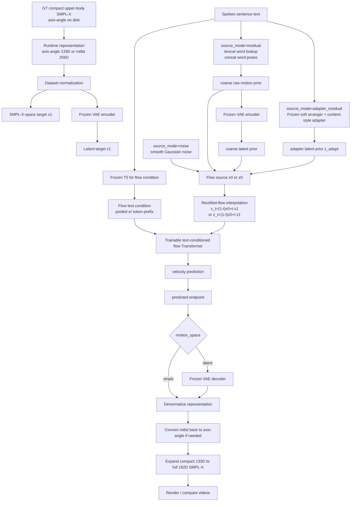

# SOKE Upper-Body SMPL-X Flow-Matching Pipeline

This document describes the current continuous SMPL-X flow-matching pipeline for SOKE.

The purpose of this pipeline is to replace the old discrete motion-token generation path:

```text
text -> LM -> VQ motion token IDs -> VQ decoder -> SMPL-X render
```

with a direct continuous generation path:

```text
text -> text-conditioned flow model -> upper-body SMPL-X parameters -> SMPL-X render
```

The current implementation lives under `flow/`. It supports:

- unconditional flow matching, used first as a sanity/overfit test
- text-conditional SMPL-X flow matching, now used for How2Sign and ChatSign training
- text-conditional latent flow matching through the frozen temporal SMPL-X VAE
- frozen soft-arranger adapter residual latent flow, where the adapter supplies a text-only prior and the flow refines it
- configurable neural rotation representation: original axis-angle or internal 6D rotations

The text-conditional version is the main current pipeline. It now has two motion spaces:

```text
motion_space=smplx   -> flow directly predicts compact SMPL-X motion representation
motion_space=latent  -> flow predicts VAE latent motion, then the frozen VAE decodes to compact motion representation
```

It also has two rotation representations:

```text
rotation_rep=axis_angle  -> original compact 133D representation
rotation_rep=rot6d       -> internal compact 256D representation for the neural network
```

## High-Level Pipeline

```text
How2Sign row
  - SENTENCE_NAME
  - SENTENCE
  - fps
        |
        v
Load SMPL-X pickle:
  /media/cvpr/haomian/data/how2sign_pkls_cropTrue_shapeFalse/<SENTENCE_NAME>.pkl
        |
        v
Extract compact 133D upper-body SMPL-X
        |
        v
Save prepared .npz + manifest JSONL
        |
        v
During training:
  choose rotation representation:
    rotation_rep=axis_angle -> train on 133D compact axis-angle
    rotation_rep=rot6d      -> convert rotations to 256D compact 6D representation
  normalize motion
  encode text with frozen T5
  choose motion space:
    motion_space=smplx   -> train in normalized compact motion representation
    motion_space=latent  -> encode GT through frozen VAE and train in normalized latent space
  choose a flow source x0:
    source_mode=noise             -> smooth Gaussian noise
    source_mode=residual          -> word-dictionary coarse motion + smooth noise
    source_mode=adapter_residual  -> frozen adapter latent prior + smooth noise
  interpolate x_t between x0 and GT x1
  train Transformer to predict velocity x1 - x0
        |
        v
During sampling:
  encode input text
  start from the same source mode saved in the checkpoint
  integrate learned velocity field with Heun
  if latent mode, decode generated latent through frozen VAE
  denormalize generated compact representation
  convert rot6d back to axis-angle if needed
  expand to full 182D SMPL-X
  render / compare with GT
```

### Current Text-Conditional Flow Figure



Only the flow Transformer is trainable in `source_mode=adapter_residual`. The frozen adapter branch uses spoken sentence text and the word-pose dictionary to build `z_adapt`, but the flow stage itself never consumes gloss labels.

## Dataset Source

The SMPL-X source pickles are:

```text
/media/cvpr/haomian/data/how2sign_pkls_cropTrue_shapeFalse
```

The text annotations come from the How2Sign realigned CSVs:

```text
/media/cvpr/haomian/data/SOKE/How2Sign/train/re_aligned/how2sign_realigned_train_preprocessed_fps.csv
/media/cvpr/haomian/data/SOKE/How2Sign/val/re_aligned/how2sign_realigned_val_preprocessed_fps.csv
/media/cvpr/haomian/data/SOKE/How2Sign/test/re_aligned/how2sign_realigned_test_preprocessed_fps.csv
```

Important CSV columns:

```text
SENTENCE_NAME
SENTENCE
fps
START_REALIGNED
END_REALIGNED
```

For each row, the preprocessing code looks for:

```text
/media/cvpr/haomian/data/how2sign_pkls_cropTrue_shapeFalse/<SENTENCE_NAME>.pkl
```

If the pickle is missing or malformed, the sample is skipped with a warning.

## Prepared Dataset

The full prepared dataset is:

```text
/media/cvpr/haomian/data/SOKE_FLOW/how2sign_upper_smplx
```

The 80/10/10 split built from the training set is:

```text
/media/cvpr/haomian/data/SOKE_FLOW/how2sign_upper_smplx_split_80_10_10
```

Current split counts:

```text
train: 24507
val:    3064
test:   3064
```

The prepared directory has this structure:

```text
how2sign_upper_smplx_split_80_10_10/
  train/
    <name>.npz
  val/
    <name>.npz
  test/
    <name>.npz
  meta/
    mean.npy
    std.npy
    mean_rot6d.npy       # created on demand when --rotation_rep rot6d is used
    std_rot6d.npy        # created on demand when --rotation_rep rot6d is used
    manifest_train.jsonl
    manifest_val.jsonl
    manifest_test.jsonl
```

Each `.npz` stores:

```text
motion:      float32 [T, 133]
left_valid:  float32 [T]
right_valid: float32 [T]
```

Each manifest row stores:

```json
{
  "name": "aoJGFkOHUmY_7-8-rgb_front",
  "motion_path": "train/aoJGFkOHUmY_7-8-rgb_front.npz",
  "text": "...",
  "fps": 20.0,
  "num_frames": 67,
  "duration": 3.35
}
```

Normalization statistics are computed from the training split only:

```text
x_norm = (x - mean) / std
```

The standard deviation is clamped to at least `1e-4`.

The stored `.npz` motion remains the original compact 133D axis-angle representation. When `--rotation_rep rot6d` is used, `UpperSMPLXFlowDataset` converts each sample to 256D at load time and uses `meta/mean_rot6d.npy` and `meta/std_rot6d.npy`. If these files do not exist yet, the dataset computes and caches them from the training manifest.

The current ChatSign sentence dataset used for the small text-conditioned runs is:

```text
/media/cvpr/haomian/data/SOKE_FLOW/chatsign_175
```

It has 169 valid sentence clips. Because this set is small, the current prepared split uses the same 169 clips for train, val, and test.

The matching one-motion-per-word dictionary dataset is:

```text
/media/cvpr/haomian/data/SOKE_FLOW/chatsign_175_word
```

It has 538 word/gloss clips per split. This dataset is used only when residual flow is enabled.

## SMPL-X Representation

The original flattened SMPL-X vector has 182 dimensions:

| Slice | Dim | Meaning | Current Use |
| --- | ---: | --- | --- |
| `0:3` | 3 | global/root orientation | ignored |
| `3:66` | 63 | body pose, 21 joints | keep upper part only |
| `66:111` | 45 | left hand pose | kept |
| `111:156` | 45 | right hand pose | kept |
| `156:159` | 3 | jaw pose | kept |
| `159:169` | 10 | shape / betas | ignored |
| `169:179` | 10 | expression | kept |
| `179:182` | 3 | translation | ignored |

The compact model target is 133D:

```text
upper_body = smplx[:, 36:66]      # 30 dims
lhand      = smplx[:, 66:111]     # 45 dims
rhand      = smplx[:, 111:156]    # 45 dims
jaw        = smplx[:, 156:159]    # 3 dims
expr       = smplx[:, 169:179]    # 10 dims
```

Concatenated compact layout:

| Compact Slice | Dim | Meaning |
| --- | ---: | --- |
| `0:30` | 30 | upper-body pose |
| `30:75` | 45 | left hand |
| `75:120` | 45 | right hand |
| `120:123` | 3 | jaw |
| `123:133` | 10 | expression |

The implementation is in `flow/smplx_features.py`.

### Neural Rotation Representation

The neural network can consume either the original compact axis-angle representation or a 6D rotation representation. This is selected by CLI:

```text
--rotation_rep axis_angle
--rotation_rep rot6d
```

The default is `axis_angle`, so existing checkpoints and commands keep their old behavior.

Axis-angle mode keeps the original compact shape:

```text
rotation_rep=axis_angle
motion dimension = 133
```

Rot6d mode converts every pose rotation from axis-angle to rotation matrix and then keeps the first two matrix columns as a continuous 6D feature. Expression is not a rotation, so it stays 10D:

| Rot6D Compact Slice | Dim | Meaning |
| --- | ---: | --- |
| `0:60` | 60 | upper-body pose, 10 joints x 6D |
| `60:150` | 90 | left hand, 15 joints x 6D |
| `150:240` | 90 | right hand, 15 joints x 6D |
| `240:246` | 6 | jaw, 1 joint x 6D |
| `246:256` | 10 | expression |

```text
rotation_rep=rot6d
motion dimension = 256
```

Training and sampling use the selected representation internally. Rendering still needs SMPL-X axis-angle parameters, so generated rot6d outputs are converted back to compact 133D axis-angle before expansion to full 182D SMPL-X.

Saved generated `.npz` files therefore contain both:

```text
representation: [T, 133] or [T, 256]  # internal model representation
motion:         [T, 133]              # compact axis-angle for rendering
smplx:          [T, 182]              # full SMPL-X vector for rendering
rotation_rep:   "axis_angle" or "rot6d"
```

The conversion helpers are:

```text
compact_axis_angle_to_rot6d
compact_rot6d_to_axis_angle
compact_to_rotation_representation
compact_from_rotation_representation
```

all implemented in `flow/smplx_features.py`.

## Expanding Back to Full SMPL-X

Rendering expects `[T, 182]` axis-angle SMPL-X. In axis-angle mode, the model output is already compact `[T, 133]`. In rot6d mode, the model output is first converted from `[T, 256]` back to compact `[T, 133]`. Then ignored fields are filled with zeros:

```text
full[:, 0:3]      = 0                       # canonical root
full[:, 3:36]     = 0                       # ignored lower body / torso base
full[:, 36:66]    = x[:, 0:30]              # generated upper body
full[:, 66:111]   = x[:, 30:75]             # generated left hand
full[:, 111:156]  = x[:, 75:120]            # generated right hand
full[:, 156:159]  = x[:, 120:123]           # generated jaw
full[:, 159:169]  = 0                       # neutral shape
full[:, 169:179]  = x[:, 123:133]           # generated expression
full[:, 179:182]  = 0                       # canonical translation
```

Do not evaluate lower-body quality in this pipeline because lower body is intentionally neutralized.

## Data Loading

The dataset class is `UpperSMPLXFlowDataset` in `flow/dataset/upper_smplx.py`.

For each sample it:

1. Reads one manifest row.
2. Loads the corresponding `.npz`.
3. Reads `motion`, `left_valid`, and `right_valid`.
4. Adjusts sequence length.
5. Converts compact axis-angle motion to the selected `rotation_rep`.
6. Normalizes motion using the matching mean/std files.
7. Returns text, normalized motion representation, length, and hand-validity masks.

Current length handling:

```text
min_frames:      40
max_frames:      400
length_multiple: 4
```

If a sequence is longer than `max_frames`, training can random-crop it when random crop is enabled. Otherwise it is resampled or center-cropped depending on the case. The collate function pads each batch to the longest sequence in that batch and produces a boolean frame mask.

Batch format:

```python
{
    "name": list[str],
    "text": list[str],
    "motion": FloatTensor[B, T_max, D],
    "length": LongTensor[B],
    "mask": BoolTensor[B, T_max],
    "left_valid": FloatTensor[B, T_max],
    "right_valid": FloatTensor[B, T_max],
    "rotation_rep": str,
}
```

where:

```text
D = 133 for rotation_rep=axis_angle
D = 256 for rotation_rep=rot6d
```

## Text Encoder

The text-conditioned pipeline uses a frozen local T5 encoder:

```text
deps/flan-t5-base
```

The implementation is `FrozenT5TextEncoder` in `flow/text_encoder.py`.

It uses:

```text
AutoTokenizer
T5EncoderModel
max_text_tokens = 64
local_files_only = True
```

The T5 weights are frozen:

```text
model.eval()
requires_grad_(False)
```

The sentence embedding is mean-pooled from the encoder hidden states:

```text
hidden: [B, L, 768]
mask:   [B, L, 1]
text_emb = sum(hidden * mask) / sum(mask)
```

So the flow model receives one global sentence embedding:

```text
text_emb: [B, 768]
```

T5 weights are not saved inside flow checkpoints. Checkpoints only save the trainable flow model and metadata such as `text_model_path`, `text_dim`, and `max_text_tokens`.

## Neural Network Structure

The text-conditioned model is selected by CLI:

```text
--text_conditioning pooled        # original path
--text_conditioning token_prefix  # improved token-level path
```

The original pooled model is `TextConditionalFlowTransformer` in `flow/model.py`.

It predicts a velocity field:

```text
v_pred = f_theta(x_t, t, text_emb, mask)
```

Input/output shapes:

```text
x_t:      [B, T, D]
t:        [B]
text_emb: [B, 768]
mask:     [B, T]
v_pred:   [B, T, D]
```

The current default axis-angle architecture is:

```text
input_dim:   133 for axis_angle, 256 for rot6d
text_dim:    768
hidden_dim:  256
num_layers:  4
num_heads:   4
ffn_dim:     1024
dropout:     0.0
max_frames:  400
```

Network structure:

```text
Motion input x_t [B, T, D]
        |
        v
Linear(D -> hidden_dim)
        |
        + learned frame positional embedding [1, T, hidden_dim]
        + timestep embedding [B, 1, hidden_dim]
        + projected text embedding [B, 1, hidden_dim]
        |
        v
TransformerEncoder
        |
        v
LayerNorm
        |
        v
Linear(hidden_dim -> D)
        |
        v
velocity prediction [B, T, D]
```

The exact conditioning code is:

```python
h = self.input_proj(x)
h = h + self.pos_embed[:, : x.shape[1]]
h = h + self.time_embed(t).unsqueeze(1)
h = h + self.text_proj(text_emb).unsqueeze(1)
h = self.transformer(h, src_key_padding_mask=key_padding_mask)
out = self.output_proj(self.norm(h))
```

The improved token-prefix model is `TextPrefixFlowTransformer` in `flow/model.py`.

It keeps the same flow objective and output shape, but changes text injection:

```text
T5 token embeddings: [B, L_text, 768]
projected text:     [B, L_text, hidden_dim]
time token:         [B, 1, hidden_dim]
motion tokens:      [B, T, hidden_dim]

Transformer input:
[text tokens, time token, motion tokens]

Transformer output:
keep only motion-token outputs -> velocity [B, T, D]
```

Use:

```text
--text_conditioning token_prefix
```

This is closer to Kimodo-style prefix-token conditioning than the original mean-pooled sentence vector. It is not full cross-attention yet, but motion frames can attend directly to individual T5 token states inside the shared Transformer.

Model size is also selected by CLI:

```text
--model_size custom  # use --hidden_dim/--num_layers/--num_heads
--model_size small   # hidden=256,  layers=4,  heads=4
--model_size base    # hidden=512,  layers=8,  heads=8
--model_size large   # hidden=768,  layers=12, heads=12
--model_size xl      # hidden=1024, layers=16, heads=16
```

## Flow-Matching Objective

Training uses rectified flow in normalized compact motion representation space.
With `--rotation_rep axis_angle`, this is 133D. With `--rotation_rep rot6d`, this is 256D.

For a ground-truth sequence:

```text
x_1 = normalized GT motion representation [B, T, D]
```

Sample smooth source noise:

```text
x_0 = smooth Gaussian noise [B, T, D]
```

Sample time:

```text
t ~ Uniform(0, 1)
```

Interpolate:

```text
x_t = (1 - t) * x_0 + t * x_1
```

The velocity target is:

```text
v_target = x_1 - x_0
```

The model predicts:

```text
v_pred = f_theta(x_t, t, text_emb, mask)
```

Main flow loss:

```text
L_flow = weighted_mse(v_pred, v_target)
```

## Motion Space Modes

The text-conditioned trainer now supports two motion spaces:

```text
--motion_space smplx   # default, compact SMPL-X representation flow
--motion_space latent  # new frozen-VAE latent flow
```

### SMPL-X Motion Space

This is the original path. The flow model input and output are compact normalized motion representations:

```text
x_t:    [B, T, D]
v_pred: [B, T, D]
```

After sampling, the generated compact representation is denormalized with the matching dataset statistics. If `rotation_rep=rot6d`, it is converted back to compact 133D axis-angle before expansion to 182D SMPL-X and rendering.

### VAE Latent Motion Space

Latent mode uses the temporal VAE described in `docs/VAE/soke_smplx_vae_pipeline.md`.

The VAE checkpoint currently used for ChatSign experiments is axis-angle:

```text
experiments/flow/VAE/chatsign175_temporal_vae_b32/checkpoints/best.pt
```

If you train a rot6d VAE, latent flow can use it too. In latent mode, the trainer reads the VAE checkpoint metadata and uses the VAE's saved `rotation_rep` automatically. Do not mix a rot6d flow run with an axis-angle VAE checkpoint or the reverse.

The VAE is loaded separately and frozen:

```text
requires_grad = False
deterministic latent = encoder mu
VAE weights are not saved inside flow checkpoints
```

Training data flow:

```text
normalized compact representation x_gt [B, T, D]
  -> frozen VAE encoder
  -> latent z_gt [B, ceil(T/4), latent_dim]
  -> normalize latent with train-split latent mean/std
  -> train flow in latent space
```

With the current VAE defaults:

```text
latent_dim:         256
downsample_factor:  4
raw max_frames:     400
flow max_frames:    100
```

The flow Transformer is reused, but its motion input dimension changes:

```text
SMPL-X mode axis_angle: input_dim=133, max_frames=400
SMPL-X mode rot6d:      input_dim=256, max_frames=400
latent mode:           input_dim=VAE latent_dim, max_frames=100 with current downsample=4
```

Sampling data flow:

```text
sample latent z_pred
  -> unnormalize latent
  -> frozen VAE decoder
  -> normalized compact representation
  -> denormalize compact representation
  -> convert rot6d back to axis-angle if needed
  -> expand to 182D SMPL-X
```

Latent mode is intended to make the flow problem smoother and cheaper, while the VAE decoder acts as a learned motion prior. The tradeoff is that generated quality cannot exceed the VAE codec quality: if the VAE reconstruction jitters or loses hand detail, latent flow will inherit that.

## Flow Source Modes

The text-conditioned training script now supports three source modes:

```text
--source_mode noise             # original pipeline
--source_mode residual          # raw word-dictionary residual pipeline
--source_mode adapter_residual  # frozen soft-arranger adapter latent residual pipeline
```

The default is still `noise`, so older commands and checkpoints keep the original behavior.

Source mode is independent of motion space:

```text
motion_space=smplx   + source_mode=noise     -> raw compact SMPL-X from noise
motion_space=smplx   + source_mode=residual  -> raw compact SMPL-X from word prior
motion_space=latent  + source_mode=noise     -> VAE latent from noise
motion_space=latent  + source_mode=residual  -> VAE latent from encoded word prior
motion_space=latent  + source_mode=adapter_residual -> VAE latent from frozen adapter prior
```

`source_mode=adapter_residual` is intentionally latent-only. The adapter output is already a normalized VAE latent sequence, so raw SMPL-X-space training is rejected for this mode.

### Noise Source

The original source is temporally smoothed Gaussian noise:

```text
x_0 = smooth Gaussian noise
x_1 = target motion
v_target = x_1 - x_0
```

This asks the model to generate the whole SMPL-X sequence from text and noise.

In latent mode the same idea is applied to the VAE latent sequence:

```text
z_0 = smooth Gaussian noise
z_1 = normalized VAE latent of target motion
v_target = z_1 - z_0
```

### Residual Word-Prior Source

The residual source uses the one-motion-per-word ChatSign dictionary:

```text
text sentence
  -> tokenize / normalize words
  -> greedily retrieve matching word/gloss SMPL-X clips
  -> concatenate word clips
  -> resample to target sentence length
  -> convert to selected rotation representation
  -> normalize with the sentence dataset mean/std
```

Then training starts from the coarse retrieved sequence:

```text
r   = dictionary-composed coarse motion
eps = smooth Gaussian noise
x_0 = r + residual_noise_scale * eps
x_1 = target sentence motion
v_target = x_1 - x_0
```

In latent mode, the word prior is first encoded through the frozen VAE:

```text
r_raw = dictionary-composed coarse compact SMPL-X
z_r   = VAE.encode(r_raw).mu
z_r   = normalize_latent(z_r)
eps   = smooth latent Gaussian noise
z_0   = z_r + residual_noise_scale * eps
z_1   = normalized VAE latent of target motion
v_target = z_1 - z_0
```

The default residual noise scale is:

```text
--residual_noise_scale 0.25
```

This keeps stochasticity in the source while making the problem easier than pure text-to-motion generation. The model learns to refine a rough word-level signing sequence into the target sentence sequence, rather than inventing the full sequence from scratch.

The implementation is `WordMotionPrior` in `flow/residual_prior.py`.

Current matching is intentionally simple:

```text
uppercase token matching
hyphenated gloss support
greedy longest-span matching
basic plural / past-tense / -ing variants
```

If no word is matched, the residual source falls back to the target dataset mean sequence, which is zero in normalized space.

### Frozen Adapter-Residual Source

The adapter-residual source uses the trained soft word arranger and content-style adapter as a frozen prior generator:

```text
spoken sentence text
  -> lexical word candidate builder
  -> frozen T5 sentence and word features
  -> frozen SoftWordArranger
  -> frozen ContentStyleAdapter
  -> normalized latent prior z_adapt
```

The flow target is still the GT sentence latent from the frozen VAE:

```text
x_gt  = normalized compact SMPL-X sentence motion
z_1   = normalize_latent(VAE.encode(x_gt).mu)
z_src = frozen_adapter_prior(text).z_adapt
eps   = smooth latent Gaussian noise
z_0   = z_src + residual_noise_scale * eps
v_target = z_1 - z_0
```

This branch is useful when the raw word-concatenation prior is too brittle. The soft arranger receives unordered word candidates and can softly choose, ignore, and place word clips before the content-style adapter maps the arranged prior into sentence-style latent space.

Frozen modules in this branch:

```text
T5 used inside the adapter prior
VAE encoder / decoder
SoftWordArranger
ContentStyleAdapter
```

The only trainable module is the text-conditioned flow Transformer.

Important behavior:

```text
flow training input: spoken sentence text only
gloss input: not used in the flow stage
word dictionary: used internally by the frozen adapter prior to build candidates
latent stats: taken from the adapter checkpoint, so z_adapt and z_gt share the adapter's latent coordinate system
```

The implementation is `FrozenAdapterPrior` in `flow/adapter_prior.py`. It validates that the adapter checkpoint and active flow VAE checkpoint match. If they do not match, training or sampling fails early with a clear error.

## Smooth Source Noise

The noise is not independent per frame anymore. The current pipeline uses temporally smoothed Gaussian noise:

```text
noise_smoothing = 9
```

`make_sequence_noise()` first samples Gaussian noise, then applies a 1D Gaussian filter along time. After smoothing, it re-normalizes the valid frames so the source distribution still has approximately zero mean and unit variance.

This was important for visual quality. Independent frame noise made sampling move too fast and jitter strongly; smooth sequence noise gives the flow model a more motion-like source distribution.

The current full training run also uses multiple noise/time draws per batch item:

```text
noise_samples = 8
```

So a batch of `B` clips becomes an effective flow-matching batch of `B * 8` noisy interpolation samples.

## Loss Design

The current text-conditioned training loss is implemented in `flow/train_text_conditional.py`.

### SMPL-X Representation Space Loss

First recover the implied clean endpoint:

```text
x1_pred = x_t + (1 - t) * v_pred
```

Then compute:

```text
L_pose  = SmoothL1(x1_pred, x_1)
L_vel   = SmoothL1(diff(x1_pred), diff(x_1))
L_accel = SmoothL1(diff2(x1_pred), diff2(x_1))
```

Current default total loss:

```text
L = L_flow
  + 2.0 * L_pose
  + 2.0 * L_vel
  + 1.0 * L_accel
```

Feature weighting:

```text
upper body: 1.0
left hand:  3.0
right hand: 3.0
jaw:        1.0
expression: 1.0
```

Hand-validity weighting:

```text
hand_valid_floor = 0.2
hand_scale = 0.2 + 0.8 * hand_valid
```

So invalid hand frames are down-weighted, but not completely ignored. All losses are masked so padded frames do not contribute.

### Latent Space Loss

When `--motion_space latent` is used, the flow endpoint is a normalized VAE latent:

```text
z1_pred = z_t + (1 - t) * v_pred
```

The latent loss has two direct latent terms:

```text
L_flow         = MSE(v_pred, z_1 - z_0)
L_latent_recon = SmoothL1(z1_pred, z_1)
```

Then `z1_pred` is unnormalized and decoded by the frozen VAE:

```text
x1_pred = VAE.decode(unnormalize_latent(z1_pred))
```

The decoded compact representation receives the same pose, velocity, and acceleration losses as the raw-space model:

```text
L_pose  = SmoothL1(x1_pred, x_1)
L_vel   = SmoothL1(diff(x1_pred), diff(x_1))
L_accel = SmoothL1(diff2(x1_pred), diff2(x_1))
```

Current latent total loss:

```text
L = latent_loss_weight * (L_flow + L_latent_recon)
  + pose_loss_weight   * L_pose
  + velocity_loss_weight * L_vel
  + accel_loss_weight  * L_accel
```

Default:

```text
--latent_loss_weight 1.0
```

The VAE decoder participates in backpropagation to the predicted latent, but VAE parameters are frozen and are not updated. In rot6d VAE mode, the decoded loss is computed in 256D representation space, and saved samples are converted back to 133D axis-angle only for rendering.

## Sampling

In the original noise mode, sampling starts from smooth Gaussian noise:

```text
x_0 ~ smooth Normal(0, 1), shape [B, T, D]
```

In residual mode, sampling reconstructs the word-prior source from the checkpoint metadata:

```text
x_0 = dictionary coarse motion + residual_noise_scale * smooth noise
```

In adapter-residual latent mode, sampling reconstructs the frozen adapter source:

```text
z_0 = frozen_adapter_prior(text).z_adapt + residual_noise_scale * smooth latent noise
```

The decoded adapter prior is saved as the sample's `coarse_motion` / `coarse_smplx`, so the existing three-way renderer can compare:

```text
Ground truth | Flow output | Frozen adapter prior
```

Then the model integrates from `t=0` to `t=1`.

The current default sampler is Heun:

```text
sample_steps = 100
sampler = heun
```

Heun is a predictor-corrector version of Euler:

```text
v0 = model(x, t0, text)
x_pred = x + dt * v0
v1 = model(x_pred, t1, text)
x = x + 0.5 * dt * (v0 + v1)
```

After sampling:

```text
representation = x * std + mean
motion = compact_from_rotation_representation(representation, rotation_rep)
full_smplx = smplx182_from_compact(motion)
```

For evaluation, we usually use the ground-truth sequence length from the manifest. This avoids mixing motion quality with a separate length-prediction problem.

## Rendering and Comparison

Generated samples are saved as `.npz` files containing:

```text
motion:         [T, 133]       # compact axis-angle for rendering
representation: [T, D]         # internal network representation
rotation_rep:   string
smplx:          [T, 182]
text:           string
name:           string
length:         int
```

Residual checkpoints also save the coarse source sequence in the generated `.npz`:

```text
coarse_motion:         [T, 133]
coarse_smplx:          [T, 182]
```

For `source_mode=residual`, this is the pure word-concatenation prior. For `source_mode=adapter_residual`, this is the decoded frozen adapter prior.

For manifest-based sampling, `flow.sample_text_conditional` also saves matching GT files:

```text
gt_00.npz
sample_00.npz
```

To render GT and prediction side by side:

```bash
/media/cvpr/haomian/python_envs/soke/bin/python -m flow.visualize.visualize_compare_npz \
  --gt visualize/flow_text_cond_32_samples/gt_00.npz \
  --pred visualize/flow_text_cond_32_samples/sample_00.npz \
  --out_dir visualize/flow_text_cond_32_compare \
  --view_transform none \
  --fps 20
```

If GT and generated sequence lengths differ, the comparison renderer does not align them. It renders until the longer sequence finishes. Missing frames are blank by default, or held with `--end_mode hold`.

## Preparing Data

Prepare the compact 133D dataset from the realigned CSV annotations and SMPL-X pickles:

```bash
/media/cvpr/haomian/python_envs/soke/bin/python -m flow.dataset.prepare_dataset \
  --pkl_dir /media/cvpr/haomian/data/how2sign_pkls_cropTrue_shapeFalse \
  --soke_root /media/cvpr/haomian/data/SOKE/How2Sign \
  --out_dir /media/cvpr/haomian/data/SOKE_FLOW/how2sign_upper_smplx \
  --splits train val test \
  --target_fps 20 \
  --overwrite
```

The currently used 80/10/10 split is made from the prepared training set:

```bash
/media/cvpr/haomian/python_envs/soke/bin/python -m flow.dataset.split_prepared_dataset \
  --src_dir /media/cvpr/haomian/data/SOKE_FLOW/how2sign_upper_smplx \
  --out_dir /media/cvpr/haomian/data/SOKE_FLOW/how2sign_upper_smplx_split_80_10_10 \
  --src_split train \
  --val_ratio 0.1 \
  --test_ratio 0.1 \
  --seed 20260530 \
  --link_mode hardlink \
  --overwrite
```

## Training

Single-process text-conditioned training:

```bash
/media/cvpr/haomian/python_envs/soke/bin/python -m flow.train_text_conditional \
  --data_dir /media/cvpr/haomian/data/SOKE_FLOW/how2sign_upper_smplx_split_80_10_10 \
  --out_dir experiments/flow/text_cond_full \
  --text_model_path deps/flan-t5-base \
  --text_conditioning pooled \
  --rotation_rep axis_angle \
  --model_size custom \
  --limit_train 0 \
  --limit_val 0 \
  --batch_size 256 \
  --epochs 3000 \
  --hidden_dim 256 \
  --num_layers 4 \
  --num_heads 4 \
  --num_workers 4 \
  --noise_samples 8 \
  --noise_smoothing 9 \
  --sampler heun \
  --sample_steps 100 \
  --val_every 1 \
  --sample_every 500 \
  --save_every 500 \
  --save_last_every 50 \
  --save_top_k 3 \
  --wandb \
  --wandb_project soke-flow \
  --wandb_run_name text_cond_full
```

Multi-node Slurm training:

```bash
sbatch \
  --nodes=4 \
  --ntasks-per-node=1 \
  --gres=gpu:1 \
  --cpus-per-task=16 \
  --mem=100G \
  scripts/flow/train_text_conditional_sbatch.sh \
  --run-name text_cond_full_bs256_4nodes_online \
  --data-dir /media/cvpr/haomian/data/SOKE_FLOW/how2sign_upper_smplx_split_80_10_10 \
  --text-conditioning token_prefix \
  --rotation-rep axis_angle \
  --model-size base \
  --limit-train 0 \
  --limit-val 0 \
  --batch-size 256 \
  --epochs 3000 \
  --num-workers 4 \
  --noise-samples 8 \
  --noise-smoothing 9 \
  --sampler heun \
  --sample-steps 100 \
  --val-every 1 \
  --sample-every 500 \
  --save-every 500 \
  --save-last-every 50 \
  --save-top-k 3 \
  --distributed ddp \
  --ddp-backend nccl \
  --master-port 29577 \
  --wandb-online \
  --wandb-api-key-file /path/to/wandb_api_key_file
```

Use a key file for W&B on shared nodes. Do not put the API key directly into the command history or logs.

### Training with 6D Rotations

To make the neural network consume 6D rotations instead of axis-angle, add:

```text
--rotation_rep rot6d        # Python CLI
--rotation-rep rot6d        # Slurm launcher
```

Example raw SMPL-X-space rot6d run:

```bash
cd /media/cvpr/haomian/NeuralImplicitSignMotionTrajectory

sbatch scripts/flow/train_text_conditional_sbatch.sh \
  --run-name chatsign175_rot6d_residual_base_prefix_b32 \
  --data-dir /media/cvpr/haomian/data/SOKE_FLOW/chatsign_175 \
  --rotation-rep rot6d \
  --source-mode residual \
  --word-data-dir /media/cvpr/haomian/data/SOKE_FLOW/chatsign_175_word \
  --word-split train \
  --residual-noise-scale 0.25 \
  --text-conditioning token_prefix \
  --model-size base \
  --batch-size 32 \
  --epochs 3000 \
  --noise-samples 8 \
  --noise-smoothing 9 \
  --sampler heun \
  --sample-steps 100 \
  --val-every 1 \
  --sample-every 500 \
  --save-every 100 \
  --save-last-every 50 \
  --save-top-k 3 \
  --distributed none \
  --wandb-online \
  --wandb-api-key-file /path/to/wandb_api_key_file
```

Rot6d mode changes only the representation consumed by the network. The prepared dataset on disk still stores 133D axis-angle motion, and visualization outputs still contain `motion` and `smplx` in renderable axis-angle SMPL-X form.

For latent flow with rot6d, first train a VAE with `--rotation-rep rot6d`, then pass that VAE checkpoint to the flow trainer. Latent flow infers the representation from the VAE checkpoint, so the VAE and flow cannot accidentally disagree if the checkpoint metadata is correct.

### Retrieval-Conditioned Residual Flow Training

In SMPL-X motion space, retrieval-conditioned residual flow keeps the same text-conditioned model and loss, but changes the flow source:

```text
noise mode:
  x_0 = smooth Gaussian noise

residual mode:
  x_0 = word-concatenation prior + residual_noise_scale * smooth Gaussian noise
```

For ChatSign, the sentence dataset and word dictionary are:

```text
sentence dataset: /media/cvpr/haomian/data/SOKE_FLOW/chatsign_175
word dictionary:  /media/cvpr/haomian/data/SOKE_FLOW/chatsign_175_word
```

Use single-node Slurm for the current ChatSign residual run:

```bash
cd /media/cvpr/haomian/NeuralImplicitSignMotionTrajectory

sbatch scripts/flow/train_text_conditional_sbatch.sh \
  --run-name chatsign175_residual_base_prefix_b32_1node_online \
  --data-dir /media/cvpr/haomian/data/SOKE_FLOW/chatsign_175 \
  --source-mode residual \
  --word-data-dir /media/cvpr/haomian/data/SOKE_FLOW/chatsign_175_word \
  --word-split train \
  --residual-noise-scale 0.25 \
  --text-conditioning token_prefix \
  --rotation-rep axis_angle \
  --model-size base \
  --limit-train 0 \
  --limit-val 0 \
  --batch-size 32 \
  --epochs 3000 \
  --num-workers 4 \
  --noise-samples 8 \
  --noise-smoothing 9 \
  --sampler heun \
  --sample-steps 100 \
  --val-every 1 \
  --sample-every 500 \
  --save-every 100 \
  --save-last-every 50 \
  --save-top-k 3 \
  --distributed none \
  --wandb-online \
  --wandb-api-key-file /path/to/wandb_api_key_file
```

To verify the resolved command without launching training:

```bash
bash scripts/flow/train_text_conditional_sbatch.sh \
  --dry-run \
  --run-name residual_dry_run \
  --data-dir /media/cvpr/haomian/data/SOKE_FLOW/chatsign_175 \
  --source-mode residual \
  --word-data-dir /media/cvpr/haomian/data/SOKE_FLOW/chatsign_175_word \
  --text-conditioning token_prefix \
  --model-size base \
  --batch-size 32 \
  --distributed none
```

Important switches:

| Switch | Meaning |
| --- | --- |
| `--source-mode residual` | Enables retrieval-conditioned residual flow. |
| `--word-data-dir` | Flow-format word/gloss dataset used to build the coarse sequence. |
| `--word-split train` | Dictionary split used for lookup. For `chatsign_175_word`, train/val/test contain the same dictionary. |
| `--residual-noise-scale 0.25` | Adds smooth stochastic noise around the retrieved word prior. |
| `--text-conditioning token_prefix` | Uses T5 token features as prefix tokens instead of a pooled sentence vector. |
| `--rotation-rep axis_angle\|rot6d` | Chooses the representation consumed by the raw-space flow network and word prior. |
| `--save-top-k 3` | Keeps the best three validation checkpoints in addition to `last.pt`. |

Residual checkpoints are written to:

```text
experiments/flow/chatsign175_residual_base_prefix_b32_1node_online/checkpoints/
```

Common choices for testing are:

```text
best.pt
best_01.pt
epoch_XXXX.pt
last.pt
```

Resume the same run from `last.pt`:

```bash
sbatch scripts/flow/train_text_conditional_sbatch.sh \
  --run-name chatsign175_residual_base_prefix_b32_1node_online \
  --data-dir /media/cvpr/haomian/data/SOKE_FLOW/chatsign_175 \
  --source-mode residual \
  --word-data-dir /media/cvpr/haomian/data/SOKE_FLOW/chatsign_175_word \
  --text-conditioning token_prefix \
  --rotation-rep axis_angle \
  --model-size base \
  --batch-size 32 \
  --epochs 3000 \
  --num-workers 4 \
  --val-every 1 \
  --sample-every 500 \
  --save-every 100 \
  --save-last-every 50 \
  --save-top-k 3 \
  --distributed none \
  --resume-from-checkpoint experiments/flow/chatsign175_residual_base_prefix_b32_1node_online/checkpoints/last.pt \
  --wandb-online \
  --wandb-api-key-file /path/to/wandb_api_key_file
```

Check Slurm logs:

```bash
tail -f logs/sbatch/flow/soke_flow_textcond_<job_id>.out
tail -f logs/sbatch/flow/soke_flow_textcond_<job_id>.err
```

### Latent Flow Training

Latent flow keeps the same trainer and Slurm launcher. Add:

```text
--motion-space latent
--vae-checkpoint experiments/flow/VAE/chatsign175_temporal_vae_b32/checkpoints/best.pt
```

Direct latent flow without word prior:

```bash
cd /media/cvpr/haomian/NeuralImplicitSignMotionTrajectory

sbatch scripts/flow/train_text_conditional_sbatch.sh \
  --run-name chatsign175_latent_base_prefix_noise_b32 \
  --data-dir /media/cvpr/haomian/data/SOKE_FLOW/chatsign_175 \
  --motion-space latent \
  --vae-checkpoint experiments/flow/VAE/chatsign175_temporal_vae_b32/checkpoints/best.pt \
  --source-mode noise \
  --text-conditioning token_prefix \
  --model-size base \
  --limit-train 0 \
  --limit-val 0 \
  --batch-size 32 \
  --epochs 3000 \
  --num-workers 4 \
  --noise-samples 4 \
  --noise-smoothing 3 \
  --sampler heun \
  --sample-steps 100 \
  --val-every 1 \
  --sample-every 500 \
  --save-every 100 \
  --save-last-every 50 \
  --save-top-k 3 \
  --distributed none \
  --wandb-online \
  --wandb-api-key-file /path/to/wandb_api_key_file
```

Residual latent flow with the ChatSign word dictionary:

```bash
cd /media/cvpr/haomian/NeuralImplicitSignMotionTrajectory

sbatch scripts/flow/train_text_conditional_sbatch.sh \
  --run-name chatsign175_latent_residual_base_prefix_b32 \
  --data-dir /media/cvpr/haomian/data/SOKE_FLOW/chatsign_175 \
  --motion-space latent \
  --vae-checkpoint experiments/flow/VAE/chatsign175_temporal_vae_b32/checkpoints/best.pt \
  --source-mode residual \
  --word-data-dir /media/cvpr/haomian/data/SOKE_FLOW/chatsign_175_word \
  --word-split train \
  --residual-noise-scale 0.25 \
  --text-conditioning token_prefix \
  --model-size base \
  --limit-train 0 \
  --limit-val 0 \
  --batch-size 32 \
  --epochs 3000 \
  --num-workers 4 \
  --noise-samples 4 \
  --noise-smoothing 3 \
  --sampler heun \
  --sample-steps 100 \
  --val-every 1 \
  --sample-every 500 \
  --save-every 100 \
  --save-last-every 50 \
  --save-top-k 3 \
  --distributed none \
  --wandb-online \
  --wandb-api-key-file /path/to/wandb_api_key_file
```

Frozen adapter-residual latent flow with the Phoenix soft-arranger adapter:

```bash
cd /media/cvpr/haomian/NeuralImplicitSignMotionTrajectory

sbatch \
  --nodes=4 \
  --ntasks-per-node=1 \
  --gres=gpu:1 \
  --cpus-per-task=16 \
  --mem=100G \
  scripts/flow/train_text_conditional_sbatch.sh \
  --run-name phoenix_latent_adapter_residual_b64x4 \
  --data-dir /media/cvpr/haomian/data/SOKE_FLOW/phoenix_upper_smplx \
  --motion-space latent \
  --vae-checkpoint experiments/flow/VAE/phoenix_rot6d_vae_jerk_b16x4_online_retry1/checkpoints/best.pt \
  --source-mode adapter_residual \
  --adapter-checkpoint experiments/flow/adapter/phoenix_soft_arranger_adapter_balanced_b64x4_gloss_online/checkpoints/epoch_0300.pt \
  --word-data-dir /media/cvpr/haomian/data/SOKE_FLOW/phoenix_upper_smplx_word_ctc \
  --word-split train.balanced \
  --residual-noise-scale 0.25 \
  --text-conditioning token_prefix \
  --model-size base \
  --limit-train 0 \
  --limit-val 0 \
  --batch-size 64 \
  --epochs 3000 \
  --num-workers 4 \
  --noise-samples 4 \
  --noise-smoothing 3 \
  --sampler heun \
  --sample-steps 100 \
  --val-every 1 \
  --sample-every 500 \
  --save-every 500 \
  --save-last-every 50 \
  --save-top-k 3 \
  --distributed ddp \
  --ddp-backend nccl \
  --master-port 29577 \
  --wandb-online \
  --wandb-api-key-file /path/to/wandb_api_key_file
```

Dry-run the same configuration before submitting:

```bash
bash scripts/flow/train_text_conditional_sbatch.sh \
  --dry-run \
  --run-name phoenix_latent_adapter_residual_b64x4 \
  --data-dir /media/cvpr/haomian/data/SOKE_FLOW/phoenix_upper_smplx \
  --motion-space latent \
  --vae-checkpoint experiments/flow/VAE/phoenix_rot6d_vae_jerk_b16x4_online_retry1/checkpoints/best.pt \
  --source-mode adapter_residual \
  --adapter-checkpoint experiments/flow/adapter/phoenix_soft_arranger_adapter_balanced_b64x4_gloss_online/checkpoints/epoch_0300.pt \
  --word-data-dir /media/cvpr/haomian/data/SOKE_FLOW/phoenix_upper_smplx_word_ctc \
  --word-split train.balanced \
  --text-conditioning token_prefix \
  --model-size base \
  --batch-size 64 \
  --noise-samples 4 \
  --noise-smoothing 3 \
  --residual-noise-scale 0.25 \
  --distributed ddp \
  --ddp-backend nccl \
  --wandb-online
```

Important latent switches:

| Switch | Meaning |
| --- | --- |
| `--motion-space latent` | Trains the flow model in frozen VAE latent space. |
| `--vae-checkpoint` | VAE checkpoint used for deterministic encode/decode. |
| VAE `rotation_rep` | Latent flow inherits axis-angle or rot6d from the VAE checkpoint metadata. |
| `--source-mode adapter_residual` | Starts latent flow from a frozen adapter prior instead of pure noise or raw word concatenation. |
| `--adapter-checkpoint` | Soft-arranger/content-style adapter checkpoint used to build the frozen latent prior. |
| `--latent-loss-weight 1.0` | Weight for latent flow and latent reconstruction losses. |
| `--noise-smoothing 3` | Recommended latent noise smoothing; latent sequences are already downsampled by 4. |
| `--noise-samples 4` | Recommended first latent run value; increase after memory testing. |

The launcher still defaults to `--motion-space smplx`, so old raw-space commands remain valid.

Implemented latent-flow files:

```text
flow/latent_codec.py
flow/train_text_conditional.py
flow/sample_text_conditional.py
scripts/flow/train_text_conditional_sbatch.sh
```

The implementation has passed:

```text
py_compile static checks
Slurm launcher syntax check
raw-space dry-run compatibility check
latent residual dry-run check
CPU smoke training on 2 clips for 1 epoch
CPU latent residual sampling smoke test
```

## Sampling from Text

Free text prompt:

```bash
/media/cvpr/haomian/python_envs/soke/bin/python -m flow.sample_text_conditional \
  --checkpoint experiments/flow/text_cond_full/checkpoints/last.pt \
  --text "And I call them decorative elements." \
  --length 316 \
  --out_dir visualize/flow_text_cond_prompt \
  --sampler heun \
  --steps 100 \
  --noise_smoothing 9
```

`flow.sample_text_conditional` reads `rotation_rep` from the checkpoint and loads the matching dataset statistics. Normally you do not need to pass `--rotation_rep` at sampling time. Use it only as an override for older checkpoints that do not contain representation metadata.

Dataset-prompt sampling with GT lengths:

```bash
/media/cvpr/haomian/python_envs/soke/bin/python -m flow.sample_text_conditional \
  --checkpoint experiments/flow/text_cond_full/checkpoints/last.pt \
  --manifest /media/cvpr/haomian/data/SOKE_FLOW/how2sign_upper_smplx_split_80_10_10/meta/manifest_test.jsonl \
  --num_prompts 4 \
  --match_manifest_lengths \
  --out_dir visualize/flow_text_cond_test_samples \
  --sampler heun \
  --steps 100 \
  --noise_smoothing 9
```

Render generated samples directly by adding:

```text
--render --view_transform none
```

Use `none` for flow-generated compact SMPL-X samples. The `how2sign_front` transform is for raw How2Sign pickle coordinates and can make generated compact samples appear upside-down or back-facing.

For GT-vs-prediction comparison videos, use `flow.visualize.visualize_compare_npz` after sampling.

### Retrieval-Conditioned Residual Flow Test

Residual checkpoint sampling automatically reads `source_config` from the checkpoint:

```text
source_mode
word_data_dir
word_split
residual_noise_scale
```

It also reads the representation metadata:

```text
rotation_rep=axis_angle or rot6d
```

Rot6d checkpoints are sampled in 256D internally, then converted back to compact 133D axis-angle before `smplx` is saved.

Latent checkpoints also read `latent_config` from the checkpoint:

```text
motion_space=latent
vae_checkpoint
latent_dim
downsample_factor
latent mean/std
```

So the normal sampling command is enough as long as the saved `word_data_dir` and `vae_checkpoint` paths still exist.

Sample several test prompts with GT-matched lengths:

```bash
cd /media/cvpr/haomian/NeuralImplicitSignMotionTrajectory

PYTHONNOUSERSITE=1 PYTHONPATH=/media/cvpr/haomian/NeuralImplicitSignMotionTrajectory \
/media/cvpr/haomian/python_envs/soke/bin/python -m flow.sample_text_conditional \
  --checkpoint experiments/flow/chatsign175_residual_base_prefix_b32_1node_online/checkpoints/best.pt \
  --manifest /media/cvpr/haomian/data/SOKE_FLOW/chatsign_175/meta/manifest_test.jsonl \
  --num_prompts 4 \
  --match_manifest_lengths \
  --out_dir visualize/flow_chatsign175_residual_best_test_samples \
  --sampler heun \
  --steps 100 \
  --noise_smoothing 9 \
  --seed 123 \
  --device cuda
```

If CUDA is not available for sampling, use `--device cpu`. Sampling is slower but valid.

Sample from a residual latent checkpoint:

```bash
cd /media/cvpr/haomian/NeuralImplicitSignMotionTrajectory

PYTHONNOUSERSITE=1 PYTHONPATH=/media/cvpr/haomian/NeuralImplicitSignMotionTrajectory \
/media/cvpr/haomian/python_envs/soke/bin/python -m flow.sample_text_conditional \
  --checkpoint experiments/flow/chatsign175_latent_residual_base_prefix_b32/checkpoints/best.pt \
  --manifest /media/cvpr/haomian/data/SOKE_FLOW/chatsign_175/meta/manifest_test.jsonl \
  --num_prompts 4 \
  --match_manifest_lengths \
  --out_dir visualize/flow_chatsign175_latent_residual_best_test_samples \
  --sampler heun \
  --steps 100 \
  --noise_smoothing 3 \
  --seed 123 \
  --device cuda
```

Sample from an adapter-residual latent checkpoint:

```bash
cd /media/cvpr/haomian/NeuralImplicitSignMotionTrajectory

PYTHONNOUSERSITE=1 PYTHONPATH=/media/cvpr/haomian/NeuralImplicitSignMotionTrajectory \
/media/cvpr/haomian/python_envs/soke/bin/python -m flow.sample_text_conditional \
  --checkpoint experiments/flow/phoenix_latent_adapter_residual_b64x4/checkpoints/best.pt \
  --manifest /media/cvpr/haomian/data/SOKE_FLOW/phoenix_upper_smplx/meta/manifest_test.jsonl \
  --num_prompts 4 \
  --match_manifest_lengths \
  --out_dir visualize/flow_phoenix_latent_adapter_residual_best_test_samples \
  --sampler heun \
  --steps 100 \
  --noise_smoothing 3 \
  --seed 123 \
  --device cuda
```

If the checkpoint has moved, override the saved VAE path:

```text
--vae_checkpoint experiments/flow/VAE/chatsign175_temporal_vae_b32/checkpoints/best.pt
```

If an adapter-residual checkpoint has moved, override the saved adapter path:

```text
--adapter_checkpoint experiments/flow/adapter/phoenix_soft_arranger_adapter_balanced_b64x4_gloss_online/checkpoints/epoch_0300.pt
```

The output directory contains paired files:

```text
gt_00.npz
sample_00.npz
gt_01.npz
sample_01.npz
...
```

For residual checkpoints, each `sample_XX.npz` also contains:

```text
coarse_motion
coarse_smplx
```

For raw residual checkpoints these are the pure word-concatenation prior before the flow model refines it. For adapter-residual checkpoints these are the decoded frozen adapter prior.

Render GT and residual flow output side by side:

```bash
for idx in 00 01 02 03; do
  PYTHONNOUSERSITE=1 PYTHONPATH=/media/cvpr/haomian/NeuralImplicitSignMotionTrajectory \
  /media/cvpr/haomian/python_envs/soke/bin/python -m flow.visualize.visualize_compare_npz \
    --gt "visualize/flow_chatsign175_residual_best_test_samples/gt_${idx}.npz" \
    --pred "visualize/flow_chatsign175_residual_best_test_samples/sample_${idx}.npz" \
    --out_dir visualize/flow_chatsign175_residual_best_test_compare_pair \
    --view_transform none \
    --fps 20 \
    --width 512 \
    --height 512 \
    --software_face_stride 1 \
    --device cpu \
    --end_mode blank
done
```

Render the diagnostic three-way comparison:

```bash
for idx in 00 01 02 03; do
  PYTHONNOUSERSITE=1 PYTHONPATH=/media/cvpr/haomian/NeuralImplicitSignMotionTrajectory \
  /media/cvpr/haomian/python_envs/soke/bin/python -m flow.visualize.visualize_compare_three_npz \
    --gt "visualize/flow_chatsign175_residual_best_test_samples/gt_${idx}.npz" \
    --pred "visualize/flow_chatsign175_residual_best_test_samples/sample_${idx}.npz" \
    --out_dir visualize/flow_chatsign175_residual_best_test_compare_three \
    --view_transform none \
    --fps 20 \
    --width 512 \
    --height 512 \
    --software_face_stride 1 \
    --device cpu \
    --end_mode blank
done
```

The three panels are:

```text
Ground truth | Flow matching output | Pure word-concatenation prior
```

Use this test to answer two questions:

1. Does the word prior retrieve useful rough sign content?
2. Does the flow model improve the prior instead of merely copying or damaging it?

Video sizes with `--width 512 --height 512`:

```text
two-way comparison:   1024 x 564
three-way comparison: 1536 x 568
```

## Distributed Training Notes

Distributed support is implemented in `flow/distributed.py`.

The Slurm launcher sets:

```text
MASTER_ADDR
MASTER_PORT
WORLD_SIZE
RANK / LOCAL_RANK from Slurm
```

The Python training script then:

1. Initializes `torch.distributed`.
2. Wraps the flow model in `DistributedDataParallel`.
3. Uses `DistributedSampler` for training.
4. Averages scalar losses across ranks.
5. Saves checkpoints and logs W&B only on rank 0.

The frozen T5 encoder is instantiated separately on each rank, but it is not part of DDP and has no trainable parameters.

## Checkpoints

Checkpoints are saved under:

```text
<out_dir>/checkpoints/last.pt
<out_dir>/checkpoints/best.pt          # alias of best_01.pt
<out_dir>/checkpoints/best_01.pt       # lowest validation flow loss
<out_dir>/checkpoints/best_02.pt       # second-lowest validation flow loss
<out_dir>/checkpoints/best_03.pt       # third-lowest validation flow loss
<out_dir>/checkpoints/best_top_k.json  # rank/epoch/score metadata
<out_dir>/checkpoints/epoch_XXXX.pt
```

The validation checkpoint ranking uses `val/flow`, where lower is better. The default is:

```text
--save_top_k 3
```

Set `--save_top_k 1` to recover the old single-best behavior, or `--save_top_k 0` to disable validation-best checkpoint saving.

They contain:

```text
model: trainable flow model weights
optimizer: optimizer state
epoch
global_step
model_config
text_config
data_config
source_config
latent_config
args
```

`model_config` and `data_config` store:

```text
rotation_rep=axis_angle or rot6d
input_dim=133 or 256 for motion_space=smplx
```

Sampling uses this metadata to pick the correct normalization files and to convert generated representations back to renderable axis-angle SMPL-X.

They do not contain frozen T5 weights. Sampling reloads T5 from `text_config["text_model_path"]`, usually `deps/flan-t5-base`.

For residual checkpoints, `source_config` stores:

```text
source_mode
word_data_dir
word_split
residual_noise_scale
```

Sampling uses this metadata automatically. You only need to pass `--word_data_dir` manually if the checkpoint was moved and the saved path is no longer valid.

For adapter-residual checkpoints, `source_config` also stores:

```text
adapter_checkpoint
adapter_prior_config
```

`adapter_prior_config` records the frozen adapter prior mode, candidate settings, text settings, and the adapter-side word dictionary metadata. Sampling reloads the adapter checkpoint and validates that its VAE checkpoint matches the active flow VAE. You only need to pass `--adapter_checkpoint` manually if the saved checkpoint path is no longer valid.

For latent checkpoints, `model_config` stores:

```text
motion_space=latent
input_dim
max_frames          # latent flow length limit
raw_max_frames      # compact SMPL-X frame length limit
rotation_rep        # inherited from the frozen VAE checkpoint
```

and `latent_config` stores:

```text
vae_checkpoint
vae_model_config
latent_dim
downsample_factor
vae_max_frames
max_latent_frames
deterministic=mu
frozen=True
stats.mean
stats.std
```

They do not contain frozen VAE weights. Sampling reloads the VAE from `latent_config["vae_checkpoint"]`, or from `--vae_checkpoint` if the checkpoint was moved.

## Implementation File Map

Current files:

```text
flow/
  dataset/
    upper_smplx.py                   # manifest/.npz dataset and collate
    prepare_dataset.py               # How2Sign pickle/CSV -> compact .npz dataset
    split_prepared_dataset.py        # train -> train/val/test split
  adapter_prior.py                   # frozen adapter prior source for latent flow
  content_style_adapter.py           # adapter that maps word-prior latent to sentence-style latent
  distributed.py                     # DDP helpers
  latent_codec.py                    # frozen VAE encode/decode and latent stats for latent flow
  model.py                           # flow Transformer, smooth noise, Euler/Heun samplers
  residual_prior.py                  # word/gloss dictionary -> coarse residual source
  sample_text_conditional.py         # text/manifest conditioned sampling
  sample_unconditional.py            # unconditional sampling
  smplx_features.py                  # SMPL-X slicing, rot6d conversion, resampling
  temporal_word_attention.py         # soft word arranger and word-candidate builder
  text_encoder.py                    # frozen T5 encoder
  train_adapter.py                   # content-style adapter / soft-arranger training
  train_text_conditional.py          # text-conditioned training
  train_unconditional.py             # unconditional training
  VAE/
    model.py                         # temporal SMPL-X VAE codec
    train_vae.py                     # VAE training
    reconstruct_vae.py               # GT vs VAE reconstruction samples
  visualize/
    visualize_compare_npz.py         # GT vs prediction MP4
    visualize_compare_three_npz.py   # GT vs flow vs word-prior MP4
    visualize_npz.py                 # single-sequence MP4

scripts/flow/
  train_text_conditional_sbatch.sh
  train_overfit_unconditional_sbatch.sh
  probe_text_conditional_batch_size.py
  VAE/
    train_vae_sbatch.sh              # VAE training launcher, supports --rotation-rep
```

## Current Limitations

1. Token-prefix conditioning is implemented, but there is no cross-attention module or explicit sign/gloss timing alignment yet.
2. The model does not predict length. Sampling needs either a fixed length or a manifest-derived GT length.
3. Axis-angle and rot6d are both supported, but they are separate training regimes. A checkpoint trained in one representation should not be mixed with stats, VAE checkpoints, or priors from the other representation.
4. Lower body, global root, translation, and shape are ignored. This is intentional for the current upper-body signing experiment.
5. Raw `source_mode=residual` still uses simple word lookup and concatenation. It does not solve word order timing, missing dictionary words, coarticulation, or phrase-level signing by itself.
6. `source_mode=adapter_residual` improves the prior with a frozen soft arranger and content-style adapter, but the flow model can only benefit if that adapter prior is useful for the target text and dictionary.
7. Latent flow quality depends on the frozen VAE. If VAE reconstruction has jitter or loses hand detail, the latent flow output will inherit that codec limitation.

## Recommended Next Improvements

The current model can produce reasonable, non-distorted signing-like motion, but it does not match the ground-truth test motion closely. This suggests the flow model has learned a useful motion prior, while the text-to-motion conditioning is still weak.

The next improvements should separate two goals:

```text
motion validity:      generate plausible upper-body SMPL-X motion
semantic alignment:   make the motion match the input sentence / GT sequence
```

The first goal is already moving in the right direction. The second goal needs stronger conditioning.

### 1. Scale The Flow Model

Status: implemented as CLI model presets.

The original text-conditioned model is small:

```text
hidden_dim=256
num_layers=4
num_heads=4
trainable params ~= 4.05M
```

Useful scale-up candidates:

| Preset | Config | Approx Params | Use |
| --- | --- | ---: | --- |
| `small` | `hidden=256, layers=4, heads=4` | 4.05M | original-size baseline |
| `base` | `hidden=512, layers=8, heads=8` | 28.06M | recommended next run |
| `large` | `hidden=768, layers=12, heads=12` | 90.88M | strong model if memory allows |
| `xl` | `hidden=1024, layers=16, heads=16` | 211.41M | large-scale experiment |

Recent motion diffusion systems use much larger models. Kimodo, for example, reports a 282M-parameter motion diffusion model and uses a 16-layer Transformer with large hidden dimension. So our current 4M model is likely under-capacity for full-set text-conditioned training.

However, model size alone is unlikely to fix GT mismatch if text conditioning remains a single pooled sentence vector. Scale should be combined with better conditioning.

Current recommended training run:

```text
model_size=base
text_conditioning=token_prefix
dropout=0.0 or 0.1
noise_samples=8
noise_smoothing=9
sampler=heun
sample_steps=100
```

### 2. Replace Pooled Text Addition With Token-Level Conditioning

Status: implemented as `--text_conditioning token_prefix`.

Current conditioning:

```text
T5 hidden states -> mean pool -> one [B, 768] sentence vector
sentence vector -> projected -> added to every motion frame
```

This is weak because the model loses word order, token timing, and phrase-level information. It can learn that a sentence describes signing motion, but it has little mechanism for aligning individual words or clauses to parts of the motion.

Better conditioning options:

1. Use T5 token embeddings as prefix tokens, similar to Kimodo.
2. Use cross-attention from motion tokens to T5 token embeddings.
3. Add temporal text segments later if glosses, keywords, or phrase timestamps become available.

Kimodo-style prefix-token conditioning:

```text
T5 token embeddings: [B, L_text, 768]
project to hidden:  [B, L_text, H]
time token:         [B, 1, H]
motion tokens:      [B, T, H]

Transformer input:
[text tokens, time token, motion tokens]

Transformer output:
keep only motion-token outputs -> velocity [B, T, D]
```

This lets motion frames attend directly to text tokens, rather than receiving one global sentence vector.

### 3. Add Classifier-Free Guidance

Classifier-free guidance, or CFG, should be added to make the model respond more strongly to text at sampling time.

Training change:

```text
with probability p_uncond:
    replace the text condition with an empty/null text condition
```

For example:

```text
p_uncond = 0.1 or 0.2
```

The same model then learns both:

```text
conditional velocity:   v_text   = model(x, t, text)
unconditional velocity: v_uncond = model(x, t, empty_text)
```

Sampling combines them:

```text
v_guided = v_uncond + guidance_scale * (v_text - v_uncond)
```

Start with:

```text
guidance_scale = 1.5 to 3.0
```

If guidance is too low, the sample may ignore text. If guidance is too high, the motion can become exaggerated or unstable.

### 4. Add A Text-Sensitivity Diagnostic

Before trusting a text-conditioned checkpoint, test whether it really uses text:

```text
same seed + same text       -> should reproduce the same motion
same seed + different text  -> should produce noticeably different motion
same text + different seed  -> should produce different but related motions
```

If the first two cases look almost identical, the model has learned a generic motion prior and is mostly ignoring text.

This diagnostic should be run after every major architecture change.

### 5. Add Retrieval-Conditioned Residual Flow

Status: implemented as `--source_mode residual` for both `--motion_space smplx` and `--motion_space latent`, and extended with latent-only `--source_mode adapter_residual`.

For close GT matching, pure text may be too ambiguous. One English sentence can correspond to many valid sign-language productions. A retrieval-conditioned flow model can make the target much easier.

Instead of starting from pure noise:

```text
x_0 = smooth Gaussian noise
x_1 = target motion
```

start near a retrieved motion:

```text
r   = retrieved similar compact SMPL-X sequence
eps = smooth Gaussian noise
x_0 = r + sigma * eps
x_1 = target motion
```

The model then learns to refine an approximate sign motion rather than inventing the full sequence from text alone.

This is especially promising for SOKE because the old SOKE pipeline already has retrieval-related components. Retrieval can provide rough sign order, duration, and motion style, while flow matching can clean and adapt the continuous SMPL-X sequence.

The implemented v1 is simpler than full retrieval because ChatSign has one SMPL-X sequence for each word/gloss. It loads `/media/cvpr/haomian/data/SOKE_FLOW/chatsign_175_word`, composes a coarse sequence during training/sampling, and trains the flow model on the residual from that coarse sequence to the GT sentence sequence.

The newer adapter-residual branch freezes the soft arranger and content-style adapter before flow training:

```text
sentence text -> frozen soft arranger + adapter -> z_adapt
z_0 = z_adapt + residual_noise_scale * smooth latent noise
z_1 = GT VAE latent
```

This keeps the flow stage text-only and avoids using gloss as a flow input. The word dictionary is used inside the frozen adapter prior to build candidate clips, and the adapter decides how to arrange or ignore them.

For the maintained launch, resume, sampling, and three-way visualization commands, see `Retrieval-Conditioned Residual Flow Training` and `Retrieval-Conditioned Residual Flow Test` above.

### 6. Add Latent Flow Through The Temporal VAE

Status: implemented as `--motion_space latent`.

The latent pipeline keeps the current text-conditioned flow code, but changes the generated object:

```text
SMPL-X flow:
  x_0 -> x_1 in normalized compact motion representation

latent flow:
  z_0 -> z_1 in normalized temporal VAE latent space
  z_1 -> frozen VAE decoder -> compact motion representation
```

It supports both direct latent noise generation and residual latent refinement:

```text
--motion_space latent --source_mode noise
--motion_space latent --source_mode residual
--motion_space latent --source_mode adapter_residual
```

This should make the flow field smoother and shorter in time, because the current VAE compresses 400 raw frames into at most 100 latent frames. The main risk is codec quality: before judging latent flow, always compare GT vs VAE reconstruction to know the ceiling.

### 7. Add Length Or Duration Modeling

Current evaluation often uses GT length. This is useful for isolating motion quality, but real text-to-motion generation needs length prediction.

Possible v1 duration model:

```text
T5 text embedding -> MLP -> length in frames
```

Better later:

```text
gloss / keyword sequence -> per-sign duration -> total length
```

Until length prediction is reliable, keep using GT length for validation videos so generation quality and length prediction are not mixed together.

### 8. Use 6D Rotation Representation When Axis-Angle Is Unstable

Status: implemented as `--rotation_rep rot6d`.

The original compact feature uses SMPL-X axis-angle parameters directly. Axis-angle can have discontinuities near rotation boundaries. The current pipeline can now convert pose rotations to 6D rotation representation for training:

```text
axis-angle SMPL-X -> rotation matrix -> 6D rotation feature
```

Then convert back for rendering:

```text
6D rotation feature -> rotation matrix -> axis-angle SMPL-X
```

Use this when hands, jaw, or upper body show sudden rotation flips, or when you want the network to learn in a smoother rotation space. It increases the raw motion dimension from 133D to 256D, so memory and compute are higher. For latent flow, train the VAE with `--rotation_rep rot6d` first, then train latent flow with that VAE checkpoint.

### Priority Order

Recommended implementation order:

1. Train the 28M model: `hidden=512, layers=8, heads=8`. Implemented through `--model_size base`.
2. Add text-sensitivity tests.
3. Replace pooled sentence conditioning with T5 token-prefix or cross-attention conditioning. Token-prefix is implemented; cross-attention is still future work.
4. Add classifier-free guidance.
5. Add retrieval-conditioned residual flow. Implemented for the ChatSign word dictionary through `--source_mode residual`.
6. Add latent flow through the temporal VAE. Implemented through `--motion_space latent`.
7. Add frozen soft-arranger adapter residual flow. Implemented through `--motion_space latent --source_mode adapter_residual`.
8. Add length prediction.
9. Use 6D rotations if pose discontinuities appear. Implemented through `--rotation_rep rot6d`.

The current version is still valuable because it directly tests whether continuous flow matching can produce smoother upper-body SMPL-X motion than the previous discrete token-LM path. The next phase should focus on making that smooth motion follow the input sentence more faithfully.
